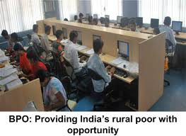

<figure aria-describedby="caption-attachment-1310" class="wp-caption alignleft" id="attachment_1310" style="width: 263px">

<figcaption class="wp-caption-text" id="caption-attachment-1310">Rural BPO: career opportunity for the educated villager (Pic: courtesy outsourceportfolio.com)</figcaption></figure>

*\[Editor’s Note: I finally caught up with Rajiv Kuchhal in person yesterday. Rajiv is an angel investor and mentor at [DesiCrew](http://desicrew.in/), a role he took up after successful senior leadership stints at Infosys BPO and OnMobile. As we talked about the BPO market in general and early trends in rural BPOs, he casually mentioned that DesiCrew had closed a round of institutional funding. Turns out this news is not yet widely disseminated hence this hurried post to “break the news”. Will update once I get details.\]*

This is a Series A round from an India-based VC firm. The size of the round is not yet disclosed but I’m guessing it’s in the 2 to 4 crore INR range. If you are new to the rural BPO space, DesiCrew is one among a handful with early traction – the other players are [Rural Shores](http://www.ruralshores.com/), Next Shores, and [B2R](http://b2r.in/).

DesiCrew was incubated at IIT-Chennai’s Rural Technology Business Incubator (RTBI) in 2005. Spun off as a commercial entity in early 2007 with founder Saloni Malhotra at the helm, it attracted Rajiv Kuchhal as an angel investor and mentor in 2008. Rajiv spends about 30% of his time on DesiCrew (mostly in his Bangalore office while the rest of the management team is based in Chennai).

Here are some quick DesiCrew/Rural BPO facts:

- DesiCrew now employs 250 employees across its 4 centers (three in Tamil Nadu, one in Karnataka).
- 2/3 of DesiCrew’s employees are women.
- In recent years, clients’ attitude towards rural BPOs has shifted from novelty to curiosity.
- Majority of DesiCrew’s clients are Indian. They’ve also landed some marquee clients like Infosys, HDFC, Google-India, and AOL-India.
- Rural BPO margins are not high since the stage hasn’t come where a premium can be charged. Carving out a niche and siphoning the low-end of the market (where the Tier 1 BPO players cannot/will not compete) are what’s fueling rural BPOs’ growth.
- Since DesiCrew’s locations are all in semi-urban Tier 3 towns (like Udupi), there’s abundant availability of college graduates. Most of their employees live 5-6 km from their centers. The exception might be the center head who’d have a longer commute.
- Attrition is also noticeably lower, compared to Tier 1 and Tier 2 BPO players.

Stay tuned for an update on DesiCrew’s funding and other details.