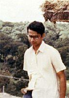
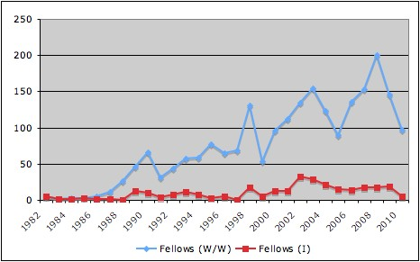

<figure aria-describedby="caption-attachment-710" class="wp-caption alignleft" id="attachment_710" style="width: 300px">

<figcaption class="wp-caption-text" id="caption-attachment-710">Pic: courtesy india.ashoka.org</figcaption></figure>

*\[Editor’s Note: Last month, I sat down with Solomon Prakash for the first of what promises to be many more interesting conversations. Solomon is a serial social entrepreneur — started off with a non-profit called MAYA which eventually gave birth to two social enterprises – Maya Organics and LabourNet. In 2006, he was elected as an Ashoka Fellow for his pioneering work with Maya Organics and LabourNet. In Mar 2010, Solomon joined Ashoka’s Global Leadership team and is the Country Head of Ashoka in India. We chatted about LabourNet, Maya and Ashoka but this post’s focus is entirely on Ashoka.\]*

Bill Drayton, founder-CEO of [Ashoka](http://ashoka.org/) and pioneer of the social entrepreneurship movement, just got awarded Spain’s highest civilian honor – the Prince of Asturias prize. Drayton founded Ashoka in 1980 with a core belief that “everyone is a changemaker”. In thirty years, Ashoka has grown to an association of 2700+ Fellows in over 60 countries. In this [nextBillion interview](http://www.nextbillion.net/blog/2011/06/08/ashokas-drayton-education-and-the-future-marketplace), he shared some great insights:

- The change-making power held in the Fellows is breathtaking: 50 percent of Ashoka Fellow enterprises achieved a policy change (economic/or governmental) within one year of being operational.
- The cities and nations that empower a high proportion of people to be changemakers will become the Silicon Valleys of the world. Those who do not will become Detroit (link to [nextBilion Detroit post](http://www.nextbillion.net/blog/2010/05/21/look-no-further-than-detroit-for-the-bop)).
- Changemakers have four fundamental traits that cannot be understated: *empathy*, *teamwork*, *leadership*, and *change-making*.
- “Empathy,” Drayton says, “will be like literacy was in the 1300s. Without it, one will be marginalized and unable to function professionally.” We’re increasingly dependent on the people around us to guide our behavior, which requires an increasingly more sophisticated empathetic skill.

<figure aria-describedby="caption-attachment-711" class="wp-caption alignright" id="attachment_711" style="width: 142px">

<figcaption class="wp-caption-text" id="caption-attachment-711">Dr. Sudarshan (among the 1st three Ashoka fellows - elected in 1973)</figcaption></figure>

The first five individuals elected to the Ashoka Fellowship in 1982 were all from India. Since then, a total of 286 Ashoka Fellows have been elected from India. After spending some time on Ashoka’s website, I threw the numbers into Excel and created this trend graph on Ashoka Fellows elected from inception to 2010 (corresponding Excel table pasted at the end of this post).

<figure aria-describedby="caption-attachment-78" class="wp-caption alignleft" id="attachment_78" style="width: 466px">

<figcaption class="wp-caption-text" id="caption-attachment-78">Ashoka Fellows (World/Wide and India) - 1982 to 2010</figcaption></figure>

Over the entire duration, Ashok Fellows from India comprise 13% of the worldwide pool. The 3-year period 2002-2004 represent a ‘golden-era’ when 32, 28 and 21 Ashoka Fellows were elected from India. There appear to be three distinct phases of Ashoka Fellowship growth – Phase1 (1982-87), Phase2 (1988-1997) and Phase3 (1998-2010). Phase1 clearly represents early years for Ashoka. During the Phase2 years, an average number of 54 Ashoka Fellows (worldwide) were elected per year. During the Phase3 years, this average skyrocketed to 125.

What’s interesting is that the number (or percentage) of Ashoka Fellows from India did not noticeably increase from the Phase2 to Phase3 years. Most likely that’s because Ashoka expanded its geographical footprint to include additional countries. 2002 seems to be a stand-out year for India – both in terms of number of Fellows (32) and the percentage from India (24%).

Besides counting the Ashoka Fellow cohorts by year, I also browsed through the entire list of 286 Indian Ashoka Fellows – partly because I’m a curious individual but also because I wanted to see how many of them I had heard of. That number turned out to be 25 (~9%). Furthermore, sixteen from that list of 25 were already on my radar of people whose organizations I wanted to cover on this blog. But… I didn’t know that these individuals (barring Solomon) were Ashoka Fellows until I browsed the list on Ashoka.org.

The Ashoka Fellow election process is no doubt documented somewhere on Ashoka’s website but Solomon walked me through the high-level process:

- Questionnaire filled out on nominated individual based on first-opinion search
- Second-opinion review (non-native country) panel
- 3-4 person panel interview of the candidate
- Recommendation from previous stage only goes to 12-member board if it’s a unanimous yes
- For a majority of recommendations, the final decision by the board is Yes. For applicants getting rejected at this stage, it’s usually due to the idea being *not original enough*.

Excel table source for the above graph:

<table border="0" cellpadding="0" cellspacing="0" width="214"><colgroup><col width="63"></col><col span="2" width="49"></col><col width="53"></col></colgroup><tbody><tr><td height="26" width="63">Year</td><td width="49">Fellows (W/W)</td><td width="49">Fellows (India)</td><td width="53">India %</td></tr><tr><td height="13">1982</td><td align="right">5</td><td align="right">5</td><td align="right">100%</td></tr><tr><td height="13">1983</td><td align="right">1</td><td align="right">1</td><td align="right">100%</td></tr><tr><td height="13">1984</td><td align="right">2</td><td align="right">1</td><td align="right">50%</td></tr><tr><td height="13">1985</td><td align="right">3</td><td align="right">2</td><td align="right">67%</td></tr><tr><td height="13">1986</td><td align="right">5</td><td align="right">1</td><td align="right">20%</td></tr><tr><td height="13">1987</td><td align="right">11</td><td align="right">1</td><td align="right">9%</td></tr><tr><td height="13">1988</td><td align="right">26</td><td align="right">0</td><td align="right">0%</td></tr><tr><td height="13">1989</td><td align="right">46</td><td align="right">12</td><td align="right">26%</td></tr><tr><td height="13">1990</td><td align="right">66</td><td align="right">10</td><td align="right">15%</td></tr><tr><td height="13">1991</td><td align="right">31</td><td align="right">4</td><td align="right">13%</td></tr><tr><td height="13">1992</td><td align="right">44</td><td align="right">7</td><td align="right">16%</td></tr><tr><td height="13">1993</td><td align="right">57</td><td align="right">11</td><td align="right">19%</td></tr><tr><td height="13">1994</td><td align="right">58</td><td align="right">7</td><td align="right">12%</td></tr><tr><td height="13">1995</td><td align="right">77</td><td align="right">3</td><td align="right">4%</td></tr><tr><td height="13">1996</td><td align="right">65</td><td align="right">5</td><td align="right">8%</td></tr><tr><td height="13">1997</td><td align="right">69</td><td align="right">0</td><td align="right">0%</td></tr><tr><td height="13">1998</td><td align="right">131</td><td align="right">18</td><td align="right">14%</td></tr><tr><td height="13">1999</td><td align="right">54</td><td align="right">5</td><td align="right">9%</td></tr><tr><td height="13">2000</td><td align="right">96</td><td align="right">12</td><td align="right">13%</td></tr><tr><td height="13">2001</td><td align="right">112</td><td align="right">12</td><td align="right">11%</td></tr><tr><td height="13">2002</td><td align="right">134</td><td align="right">32</td><td align="right">24%</td></tr><tr><td height="13">2003</td><td align="right">154</td><td align="right">28</td><td align="right">18%</td></tr><tr><td height="13">2004</td><td align="right">123</td><td align="right">21</td><td align="right">17%</td></tr><tr><td height="13">2005</td><td align="right">89</td><td align="right">15</td><td align="right">17%</td></tr><tr><td height="13">2006</td><td align="right">135</td><td align="right">14</td><td align="right">10%</td></tr><tr><td height="13">2007</td><td align="right">153</td><td align="right">17</td><td align="right">11%</td></tr><tr><td height="13">2008</td><td align="right">200</td><td align="right">18</td><td align="right">9%</td></tr><tr><td height="13">2009</td><td align="right">146</td><td align="right">19</td><td align="right">13%</td></tr><tr><td height="13">2010</td><td align="right">97</td><td align="right">5</td><td align="right">5%</td></tr><tr><td height="13">Totals –&gt;</td><td align="right">2190</td><td align="right">286</td><td align="right">13%</td></tr></tbody></table>