*\[Editor’s Note: Last week, I spent a few hours with the [Arghyam](http://www.arghyam.org/) management team – Sunita Nadhamuni (CEO) and Vijay Krishna (Director, R&amp;D and head of [India Water Portal](http://www.indiawaterportal.org/) (one of Arghyam’s key offerings)). Arghyam is an Indian public charitable foundation setup with an endowment from Rohini Nilekani, working in the water and sanitation sector since 2005.*  *Sunita, Vijay and I are collaborators and friends from Silicon Valley during our [Rejuvenate India Movement](http://www.rejuvenateindiamovement.org/) days (circa 1999-2003). This is the first of a multi-part series on Arghyam focusing on ASHWAS. The acronym ASHWAS, which expands to A Survey of Household Water and Sanitation, refers to a participatory survey that covers 28 districts of Karnataka spanning 17,200 households across 172 gram panchayats (GPs) – the only Karnataka district excluded in this study is Bangalore Urban.\]*

<figure aria-describedby="caption-attachment-81" class="wp-caption alignleft" id="attachment_81" style="width: 400px">**[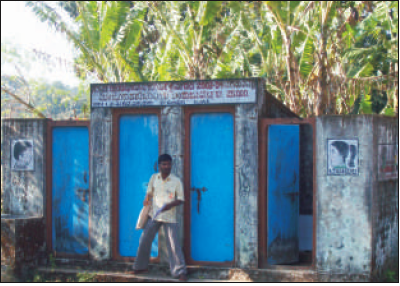](../../../../uploads/2011/06/ashwas_coverpic_village_public_toilet.png)**<figcaption class="wp-caption-text" id="caption-attachment-81">82% of Gram Panchayats reported presence of toilets in all schools but ASHWAS surveyors found most to be defunct</figcaption></figure>

Late last year, the big story making the rounds was that India had more mobile phones than toilets. This was news to everyone except Indians. Then I read somewhere that the Government of India is allegedly spending $350 million a year to build toilets in rural areas. Bindeshwar Pathak, founder of Sulabh Sanitation and Social Reform Movement, estimates that India needs about 120 million more latrines. Atanu Dey, economist and author who blogs at [Deesha.org](http://www.deeshaa.org/), had the following pithy comment on one of his 2004 posts:

> Sanitation and clean drinking water are problems that are real and will have a greater impact on the lives of people in urban and rural India than giving them access to information and installing internet kiosks. If you provide them with just those two, you would improve their lives much more and they will suffer much less from diseases. A glass of clean drinking water will help them more than information on the internet about health. A decent place to crap in would help the women in urban and rural areas more than surfing the world wide web.

<figure aria-describedby="caption-attachment-82" class="wp-caption alignleft" id="attachment_82" style="width: 245px">

[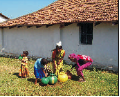](../../../../uploads/2011/06/ashwas_coverpic_women_and_kids_collecting_water.png)<figcaption class="wp-caption-text" id="caption-attachment-82">90% of drinking water is collected by women and children in rural Karnataka</figcaption></figure>

Clean drinking water and sanitation are inextricably linked at the hip in most parts of India (rural and urban). The India-level statistics and narrative on clean drinking water and sanitation are scary. Zooming into the statistics for just *one* state (done by Arghyam via the ASHWAS study), is orders of magnitude more sobering. Arghyam describes the survey as different from conventional surveys in that:

- it is a citizen’s survey in that it places a high premium on the *perceptions of the citizens of rural Karnataka*.
- an important objective is to go beyond mere extraction of information to the development of a layered analytical process to assess the water, sanitation and hygiene situation at *gram panchayat (GP), district and state levels*.

**Key ASHWAS** **Findings** **(Text Version)**

(For the graphical version, scroll down just a wee bit.)

- **SANITATION**
  - 72% of the people defecate in the open with the figure being as high as 98% in Raichur district.
  
  
  - Only 50% of respondents claim to use soap while washing their hands after defecation.
  - Many village maps show open defecation areas dangerously close to drinking water sources.
  - 80% of those who practice open defecation say they find it inconvenient.
  - Lack of finance is stated as the primary reason for not building toilets.
  
  
  - 82% of Gram Panchayats reported presence of toilets in all schools but ASHWAS surveyors observed that most toilets are defunct.
  - Only 50% of Panchayats reported the presence of toilets in all anganwadis (government-sponsored child-care centers).
  - Only 42% of households have access to drains in front of their houses, and 50% of drains are not cleaned for 6 months or longer.

- **WATER**
  - 87% of households depend on groundwater.
  - 60% of sources tested exceeded 1 ppm (Bureau of Indian Standards norm on permissible fluoride), 20% of sources tested positive for nitrate contamination, while 38% had bacteriological contamination.
  - In terms of time taken to collect water, 41% of households take between 30 and 60 minutes per day.

**Key ASHWAS** **Findings** **(Graphical Version)**

<figure aria-describedby="caption-attachment-91" class="wp-caption aligncenter" id="attachment_91" style="width: 415px">****[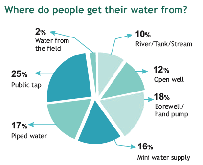](../../../../uploads/2011/06/ashwas_source_of_water.png)****<figcaption class="wp-caption-text" id="caption-attachment-91">25% of rural Karnataka gets its water from public taps</figcaption></figure>

<figure aria-describedby="caption-attachment-94" class="wp-caption aligncenter" id="attachment_94" style="width: 431px">****[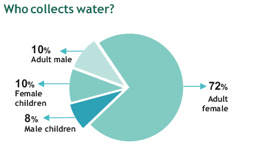](../../../../uploads/2011/06/ashwas_who_collects_water.png)****<figcaption class="wp-caption-text" id="caption-attachment-94">90% of water collected by women and children</figcaption></figure>

<figure aria-describedby="caption-attachment-95" class="wp-caption aligncenter" id="attachment_95" style="width: 411px">****[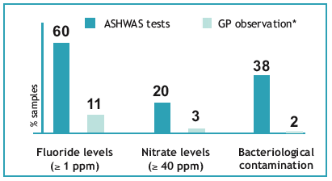](../../../../uploads/2011/06/ashwas_quality_of_water1.png)****<figcaption class="wp-caption-text" id="caption-attachment-95">60% of water has high levels of fluoride, 38% water has bacterial contamination</figcaption></figure>

<figure aria-describedby="caption-attachment-87" class="wp-caption aligncenter" id="attachment_87" style="width: 434px">****[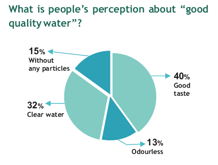](../../../../uploads/2011/06/ashwas_peoples_perception_good_quality_water.png)****<figcaption class="wp-caption-text" id="caption-attachment-87">Big gap in perception vs. reality of "good quality" water</figcaption></figure>

<figure aria-describedby="caption-attachment-86" class="wp-caption aligncenter" id="attachment_86" style="width: 436px">****[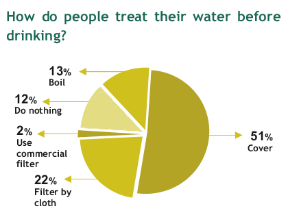](../../../../uploads/2011/06/ashwas_how_people_treat_water_before_drinking.png)****<figcaption class="wp-caption-text" id="caption-attachment-86">A mere 37% attempt treatment technique (filtering, boiling, etc.)</figcaption></figure>

<figure aria-describedby="caption-attachment-85" class="wp-caption aligncenter" id="attachment_85" style="width: 424px">****[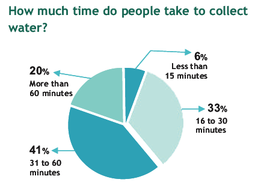](../../../../uploads/2011/06/ashwas_how_much_time_to_collect_water.png)****<figcaption class="wp-caption-text" id="caption-attachment-85">For 94% of people, it takes 16 min or longer to collect water</figcaption></figure>

<figure aria-describedby="caption-attachment-97" class="wp-caption aligncenter" id="attachment_97" style="width: 420px">****[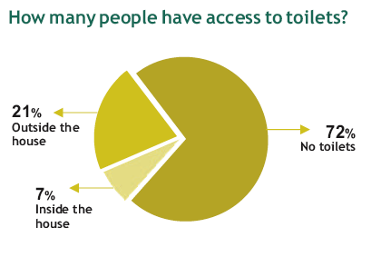](../../../../uploads/2011/06/ashwas_people_with_access_to_toilets.png)****<figcaption class="wp-caption-text" id="caption-attachment-97">A mere 7% have toilets inside the house!</figcaption></figure>

<figure aria-describedby="caption-attachment-98" class="wp-caption aligncenter" id="attachment_98" style="width: 420px">****[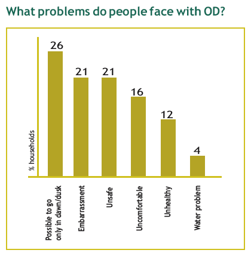](../../../../uploads/2011/06/ashwas_problems_people_face_with_OD.png)****<figcaption class="wp-caption-text" id="caption-attachment-98">Clearly Outside Defecation is NOT preferred; method of last resort!</figcaption></figure>

<figure aria-describedby="caption-attachment-99" class="wp-caption aligncenter" id="attachment_99" style="width: 436px">****[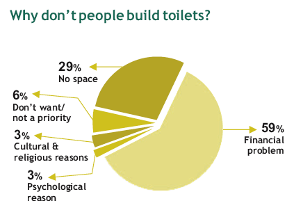](../../../../uploads/2011/06/ashwas_why_dont_people_build_toilets.png)****<figcaption class="wp-caption-text" id="caption-attachment-99">Most people don't build toilets because they can't afford it!</figcaption></figure>

<figure aria-describedby="caption-attachment-96" class="wp-caption aligncenter" id="attachment_96" style="width: 415px">****[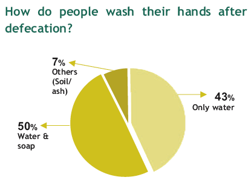](../../../../uploads/2011/06/ashwas_people_wash_habits_after_defecation.png)****<figcaption class="wp-caption-text" id="caption-attachment-96">Only 50% people use soap after defecation</figcaption></figure>