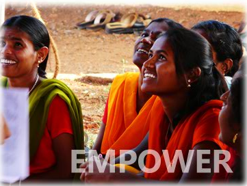
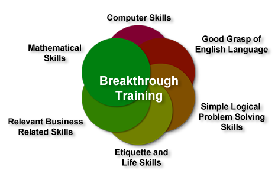
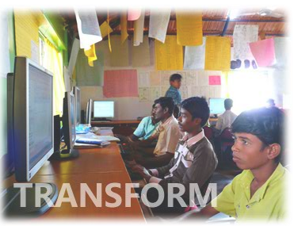

*\[Editor’s Note: Last month I spent a few hours chatting with Sunil Savara at his Koramangala office. Savara is co-founder of Head Held High, a social enterprise with aspirations to become the largest vocational training institute in the world. Prior to starting Head Held High, Savara was co-founder and CEO of Automated Workflow Group for 8 years. Since starting Head Held High, he has moved to a part-time Director role.\]*

<figure aria-describedby="caption-attachment-117" class="wp-caption alignright" id="attachment_117" style="width: 300px">

<figcaption class="wp-caption-text" id="caption-attachment-117">Head Held High empowering the rural youth</figcaption></figure>

What if I had a wager with you that I could take a 21-year old illiterate non-English speaking villager, put him into a secret training program for 8 months at the end of which the villager would be employable by any of India’s BPOs. Chances are high you’d accept the wager. What if I modified the wager to say that I could do this at scale – i.e. educate 2 million such villagers in a span of ten years. Chances are even higher you’d accept the wager.

[Foundation for Life](http://f4life.org/)‘s Sunil Savara will want you to accept that wager. As though inspired by [My Fair Lady](http://www.imdb.com/title/tt0058385/)‘s Rex Harrison (who plays the role of a snobbish phonetics professor who agrees to a wager that he can take a flower girl and make her presentable in high society), in early 2008 Savara and three other co-founders of Head Held High (HHH) selected eight village youths, put them through an intensive eight-month training program at the end of which they were all successfully placed in BPO organizations. The remarkable aspect of this experiment was that all eight were non-English speaking villagers who had *never held a pencil*. Eight months later at graduation time, they could converse, read, and write in English, and work on a computer with typing speeds of around 60 words per minute!

The cynic among us is probably thinking “*But it’s only eight! That’s not much of a proof point*.” A year later, Savara and team in partnership with SAMUHA (an NGO) executed on a more elaborate pilot program, this time with a class size of 120. The average age of the class was still 21 and the academic profile ranged from 0 to 5 years of school education. This pilot program, conducted in three villages in Koppal District around 50km from Hampi, was 50% funded by [Sir Dorabji Tata Trust](http://www.dorabjitatatrust.org/) with the remainder bootstrapped by the four co-founders. A majority of the graduating class are now employed at the Village BPO created and run by HHH. A small number were placed in Bangalore companies but HHH’s overall strategy is that villagers would be employed in their own villages.

**Brain Trust and HHH’s *My Fair Lady* moment**

The audacious goal of HHH is to become the largest vocation training institute in the world and in the process train 2 million village youths in 10 years. Savara doesn’t claim to have all the answers (especially to take HHH to the next level) but he’s assembled a veritable list of 40+ successful and well-known CEO’s and CXO’s into an advisory group called the Brain Trust. What’s even more impressive is that he persuaded half this group to attend a Round Table Conference in Bangalore. Guess who kicked off the conference? A graduate of the Head Held High program. If this isn’t a *My Fair Lady* moment, then you haven’t seen the movie.

Savara is leveraging the Brain Trust to get leads into possible BPO customers throughout the world and is already seeing results. He has also found some early celebrity supporters like Tushar Gandhi (see Youtube video below) and India’s first astronaut Rakesh Sharma.

<iframe allowfullscreen="true" class="youtube-player" height="394" src="https://www.youtube.com/embed/XxbzH0zGkjI?version=3&rel=1&fs=1&autohide=2&showsearch=0&showinfo=1&iv_load_policy=1&wmode=transparent" style="border:0;" width="700"></iframe>

<figure aria-describedby="caption-attachment-116" class="wp-caption alignright" id="attachment_116" style="width: 300px">********<figcaption class="wp-caption-text" id="caption-attachment-116">Head Held High's training components</figcaption></figure>

**Training Components**

The graphic on the right shows the six components of HHH’s training program.

**What Next?**

Savara and team have worked out the structural details of the Head Held High organization – two for-profit social enterprises under one holding trust. One of the social enterprises (current moniker: Village Knowledge Services) will most closely resemble a BPO. The other social enterprise would be the training institute. Training for the next two batches of HHH (120 each) will commence in July 2011. HHH will be seeking an institutional round of funding and will get on the fundraising trail in three months.

<figure aria-describedby="caption-attachment-118" class="wp-caption alignleft" id="attachment_118" style="width: 300px">

<figcaption class="wp-caption-text" id="caption-attachment-118">Getting savvy with the computers</figcaption></figure>

The first year of funding for HHH Village Knowledge Services is being organized by Madan Padaki (participation by him and some of his friends). Madan Padaki is the Founder &amp; CEO of [MeritTrac](http://www.merittrac.com/) and and the fourth co-founder of HHH. The training operation is being funded by other organizations (still to be named).

**Founding Team**

The founding team comprises of Sunil Savara, Rajesh Bhat (training whiz), Samik Ghosh, and Madan Padaki.

It will be interesting to see what kind of traction Head Held High makes in the coming year…