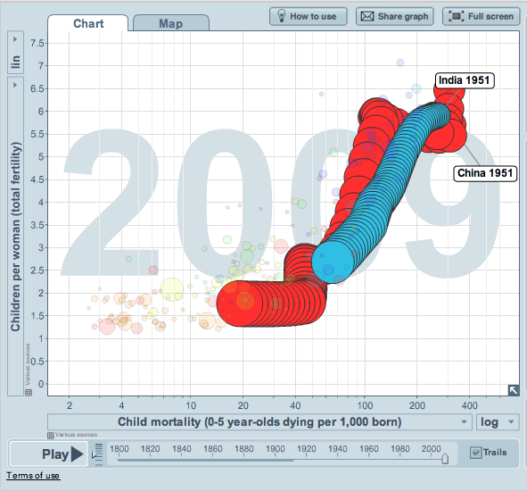
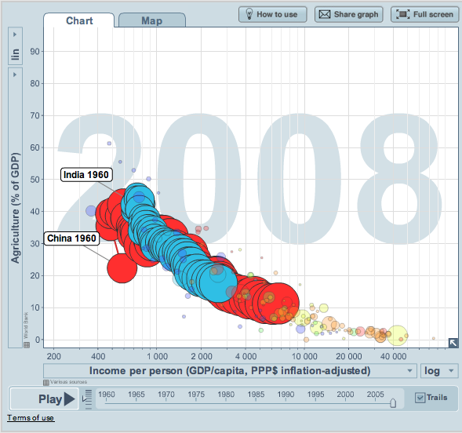
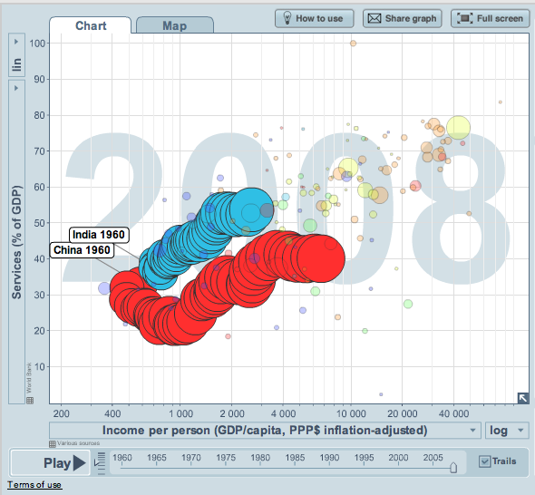
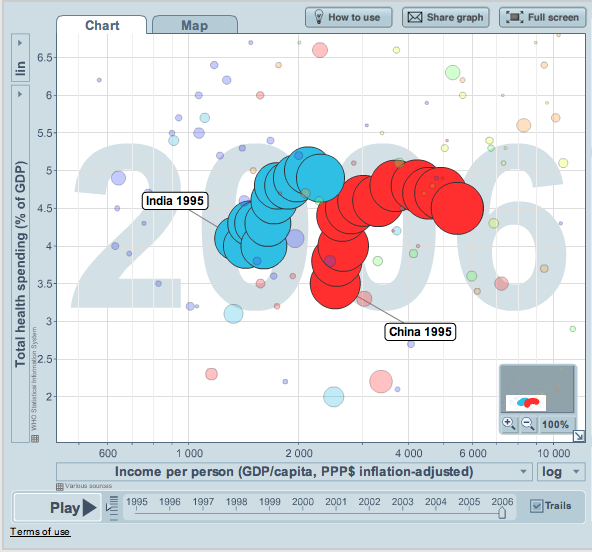

A friend alerted me to [Gapminder.org](http://www.gapminder.org/) a while ago and today I finally sampled some of their amazing datasets via their nifty Trendalyzer. If you haven’t heard of Gapminder, their mission statement should catch your attention:

> *Fighting the most devastating myths by building a fact-based world view that everyone understands.*

Their website describes Gapminder as a non-profit venture – a modern “museum† on the Internet – promoting sustainable global development and achievement of the [United Nations Millennium Development Goals](http://www.un.org/millenniumgoals/). Expressed more tersely, Gapminder is a “fact tank” (think “think tanks”).

Anyway, I picked four datasets relevant to this blog with a sufficiently long time series to make them interesting. The interactive graphics on the Gapminder Trendalyzer are fun to view so I’ve linked the original Gapminder interactive graph from the screenshots. Since it’s more fun to compare trends with a similarly large country (in terms of population), I’m using China for that purpose.

<dl class="wp-caption aligncenter" id="attachment_122" style="width: 601px;"><dt class="wp-caption-dt">

</dt><dd class="wp-caption-dd">India’s child mortality rate dropped from 26% (1951) to 6.6% (2009). For China it dropped from 31% (1951) to 1.9% (2009).</dd></dl><figure aria-describedby="caption-attachment-123" class="wp-caption aligncenter" id="attachment_123" style="width: 589px">

<figcaption class="wp-caption-text" id="caption-attachment-123">India's agriculture GDP % dropped from 43% (1960) to 17% (2008). For China it dropped from 22% to 11% in the same time period. Interestingly, China's agriculture GDP % spiked from 1960 to 1968 (42%) before plummeting again.</figcaption></figure>

<figure aria-describedby="caption-attachment-124" class="wp-caption aligncenter" id="attachment_124" style="width: 590px">

<figcaption class="wp-caption-text" id="caption-attachment-124">India's services GDP % increased from 38% (1960) to 54% (2008). For China it increased from 33% to 40% in the same time period. China's services GDP % plummeted from 1960 to 1976 (22%) which corresponds to the same-time-period spike in agricultural GDP %.</figcaption></figure>

<figure aria-describedby="caption-attachment-125" class="wp-caption aligncenter" id="attachment_125" style="width: 592px">

<figcaption class="wp-caption-text" id="caption-attachment-125">India's health spend as a % of GDP marginally increased from 4.1% (1995) to 4.9% (2006). For China too, it increased marginally from 3.5% to 4.5% in the same time period. </figcaption></figure>