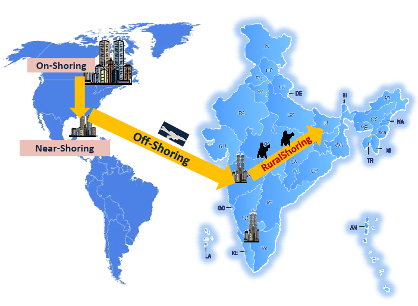
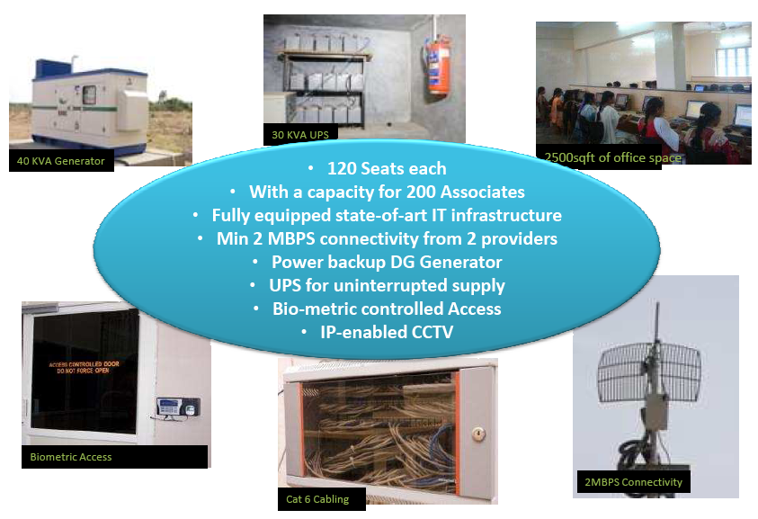

*\[Editor’s Note: Yesterday I drove up to Whitefield to meet Murali Vullaganti, co-founder and CEO of India’s largest rural BPO, Rural Shores. What I heard must have excited me because I’m publishing this post with a mere 1-day gestation period – a record for this fledgling blog.\]*

<figure aria-describedby="caption-attachment-128" class="wp-caption alignleft" id="attachment_128" style="width: 300px">********<figcaption class="wp-caption-text" id="caption-attachment-128">Move over off-shoring, it's time for rural-shoring!</figcaption></figure>

**A different breed of social entrepreneur**

By any yardstick, Murali Vullaganti has had a successful career – a fifteen year IT career capped by Managing Director stints with EDS and Xansa. Then in 2008, he decided it was time to change his trajectory from a *life of business* to the *business of life*. The business of life, for Murali, was to make a significant impact in the livelihood of India’s rural population. He teamed up with five other industry leaders, most notable of which include Mastek CMD Sudhakar Ram and Essar Group’s CN Ram, to co-found Rural Shores.

Rural Shores was incorporated in 2008 and the first center became operational in Feb 2009. The unique thing about Rural Shore’s formation was that all six co-founders share a common belief that it’s the social cause that’s *solely* driving them and, by corollary, don’t intend to materially benefit from the venture. This wasn’t a token *Do no evil* verbal pledge but a deliberately codified decision – a decision to create a separate charitable entity (Rural Shores Foundation) and transfer founder equity to it.

**Company Snapshot**

After completing two years of operation, Rural Shores has 700+ employees spread across 10 centers serving a dozen reputable clients. Within 9 months, the number of centers is expected to double. Each center currently seats 100-120 and can scale up to 200. 60% of their employee base comprises of women – a notable outlier is their Rathinagiri center where a whopping 95% are women. The centers are located *all over* India and I’m not exaggerating – here’s their [location map](http://ruralshores.com/index.php?option=com_content&task=blogsection&id=7&menuId=7) that shows currently operational and upcoming centers. Barring Gangtok and Nagercoil, most Indians wouldn’t have heard of any of the locations. The population of majority of these towns ranges from 10,000 to 30,000.

**Mission &amp; Strategy**

Rural Shores’ mission is simple – 500 centers, one in each of India’s 500 rural districts, operational by 2020 generating employment for 100,000 rural youth. Wow! That makes it a yearly runrate in excess of 50 new centers! But entrepreneurs thrive on BHAGs like these and Murali smiled at me confidently from across the table.

The current focus for Rural Shores is clearly the BPO play (process and knowledge services for domestic Indian corporations) but that’s only the first part (beachhead) of their strategy. The second part of their strategy is to harness the power of the rural consumer. Rural Shores’ geographically distributed centers would become *last-mile distribution hubs* for a whole host of services ranging from telecom, retail, and agriculture to tele-medicine and education.

<figure aria-describedby="caption-attachment-129" class="wp-caption alignleft" id="attachment_129" style="width: 300px">********<figcaption class="wp-caption-text" id="caption-attachment-129">The Rural BPO value proposition.</figcaption></figure>

**Innovation in Center Selection**

Considering that Rural Shores’ centers were so widely distributed with no discernible pattern, I was very curious about the criteria for center selection. Turns out Murali has hit upon an innovative synergistic formula for center growth while keeping costs down. Rural Shores doesn’t own any of the facilities or infrastructure. They partner with local social entrepreneurs who make the investment to build the center (with the requisite trappings needed for a BPO’s operations) and charge Rural Shores a monthly facilities management fee.

Who are these local social entrepreneurs and what’s in it for them? Most of them are High Net-worth Individuals (HNIs) who want to bring about an improvement in their local towns/districts and have bought into the Rural Shores’ vision. Tens of thousands of miles away, the [NRI](http://en.wikipedia.org/wiki/Non-resident_Indian_and_Person_of_Indian_Origin) community has also eagerly pitched in – as partners in developing the village/district of their roots. Sweet synergy I say! With a strong pipeline of 100+ such individuals waiting-in-the-wings, I can see why Murali was smiling confidently.

As I listened to Murali talk about this model, I remarked that I saw a parallel between Rural Shores and the Vaatsalya model (covered in [this post](../2011/06/20/vaatsalya-affordable-high-quality-healthcare-formula-smaller-towns/) last week) of entering into new markets by partnering with existing doctors. As it turns out, Ashwin Naik (of Vaatsalya) and Murali are neighbours and they periodically compare notes on their respective companies’ business models. Sharing pays!

**Hiring &amp; Training**

Hiring has not been a problem for Rural Shores at all levels of the BPO organization. The main eligibility criterion for entry level employees is a high school diploma and there are an abundance of high school graduates looking for a job in these small towns. Training is a rigorous 6-month long program (3 months basic and 3 months process-specific). The hiring of team leaders and process leads is also surprisingly quite smooth – placing ads on Monster.com seems to do the trick. The team leaders who take up these new roles are excited because:

- In most cases, it’s a career upgrade for them
- They get to be much closer to their families/home
- Their savings rate also increases

**Fundraising &amp; Advisory Board**

Rural Shores raised its first round of VC fundraising from Lok Capital and HDFC. The second round of fundraising is currently in progress and they hope to announce something in the not so distant future. They boast two industry stalwarts on their advisory board – Deepak Parekh (HDFC non-executive Chairman) and Deepak Satwalekar (Lead Independent Director of Infosys).

**Founding Team**

The other five co-founders of Rural Shores are:

- V V Ranganathan, Ex-Sr.Partner (E&amp;Y), Trustee (Bharti Foundation)
- C N Ram, President &amp; Group CIO (Essar)
- Sujatha Raju, MD (MMC-InfoTech)
- G Srinivasan, Co-founder (Dawn Consulting)
- Sudhakar Ram, CMD (Mastek)