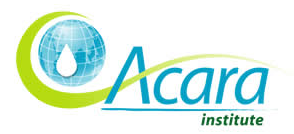

<figure aria-describedby="caption-attachment-666" class="wp-caption alignleft" id="attachment_666" style="width: 294px">

<figcaption class="wp-caption-text" id="caption-attachment-666">Pic courtesy acarainstitute.org</figcaption></figure>

*\[Editor’s Note: In the past fortnight, I had a Skype call with Fred Rose, Co-Founder &amp; CEO of [Acara Institute](http://www.acarainstitute.org/), and a meeting with Arun Patre, their India Manager. The Acara Summer Institute 2011, an intensive 3-week social entrepreneurship program, kicks off in Bangalore on Jun 27 and I’m one of the guest bloggers. This post is the first in a series on Acara Institute.\]*

The Acara Institute was created to connect individuals and organizations, across the globe, with an interest in creating sustainable business solutions to tackle social problems. The institute’s flagship program, Acara Challenge, is a joint program with University of Minnesota’s [Institute on the Environment](http://environment.umn.edu/) and is a unique way for a university to get their students involved in entrepreneurship and sustainable design for social change. Acara Challenge is similar to a business plan competition except that it is offered as a course in participating universities and involves pairing-up of a US university with a developing country university (India/Mexico).

The Challenge has three distinct stages:

1. Course: it’s a zero-credit crash course in social entrepreneurship and open to multi-disciplinary students. In its first three years, most of the enrolment has come from graduate students, split almost evenly across MBA and MS/MTech programs.
2. Challenge: Competing teams (using numbering 5-8) are composed of students from the ‘paired universities’ (e.g. Duke University &amp; IIT-Roorkee) who propose a for-profit or non-profit organization to solve a unique social challenge. By design, the societal challenge would be in the developing country. An industry expert is assigned to each team as a mentor, shepherding them through the process of expressing the problem and solution statement, market segments, the business model and how it purports to be sustainable. The judging process is not very different from a conventional business plan competition – pick top 8 teams in the first round followed (two months later) by a second round where the 4 winning teams are selected. Winning teams are each awarded a grant of $5000 and an opportunity to participate in the Summer Institute. ***The pairing-up of teams from a US university and an Indian university engenders a unique cross-cultural collaborative experience.***
3. Summer Institute for winning teams: The Summer Institute is a 3-week intensive program, which includes two weeks of classroom training and one week of immersion with social enterprises/NGOs. The faculty for Summer Institute 2011 includes individuals from design consultancy firm [Quicksand](http://quicksand.co.in/), IIM-Bangalore, InKlude Labs, and NGOs [Covenant Center of Development(CCD)](http://www.bestsellerfund.com/partners/partindia/Pages/CovenantCenter.aspx) &amp; Samuha. The final day offers the teams an opportunity to pitch to a panel of investors and incubators.

In the last two years, a total of 400 students have participated in the program. The Acara Challenge 2011 featured the following university pairings and had 21 teams participating:

- Arizona State University &lt;–&gt; Monterey Tech, Toluca (Mexico)
- Cornell University &lt;–&gt; Somaiya Institute of Management Science and Research
- Duke University &lt;–&gt; IIT Roorkee
- Roosevelt University &lt;–&gt; Kalinga Institute of Industrial Technology
- University of Hartford &lt;–&gt; Vellore Institute of Technology
- University of Minnesota &lt;–&gt; TERI University

Fred Rose explained that the goals of the Challenge were to promote the cause of social entrepreneurship as education (Goal #1) and build sustainable businesses (Goal #2). Goal #1 has clearly been met. Goal #2 is still a work in progress but they hope the teams participating in the 2011 Summer Institute (which also include a few teams from previous years) can be incubated.

My coverage of the 2011 Acara Summer Institute in Bangalore:

- [Day 1 highlights](http://www.techsangam.com/2011/06/28/acara-summer-institute-2011-day-1-highlights/)
- [War stories from Ashoka Fellow Solomon Prakash](http://www.techsangam.com/2011/06/30/war-stories-from-ashoka-fellow-solomon-prakash/)