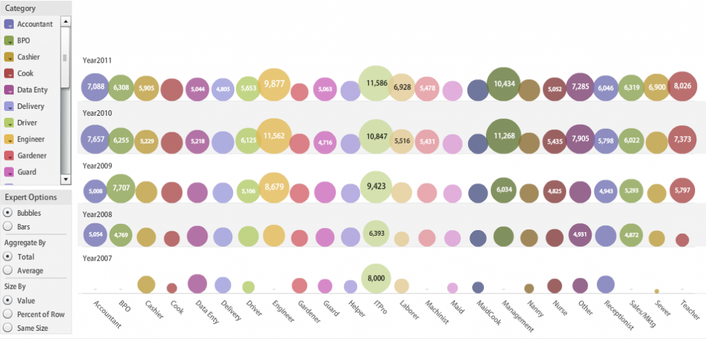

A few months ago, we covered Babajob’s 4-year journey – [A monster in the making: the Babajob story](http://www.techsangam.com/2011/04/27/a-monster-in-the-making-the-babajob-story/). During our meeting, Sean Blagsvedt (Babajob CEO) mentioned that they were working on visualizing the salary data from the rich datasets in their job seeker profiles. Earlier this month, they released the data on their Facebook page. Screenshot with a link to the interactive IBM visualizer below. For many of the job categories, you won’t see the average salary inside the ‘bubbles’ but if you hover over them (in the visualizer tool), the salary is displayed. Scroll below the image for some key takeaways and commentary.

- Not surprisingly, the ITPro, Engineer and Management categories have the highest average salary.
- The ITPro category had the greatest salary increase – almost doubling in four years.
- Surprisingly, the BPO category shows a drop (of almost 20%) from 2009 to 2010.
- A teacher’s salary increasing steadily – 27% from 2009 to 2010 and 9% the following year.
- Maids’ (the lowest paid BOP workers) salaries showed only a modest increase in the past few years.
- Cooks’ salaries also showed only a modest increase in the past few years.
- The guard’s average salary in 2011, at 5,063 INR, seemed on the lower side to me. I regularly quiz security guards (in gated apartment communities) and their salaries are usually above 6,000 INR.
- A receptionist’s salary also showed a healthy increase of 50% from 2008 to 2011.