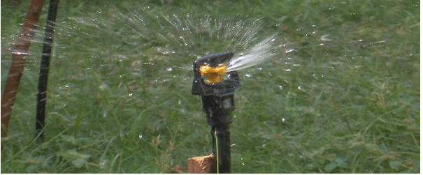

*\[Editor’s Note: On the sidelines of Sankalp Forum 2011 (which [changed the pace of this blog](http://www.techsangam.com/2011/05/09/if-i-was-looking-for-inspiration-i-found-it-at-sankalp-forum/) last month), I had a brief conversation with the affable Om Prakash Singh, CEO of Global Easy Water Products. I followed up with a phone conversation and this post is the result of those conversations and some related research.\]*

Like most agrarian economies of the world, India provides subsidies to its farmers and the surrounding ecosystem which includes, among others, manufacturers of drip irrigation systems. Jain Irrigation Systems is the big fish in the irrigation systems market but the nature of the subsidies and scale economies are such that their irrigation products, priced at 20,000 INR per acre, are beyond the reach of *small plot farmers*. Small plot farmers are typically defined as farmers with plot sizes that are two hectacres or less (Conversion math: 1 hectare = 2.47 acres).

Enter non-profit IDEI ([International Development Enterprises](http://www.ideorg.org/)) and its for-profit social enterprise creation – GEWP ([Global Easy Water Products](http://www.gewp-india.com/)). By leveraging low-cost drip irrigation technology innovations developed by IDEI and its global family of IDE organizations, GEWP was able to bring to market micro drip irrigation products costing 8,000 INR per acre. An estimated 60-70% of India’s 90 million farmers are either small plot farmers (2 hectares) or really small plot farmers (1 hectare) so the addressable market for low cost drip irrigation is massive.

GEWP was incorporated in 2004 but struggled in its initial years to reach large numbers of small-plot farmers. In late 2007, Acumen Fund invested $1 million for a 30% equity but with a precondition that GEWP be clearly spun off from IDEI and run as an independent social enterprise – a for-profit business with a social motive to deliver the benefits of drip irrigation to as many small-plot farmers as possible. The infusion of capital and the new-found autonomy worked wonders for GEWP. By the end of 2010, the social enterprise had broken even. By the end of this year, it expects to be comfortably profitable and has already crossed a landmark milestone of selling to 3 lakh farmers.

**Acumen Fund &amp; Social Output KPIs**

Acumen Fund has a unique practice of holding its portfolio companies accountable to social output metrics (in addition to the conventional VC financial metrics). In the case of GEWP, it’s no surprise that farmer reach is the top metric they closely track. **It took the company 7 years to reach 3 lakh farmers but intends to race to 10 lakh farmers within the next 2-3 years**. According to independent surveys conducted by AC Nielsen and GEWP’s own interactions with their customers, 80% of the farmers are happy with the company’s products.

**Other** **Company Stats**

GEWP currently has branch offices and sells to farmers in nine Indian states – MP, UP, Gujarat, Maharashtra, Karnataka, Orissa, Tamil Nadu, AP, and Rajasthan. Fifteen percent of GEWP’s revenue comes from export to 19 countries (9 in Africa, 8 in Asia, and 2 in Central America). The company has 150 employees and is headquartered in Aurangabad (Maharashtra). GEWP has outsourced its manufacturing to a distributed set of captive vendors in Tamil Nadu, Maharashtra and Madhya Pradesh.

As noted earlier, Acumen Fund retains a 30% stake. The remaining 70% is owned by the IDEI Employee Trust which provides the right incentives for employees, key managers and the leadership team. The company currently has no plans of going IPO.

**Competition**

Considering that the irrigation market for small plot farmers has such a low penetration and with early signs of success, it’s not surprising that startups and large companies have entered this market. According to Om Prakash, there are 50-something copycat startups, most of which are focused just in a few states. Among the big players, Jain Irrigation Systems focuses on larger farmers today but that might change in the future. Mahindra announced their entry in the micro irrigation space through a significant investment in EPC, a Bombay Stock Exchange listed micro irrigation company which operates in 12 Indian states. John Deere India is also rumoured to have entered this space through an acquisition.

But the most interesting competitor to GEWP might be Driptech – a Silicon Valley startup with offices in Pune and Beijing. Driptech claims to produce and price drip irrigation systems at least 50% lower than the nearest competition and has ambitious plans to reach “millions” of farmers within a decade, most of whom are in India and China.