A few months ago, a friend forwarded an email with 24 pictures of the Akshaya Patra kitchen workflow. If Akshaya Patra is ever asked to use only 24 pictures for a fundraising pitch, they should use these. Perhaps they already do. Besides the pictures, I’ve also pasted the first paragraph of my next post on.. (you guessed it) midday meals.

*Akshaya Patra*, a Sanskrit term with origins in the famous epic Mahabharata, translates to inexhaustible vessel. A public charitable trust which provides nutritious, high quality and tasty mid-day meals to 1.3 million children daily across 8,196 schools and 8 states using a centralized infrastructure of 18 mega-kitchens. It took Akshaya Patra 9 years to reach the 1 million mark and they plan to reach 5 million children by 2020. Wow! Clearly they are doing no disservice to the origins of their name.

<figure aria-describedby="caption-attachment-143" class="wp-caption aligncenter" id="attachment_143" style="width: 518px">

[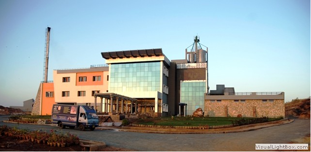](../../../../uploads/2011/07/apatra1.png)<figcaption class="wp-caption-text" id="caption-attachment-143">3-storey kitchen uses Gravity Flow Mechanism. Capacity to cook 50,000 to 100,000 mid-day meals per day. Costs approx. 9 crores to set up.</figcaption></figure>

<figure aria-describedby="caption-attachment-144" class="wp-caption aligncenter" id="attachment_144" style="width: 521px">

[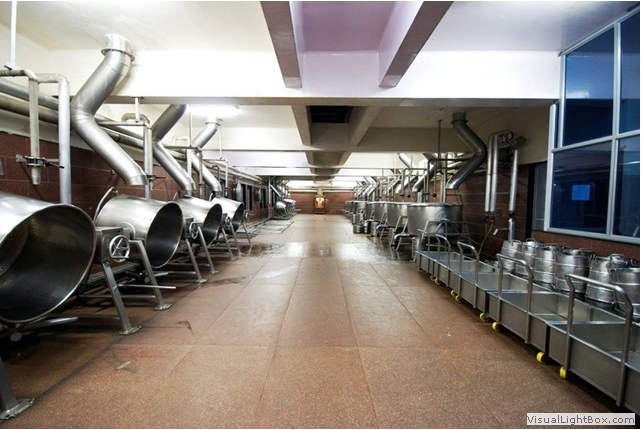](../../../../uploads/2011/07/apatra2.png)<figcaption class="wp-caption-text" id="caption-attachment-144">Kitchen from the inside consisting of rice cauldrons, each of which cooks up to 110kg of rice in 20 min. Sambar cauldrons cook up to 1200 litres of sambar in 2 hours.</figcaption></figure>

<figure aria-describedby="caption-attachment-145" class="wp-caption aligncenter" id="attachment_145" style="width: 518px">

[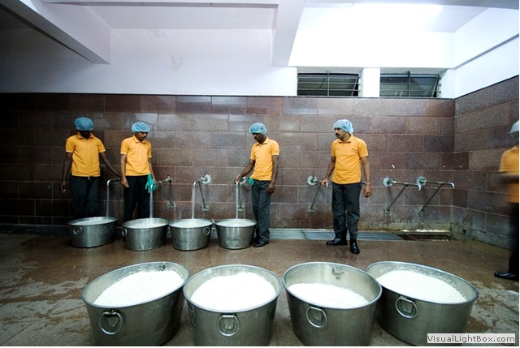](../../../../uploads/2011/07/apatra3.png)<figcaption class="wp-caption-text" id="caption-attachment-145">Rice washed thoroughly on the 2nd floor.</figcaption></figure>

<figure aria-describedby="caption-attachment-146" class="wp-caption aligncenter" id="attachment_146" style="width: 572px">

[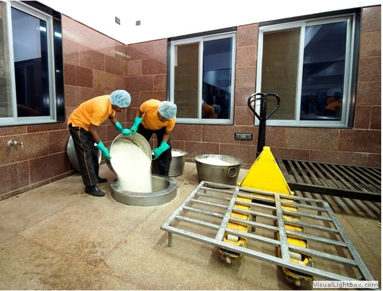](../../../../uploads/2011/07/apatra4.png)<figcaption class="wp-caption-text" id="caption-attachment-146">Washed rice is sent down the chute to the 1st floor.</figcaption></figure>

<figure aria-describedby="caption-attachment-147" class="wp-caption aligncenter" id="attachment_147" style="width: 641px">

[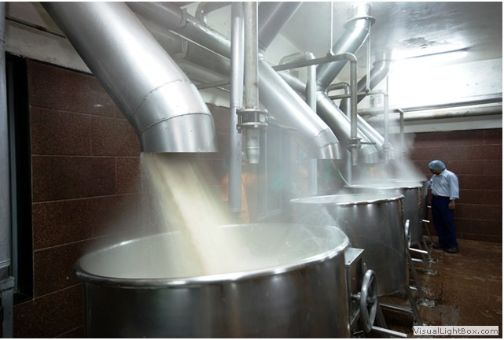](../../../../uploads/2011/07/apatra5.png)<figcaption class="wp-caption-text" id="caption-attachment-147">Rice pours down into steam heated cauldrons. Entire cooking process takes place on 1st floor.</figcaption></figure>

<figure aria-describedby="caption-attachment-148" class="wp-caption aligncenter" id="attachment_148" style="width: 639px">

[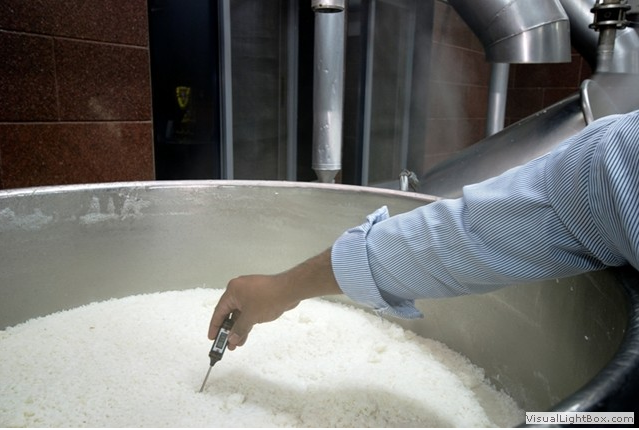](../../../../uploads/2011/07/apatra6.png)<figcaption class="wp-caption-text" id="caption-attachment-148">Super heated steam is used to cook food instead of flame.</figcaption></figure>

<figure aria-describedby="caption-attachment-149" class="wp-caption aligncenter" id="attachment_149" style="width: 639px">

[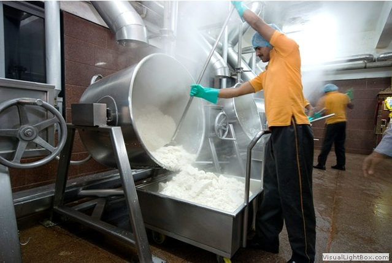](../../../../uploads/2011/07/apatra7.png)<figcaption class="wp-caption-text" id="caption-attachment-149">When cooking is finished, it is loaded into trolleys.</figcaption></figure>

<figure aria-describedby="caption-attachment-150" class="wp-caption aligncenter" id="attachment_150" style="width: 638px">

[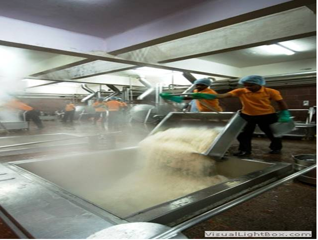](../../../../uploads/2011/07/apatra8.png)<figcaption class="wp-caption-text" id="caption-attachment-150">Cooked rice is sent down the chute to the ground floor.</figcaption></figure>

<figure aria-describedby="caption-attachment-151" class="wp-caption aligncenter" id="attachment_151" style="width: 639px">

[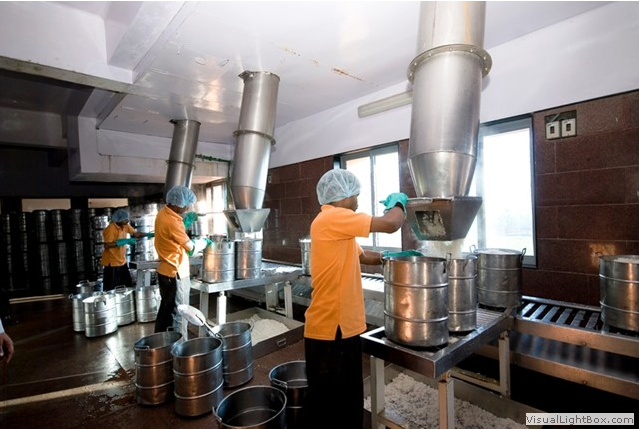](../../../../uploads/2011/07/apatra9.png)<figcaption class="wp-caption-text" id="caption-attachment-151">It flows down the pipe into containers.</figcaption></figure>

<figure aria-describedby="caption-attachment-152" class="wp-caption aligncenter" id="attachment_152" style="width: 646px">

[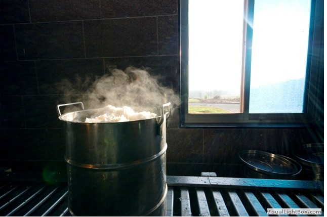](../../../../uploads/2011/07/apatra10.png)<figcaption class="wp-caption-text" id="caption-attachment-152">Piping hot rice on its way to being loaded into food vans. Around 6000 kilosof rice are cooked daily in each kitchen.</figcaption></figure>

<figure aria-describedby="caption-attachment-153" class="wp-caption aligncenter" id="attachment_153" style="width: 643px">

[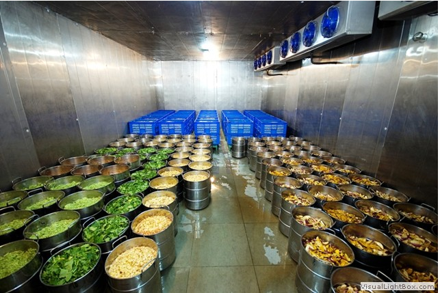](../../../../uploads/2011/07/apatra11.png)<figcaption class="wp-caption-text" id="caption-attachment-153">Food materials in kitchen.</figcaption></figure>

<figure aria-describedby="caption-attachment-154" class="wp-caption aligncenter" id="attachment_154" style="width: 639px">

[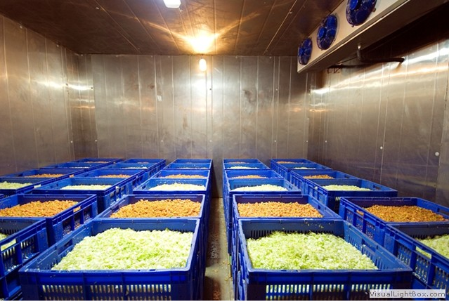](../../../../uploads/2011/07/apatra12.png)<figcaption class="wp-caption-text" id="caption-attachment-154">Stock in the kitchen.</figcaption></figure>

<figure aria-describedby="caption-attachment-155" class="wp-caption aligncenter" id="attachment_155" style="width: 644px">

<figcaption class="wp-caption-text" id="caption-attachment-155">Washed dal and vegetables flows down the chute into sambar cauldron on the 1st floor.</figcaption></figure>

<figure aria-describedby="caption-attachment-156" class="wp-caption aligncenter" id="attachment_156" style="width: 640px">

[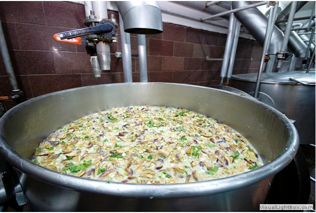](../../../../uploads/2011/07/apatra14.png)<figcaption class="wp-caption-text" id="caption-attachment-156">Vegetables and dal ready to be cooked.</figcaption></figure>

<figure aria-describedby="caption-attachment-157" class="wp-caption aligncenter" id="attachment_157" style="width: 641px">

[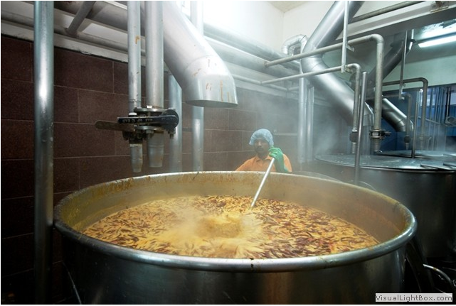](../../../../uploads/2011/07/apatra15.png)<figcaption class="wp-caption-text" id="caption-attachment-157">Sambar being cooked on the 1st floor.</figcaption></figure>

<figure aria-describedby="caption-attachment-158" class="wp-caption aligncenter" id="attachment_158" style="width: 642px">

[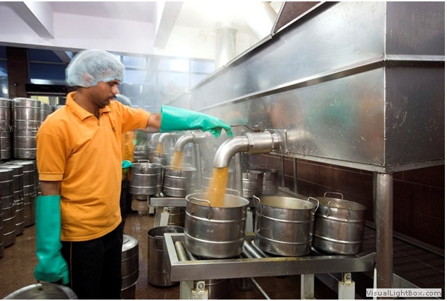](../../../../uploads/2011/07/apatra16.png)<figcaption class="wp-caption-text" id="caption-attachment-158">Cooked sambar is packed and sent to the food vans to be loaded</figcaption></figure>

<figure aria-describedby="caption-attachment-159" class="wp-caption aligncenter" id="attachment_159" style="width: 642px">

[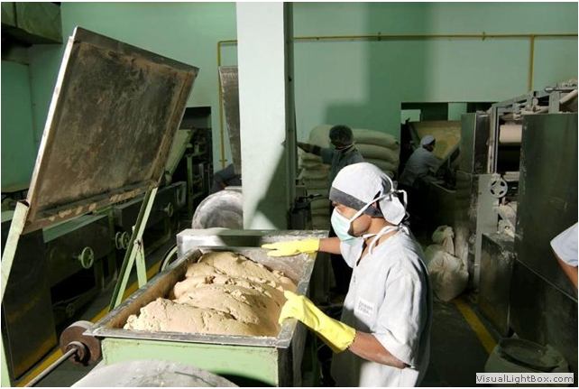](../../../../uploads/2011/07/apatra17.png)<figcaption class="wp-caption-text" id="caption-attachment-159">Chapati dough is mixed</figcaption></figure>

<figure aria-describedby="caption-attachment-160" class="wp-caption aligncenter" id="attachment_160" style="width: 640px">

[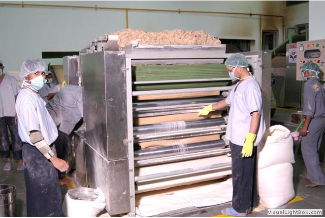](../../../../uploads/2011/07/apatra18.png)<figcaption class="wp-caption-text" id="caption-attachment-160">Heavy rollers flatten the dough into thin sheets.</figcaption></figure>

<figure aria-describedby="caption-attachment-161" class="wp-caption aligncenter" id="attachment_161" style="width: 643px">

[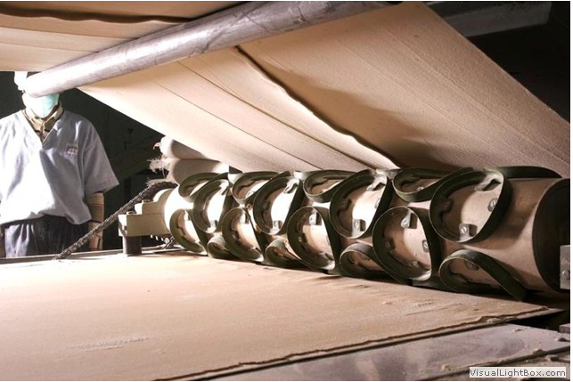](../../../../uploads/2011/07/apatra19.png)<figcaption class="wp-caption-text" id="caption-attachment-161">Dough is cut into the classic round shape.</figcaption></figure>

<figure aria-describedby="caption-attachment-162" class="wp-caption aligncenter" id="attachment_162" style="width: 642px">

[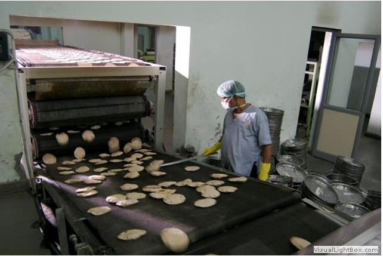](../../../../uploads/2011/07/apatra20.png)<figcaption class="wp-caption-text" id="caption-attachment-162">Making chapatis.</figcaption></figure>

<figure aria-describedby="caption-attachment-163" class="wp-caption aligncenter" id="attachment_163" style="width: 642px">

[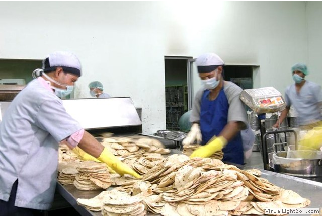](../../../../uploads/2011/07/apatra21.png)<figcaption class="wp-caption-text" id="caption-attachment-163">Collecting all the chapatis.</figcaption></figure>

<figure aria-describedby="caption-attachment-164" class="wp-caption aligncenter" id="attachment_164" style="width: 639px">

[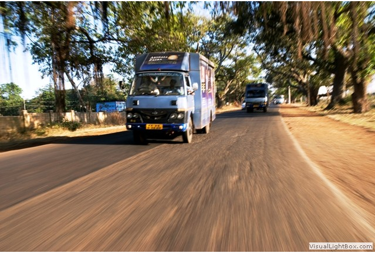](../../../../uploads/2011/07/apatra22.png)<figcaption class="wp-caption-text" id="caption-attachment-164">Transporting Akshaya Patra food.</figcaption></figure>

<figure aria-describedby="caption-attachment-165" class="wp-caption aligncenter" id="attachment_165" style="width: 643px">

[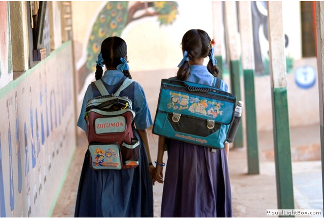](../../../../uploads/2011/07/apatra23.png)<figcaption class="wp-caption-text" id="caption-attachment-165">Happy kids!</figcaption></figure>

<figure aria-describedby="caption-attachment-166" class="wp-caption aligncenter" id="attachment_166" style="width: 639px">

[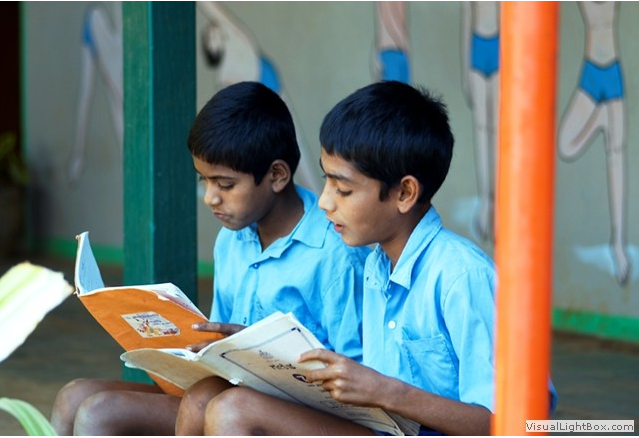](../../../../uploads/2011/07/apatra24.png)<figcaption class="wp-caption-text" id="caption-attachment-166">Happy kids studying!</figcaption></figure>