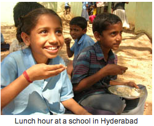

***Akshaya Patra***, a Sanskrit term with origins in the famous Hindu epic Mahabharata, translates to inexhaustible vessel. A public charitable trust which provides nutritious, high quality and tasty mid-day meals to 1.3 million children daily across 8,196 schools and 8 states using a centralized infrastructure of 18 mega-kitchens. It took Akshaya Patra 9 years to reach the 1 million mark and they plan to reach 5 million children by 2020. Wow! Clearly they are doing no disservice to the origins of their name. For a quick look at one of Akshaya Patra's mega-kitchen facilities, you can check out our previous post: [Akshaya Patra in 24 Pictures](../2011/07/01/akshaya-patra-in-24-pictures/).

Hyderabad-based **Naandi Foundation** (with primary focus areas in child rights, safe drinking water, and sustainable livelihoods) started its midday meal program in 2003 (three years after Akshaya Patra commenced operations). With a centralized mega-kitchen infrastructure, Naandi has modeled its operations around Akshaya Patra. The CEO of Naandi Foundation has placed a deliberate focus on the meal’s nutrition value – at 700 calories, it’s well above the National Institute of Nutrition’s mandated minimum of 450 calories. After 8 years of operation, Naandi is now serving midday meals to 1 million children across four states – Andhra Pradesh, Rajasthan, Madhya Pradesh, and Orissa.

**How do midday meals help education?**

The midday meal is an incentive for children, especially from impoverished families, to continue their education. It helps reduce the dropout rate to an enormous extent and improves classroom attendance. Approximately 14 million underprivileged children in India are out of school – not because they aren’t interested in learning – but because they are employed somewhere to earn their meals. Other touted benefits of the midday meals program include improved socialization among children belonging to different castes and reduction in malnutrition.

**History of Midday Meals in India**

While most people relate midday meals introduction with Akshaya Patra, the scheme goes way back to 1923 when pioneers in Madras started providing cooked meals to corporation school students. In the 1960s, Chief Minister Kamaraj introduced the program on a large scale. Two decades later, Chief Minister MG Ramachandran provided further impetus to the program by extending to all children up to grade 10. Gujarat also started their program on a large scale in the late 1980s. Kerala, Madhya Pradesh and Orissa launched the program, albeit on a smaller scale, in the mid-1990s. In late 2001, the Supreme Court passed an order mandating that cooked midday meals be provided in all government and government-aided primary schools in all the states.

By 2007, the government-run midday meals program had reached 12 crore (**120 million**) children – making it the largest school lunch program in the world. The budget allocation for this program stood at Rs. 4,813 crores in 2006-2007.

**Private-Public Partnerships vs. Government-Run Programs**

The government’s program (at 120 million children) towers over the 2+ million number that Akshaya Patra and Naandi together reach. But if one were to do a [blind taste test](http://en.wikipedia.org/wiki/Blind_taste_test) for meals provided by the two charitable trusts and any of the government-run meal programs, it would be a cinch that Akshaya Patra and Naandi would top the test. The national average subsidy (cash plus grain subsidy) that the government provides to contractors and implementers of the midday meal is **Rs. 2.69 per child**. The national average cost of the meal that Akshaya Patra provides is **Rs. 5.09 per child** (for the 2009-2010 year) – the deficit is raised by Akshaya Patra Foundation through its corporate and philanthropic donors.   ***This difference, Rs. 2.4 per child, speaks volumes about why government-run midday meal programs can never match an Akshaya Patra or a Naandi.***

**On leakage and monitoring**

The most scrupulous of commercial food contractors, operating under the constraint of Rs. 2.69 per child, probably deliver average quality midday meals while making *some* profit. And what about the unscrupulous contractors? An entire gamut of scams has been uncovered in the past 5-6 years involving corrupt contractors, conniving government agencies and culpable school officials – truckloads of rice being siphoned away from Food Corporation of India (FCI) godowns and school officials faking attendance records to pocket the surplus  are just a few examples. Monitoring government programs of such scale can be a big challenge especially when there are so many touch points. This decision by the Uttar Pradesh government to use [outbound IVR for monitoring midday meal scheme](http://www.ivrsworld.com/ivr-applications/outbound-ivr-for-monitoring-mid-day-meal-scheme-in-india/) is encouraging.

When midday meals *do* reach the school children, there is no guarantee that it will have the right nutrients, will contain quality ingredients, and saddest of all, that it won’t contain any harmful bacteria. The Somaiya Institute/Cornell University Swach team at the [Acara Summer Institute 2011](../2011/06/28/acara-summer-institute-2011-day-1-highlights/) is working on addressing this piece of the monitoring puzzle. Swach intends to provide food quality testing kits, train the teachers on its use, and create a Mobile/SMS-based infrastructure for the test results to be directly reported to government authorities. They plan to test their solution in a government school at Cheeta Camp, an impoverished community in Trombay (a suburb of Mumbai).

**Closing Thoughts**

It behooves us to learn more about the government-run midday meal programs especially in the avant-garde states (and potentially more successful states) – Tamil Nadu and Gujarat. In my mind, a few big questions need answering:

- How can monitoring processes be improved to reduce the leakage of the current government-run programs? How effective are IVR monitoring programs like the one being used by Uttar Pradesh?
- With Akshaya Patra and Naandi establishing that the government subsidy is not sufficient to delivery a high quality and nutritious midday meal, shouldn’t the government just raise the subsidy especially since the program has proven to be one of the biggest drivers of school attendance and learning?

*(I gathered the Akshaya Patra data on average meal and subsidy costs from this [ISKCON FAQ](http://www.prabhupadanugas.eu/?p=11800) page, which has other relevant details as well.)*
