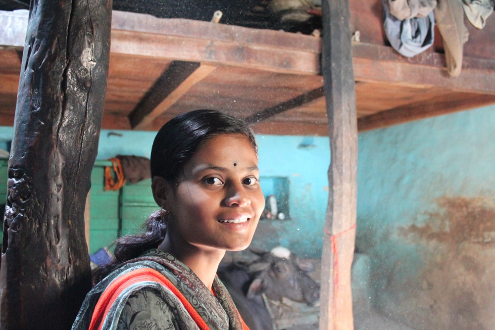

*\[Editor’s Note: A retweet in my Twitter stream took me to Andrea McLeod’s profile where I learned that she manages the fundraising and communication functions at Mumbai-based Somaiya Trust. A few tweets and DM’s later, Andrea and I got on the phone for a quick chat about [Help A Child](http://www.helpachild.in/home.aspx) – Somaiya Trust’s scholarship program for deserving college students from impoverished families.\]*

<figure aria-describedby="caption-attachment-176" class="wp-caption alignright" id="attachment_176" style="width: 300px">

<figcaption class="wp-caption-text" id="caption-attachment-176">A smiling Mahadevi: one of the 1000+ Help A Child scholarship recipients.</figcaption></figure>

There are innumerable civil organizations working in the sphere of early childhood education but not that many in higher education. Unlike college education in USA, which has a long established tradition of student loan programs, there’s a paucity of such programs in India. Banks do offer student loans but as a direct corollary of Below Poverty Line (BPL) families being financially excluded, these loans are harder to come by for the really needy students.

The inspiration for Help A Child was young Sujata Bisnal (from North Karnataka) whose family was caught in that quintessential and oft-repeating Indian dilemma in 2001 – either she start working after 10th grade or get married. Fortunately Somaiya Group chairman (Samir Somaiya) heard about her dilemma and offered to sponsor her education. Thus was born the idea for Help A Child and Sujata became the first student of the program.

In 2009, Help a Child crossed the milestone of sponsoring 1,000+ students and by the end of this year, they would have crossed the 2,000 milestone as well. Approximately 36% of their students are enrolled at the +2 level (also known as Pre-University Course in India). The rest are pursuing Bachelors degrees in diverse fields of study – B.A, B.Com, B.Tech, MBBS, and B.Ed to name a few. 53% of scholarship recipients are girls.

**Pairing &amp; Tracking**

Corporate and individual donations are evenly split at 50:50. For individual donors, Help A Child has an interesting *pairing* model where the donor can pick which aspiring student he wants to sponsor. The minimum sponsorship duration is usually one year and individual donors always have the option to stay paired with the current student. The money is disbursed to the student in stages throughout the year based on individual college’s procedures. The receipts are jointly signed by the student and college principal to encourage their participation in the scholarship program.

**Scholarship Criteria**

In initial years, the trust put out advertisements in colleges to drive awareness. Not anymore. The program currently reaches students in Bagalkot and Belgaum (Karnataka) and Satara, Ahmednagar, Mumbai &amp; Pune (Maharashtra). The qualification criterion for girls and boys is 70% and 75% respectively. The candidate selection for all regions (except Mumbai and Pune) comprises of three phases – interviews, house visits (to confirm low income levels), and a final decision using priority lists. The priorities are such that orphans are rated higher than applicants from single parent homes who in turn are rated higher than applicants who are working to support their families. In Mumbai and Pune, Help A Child works with NGO partners to select applicants.

**Student Placement &amp; Giving Back**

Anecdotally speaking, majority of Help A Child’s students secure jobs but Andrea mentioned that a survey has been formally commissioned to collect placement data from their students. A few grateful alumni (mostly engineering school graduates) have made voluntary financial contributions to Help A Child. It might be premature to call this a trend but it’s still an encouraging sign.

**Closing Thoughts**

If you were to ask the Indian intelligentsia,*What’s the surest way to lift millions of Indians out of poverty?* , chances are high that a large majority would answer: *Education*. So we need more programs like Help A Child and [Foundation for Excellence](http://ffe.org/). I daresay we also need programs like [Vittana](http://vittana.org/) and [Lumni](http://www.lumni.net/) (and a whole host of their copycats) to reach India.