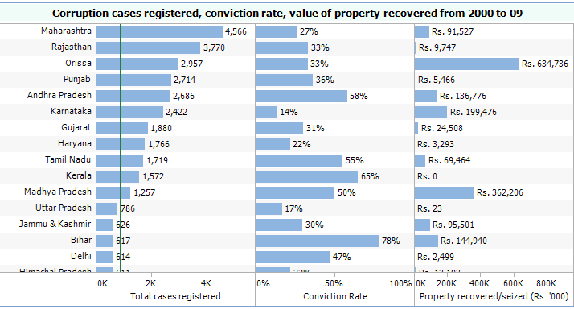
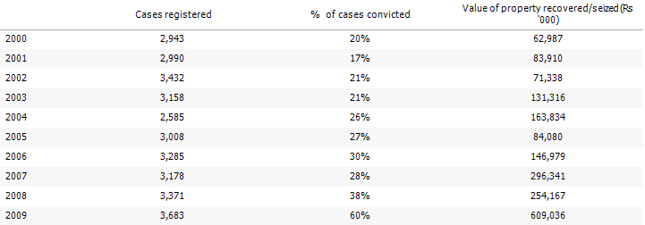
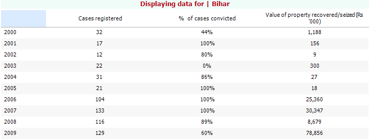
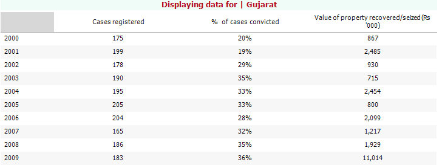

Our good friends at [PRS Legislative Services](http://prsindia.org/) took 10-years of corruption case data (2000-2009) from[ National Crime Records Bureau](http://www.ncrb.nic.in) and created a very useful visualization using Tableau. I’ll start off with some surprising observations before presenting the detailed graphical trends.

- The top 5 states, in descending order of total cases registered, are Maharashtra, Rajasthan, Orissa, Punjab, and Andhra Pradesh. The presence of Orissa and Punjab in the Top 5 surprised me.
- Bihar and Kerala have the highest conviction rate (78% and 65% respectively) in the ten year period.
- The greatest property recovered/seized was from Orissa (Rs. 635 million) and Madhya Pradesh (Rs. 362 million).

<figure aria-describedby="caption-attachment-181" class="wp-caption aligncenter" id="attachment_181" style="width: 714px">

<figcaption class="wp-caption-text" id="caption-attachment-181">Large states like UP &amp; Tamil Nadu with low case count: could also mean corruption in those states is more sophisticated.</figcaption></figure>

<figure aria-describedby="caption-attachment-182" class="wp-caption aligncenter" id="attachment_182" style="width: 721px">

<figcaption class="wp-caption-text" id="caption-attachment-182">2009 seems to be the standout year: 60% all-time high conviction rate and recovery of Rs. 609 million.</figcaption></figure>

<figure aria-describedby="caption-attachment-183" class="wp-caption aligncenter" id="attachment_183" style="width: 723px">

<figcaption class="wp-caption-text" id="caption-attachment-183">Rise in cases registered in 2006 correlates perfectly with Nitish Kumar's first tenure as Chief Minister.</figcaption></figure>

<figure aria-describedby="caption-attachment-184" class="wp-caption aligncenter" id="attachment_184" style="width: 728px">

<figcaption class="wp-caption-text" id="caption-attachment-184">Registered cases and conviction rate a flat line during Narendra Modi's tenure. Only oddity is the high recovery amount in 2009.</figcaption></figure>

You can play with the interactive visualization [here](http://public.tableausoftware.com/views/CorruptioninIndia/CorruptioninIndia?:embed=y&:tabs=no&:display_static_image=yes&:toolbar=yes&:display_spinner=yes&:animate_transition=yes&:display_overlay=yes&:host_url=http%3A%2F%2Fpublic.tableausoftware.com%2F).