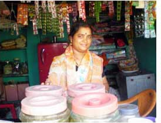
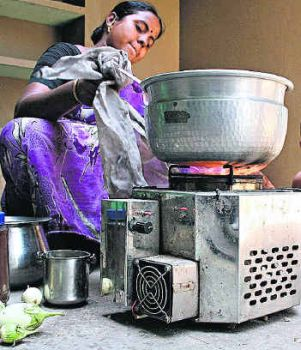

*\[Editor’s Note: I had a brief conversation with Upmanyu Patil (CEO of [Sakhi Retail](http://sakhiretail.com/?page_id=2)) on the sidelines of Sankalp Forum 2011. Last week, I followed up with a phone conversation. This post is the result of those conversations and related research.\]*

The parent organization of Sakhi Retail is Mumbai-based [Swayam Shikshan Prayog](http://www.sspindia.org/) (SSP) – an 18-year old NGO with roots in disaster relief and focus on women empowerment programs. SSP is among the growing legions of experienced NGOs that have internalized the benefits of social enterprises and re-organized themselves into appropriate legal entities for increased reach, sustainability, and impact. This internalizing didn’t happen accidentally. SSP’s Prema Gopalan participated in brainstorming sessions with management guru CK Prahalad and his business partner (Jeb Brugmann) to craft a business model that allowed village women to participate in, and benefit from, every aspect of commercial activities they would engage in. These discussions would ultimately result in the creation of two social enterprises (Sakhi Social Enterprise Network in 2006 and Sakhi Retail in 2009), a non-profit micro-finance organization (Sakhi Samudaya Kosh), and a community health trust (Sakhi Arogya Samudaya Trust).

**Oorja Story**

<figure aria-describedby="caption-attachment-190" class="wp-caption alignright" id="attachment_190" style="width: 301px">

<figcaption class="wp-caption-text" id="caption-attachment-190">The Oorja Stove</figcaption></figure>

The story of the *Oorja* stove is also the chronology of how Sakhi Retail was formed. In 2005, British Petroleum (BP) enlisted SSP to conduct research into safe eco-friendly energy options for rural households. A subsequent eighteen-month collaboration between rural women’s groups, BP Energy India, SSP, Covenant Center for Development (CCD), and Indian Institute of Science Bangalore (IISc) resulted in the creation of the *Oorja* – a smokeless biomass stove which used pellets (produced from a mush of corn cobs, coffee beans and sugar cane crush) as fuel.

Priced at Rs. 675, the *Oorja* has a chamber for burning pellets, a mini fan powered by rechargeable batteries, and is controlled by a regulator which blows air to fan the flames. The Oorja was commercialized by a BP-promoted entity (First Energy) in 2007. Two years later, a Pune-based firm with an interesting name (“The Alchemists Ark” ) obtained full stake in First Energy.

Since the target market for the Oorja stove was the millions of rural households using wood burning stoves, a rural distribution and marketing channel was the need of the hour. Enter Adharam Energy – a joint venture between SSP and CCD to stock and distribute the Oorja stoves and biomass pellets – in SSP’s operational areas (Maharashtra) and CCD’s base of operations (Tamil Nadu).

The Oorja stove and the biomass pellets were selling well but SSP wanted to broaden the distribution channel to include other products. The nature of the SSP-CCD partnership and BP’s own interests prevented that from happening within the Adharam Energy entity. Thus was born the new social enterprise entity (Sakhi Retail) in January 2009.

**Sakhi Retail Distribution Network**

Sakhi Retail’s distribution network comprises of 830+ female rural retail entrepreneurs (aka *Sakhis*) and seven warehouses with an operating reach of 630 villages in the Beed, Latur, Nanded, Osmanabad, and Solapur districts in Maharashtra. The *Sakhis* have been trained in entrepreneurship, sales and marketing by Sakhi Social Enterprise Network – the training arm of SSP.

Besides the Oorja stove and biomass pellets, other products sold by the *Sakhis* include Unilever’s Pureit and Godrej’s ChotuKool (innovative low-cost water purifier and refrigeration products targeted at BOP households), solar lanterns from D.Light, organic fertilizers, cattle feed supplement, and the Reuters Market Light SMS information service for farmers.

Sakhi Retail’s best selling products are biomass pellets, D.Light 550, and organic fertilizers. They are looking to expand the product portfolio to include products with recurring sales (i.e. more like the biomass pellets).

**Revenue &amp; Fundraising**

After two years of operations, Sakhi Retail has 17 employees and generates monthly revenue of 20 lakhs INR. The commission from manufacturers is in the 20-40% – split between the *Sakhis* (60%) and Sakhi Retail (40%).

Sakhi Retail has plans to expand both in terms of geographical footprint and product catalog breadth. While they are profitable today, they are actively seeking an investment partner for their expansion plans.