Our review post on [Travel Another India (TIA) – One Village at a Time](http://www.techsangam.com/2011/07/20/travel-another-india-one-village-at-a-time/) was published today. Here are the rest of the wonderful pictures.

**Rural Locales**

<figure aria-describedby="caption-attachment-203" class="wp-caption aligncenter" id="attachment_203" style="width: 300px">

[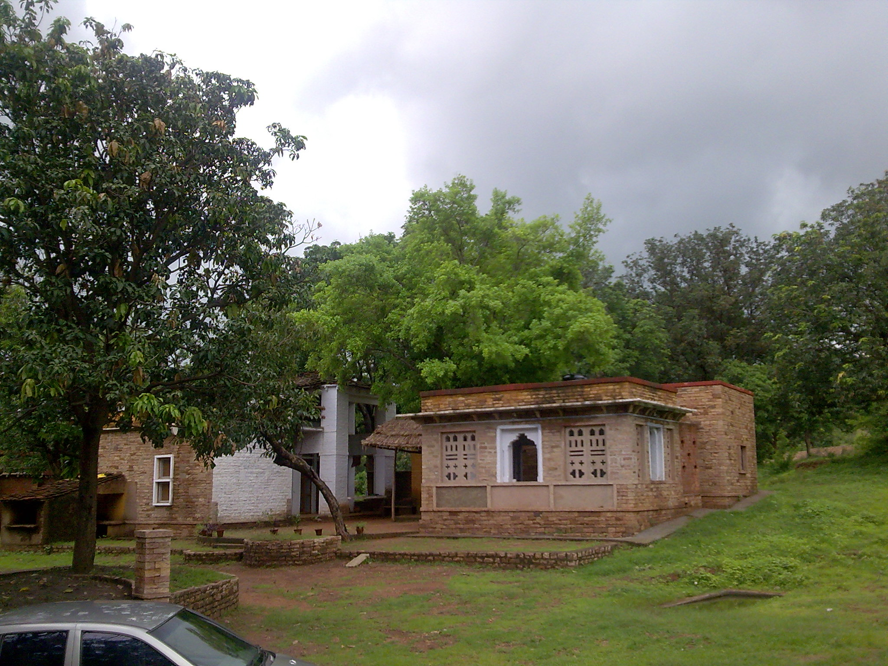](../../../../uploads/2011/07/Amraee-Rural-resort-Pranpur-MP.jpg)<figcaption class="wp-caption-text" id="caption-attachment-203">Amraee Rural resort in Pranpur (Madhya Pradesh)</figcaption></figure>

<figure aria-describedby="caption-attachment-205" class="wp-caption aligncenter" id="attachment_205" style="width: 300px">

[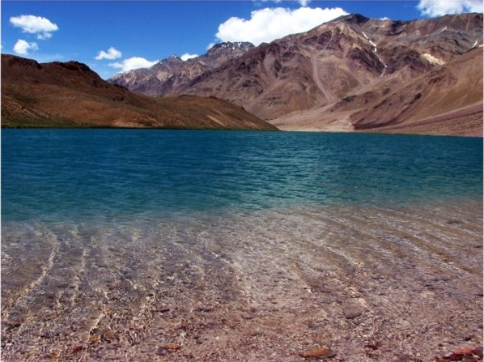](../../../../uploads/2011/07/clear-water-of-Chandra-taal-at-Spiti-Himachal-Pradesh.jpg)<figcaption class="wp-caption-text" id="caption-attachment-205">Chandra taal at Spiti, Himachal Pradesh</figcaption></figure>

<figure aria-describedby="caption-attachment-206" class="wp-caption aligncenter" id="attachment_206" style="width: 300px">

[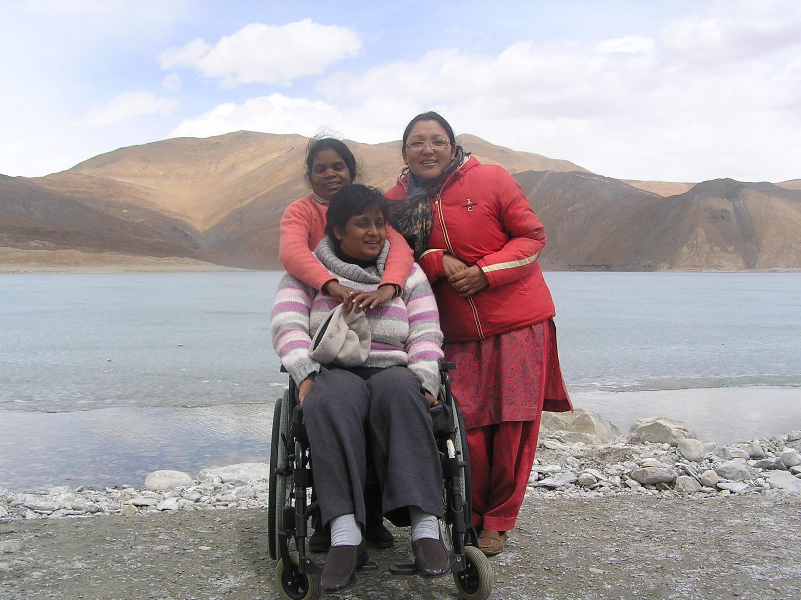](../../../../uploads/2011/07/Shivani-Gupta-Director-AccessAbility-at-Pangong-Lake-Ladakh-on-the-specially-ddesigned-inclusive-holiday-Himalaya-on-Wheels.jpg)<figcaption class="wp-caption-text" id="caption-attachment-206">Pangong Lake, Ladakh on the specially designed inclusive holiday (Himalaya on Wheels)</figcaption></figure>

<figure aria-describedby="caption-attachment-207" class="wp-caption aligncenter" id="attachment_207" style="width: 199px">

[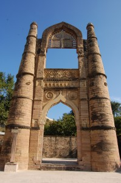](../../../../uploads/2011/07/Badal-Mahal-gate-Chanderi-madhya-Pradesh.jpg)<figcaption class="wp-caption-text" id="caption-attachment-207">Badal Mahal gate, Chanderi, Madhya Pradesh</figcaption></figure>

**Accommodations**

<figure aria-describedby="caption-attachment-209" class="wp-caption aligncenter" id="attachment_209" style="width: 300px">

[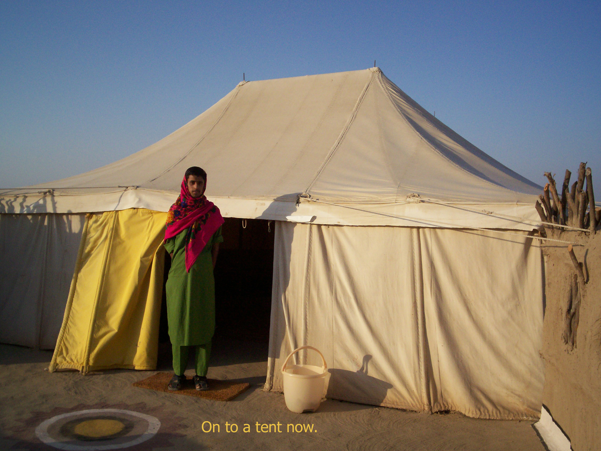](../../../../uploads/2011/07/the-tent-accomodation-at-Shaam-e-Sarhad-Hodka.jpg)<figcaption class="wp-caption-text" id="caption-attachment-209">Tent accomodation at Shaam-e-Sarhad, Hodka</figcaption></figure>

**Activities**

<figure aria-describedby="caption-attachment-211" class="wp-caption aligncenter" id="attachment_211" style="width: 300px">

[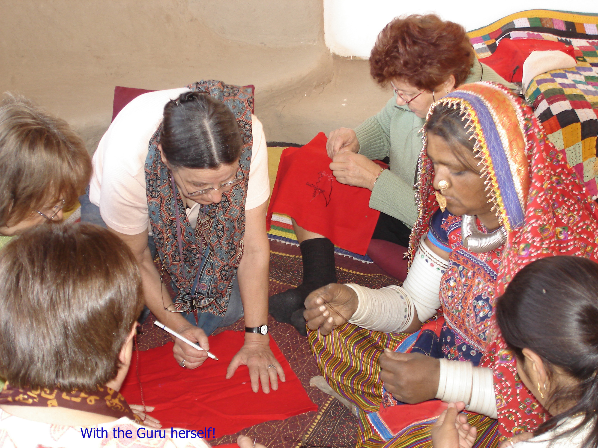](../../../../uploads/2011/07/a-guest-learning-the-craft-from-locals-Hodka-gujarat.jpg)<figcaption class="wp-caption-text" id="caption-attachment-211">A guest learning the craft from locals in Hodka, Gujarat</figcaption></figure>

<figure aria-describedby="caption-attachment-212" class="wp-caption aligncenter" id="attachment_212" style="width: 300px">

[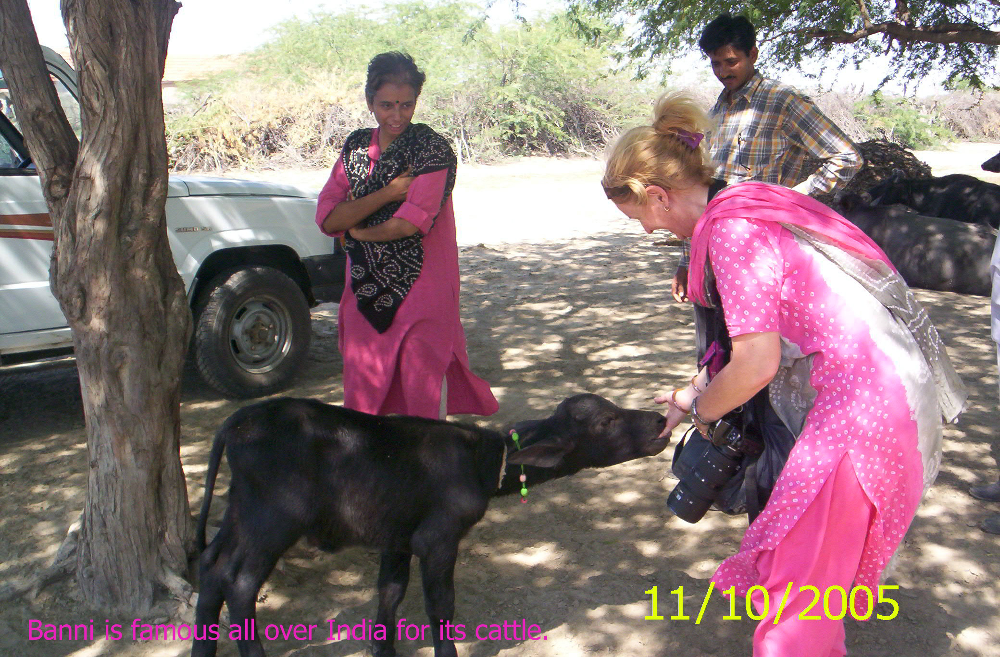](../../../../uploads/2011/07/a-guest-playing-with-a-goat-in-Hodka.jpg)<figcaption class="wp-caption-text" id="caption-attachment-212">Guest playing with a goat in Hodka</figcaption></figure>

<figure aria-describedby="caption-attachment-213" class="wp-caption aligncenter" id="attachment_213" style="width: 300px">

[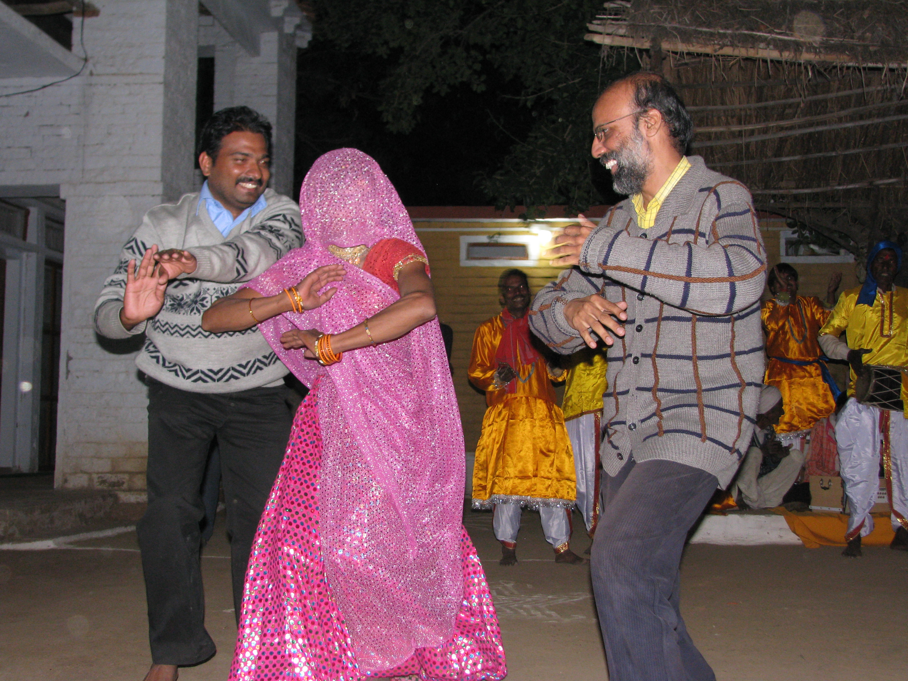](../../../../uploads/2011/07/Guests-participating-in-the-local-dance-Pranpur-madhya-pradesh.jpg)<figcaption class="wp-caption-text" id="caption-attachment-213">Guests participating in the local dance - Pranpur, Madhya Pradesh</figcaption></figure>

<figure aria-describedby="caption-attachment-214" class="wp-caption aligncenter" id="attachment_214" style="width: 300px">

[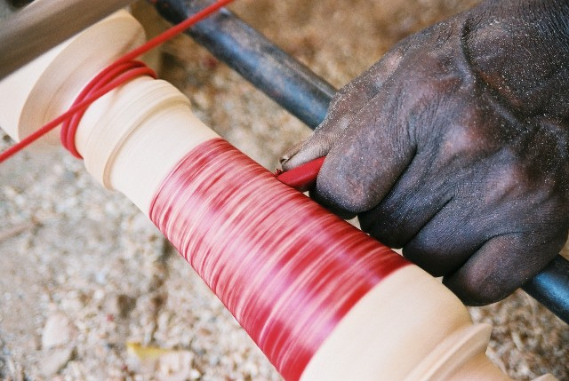](../../../../uploads/2011/07/making-bangles-from-lac-Hodka.jpg)<figcaption class="wp-caption-text" id="caption-attachment-214">Making bangles from lac in Hodka, Gujarat</figcaption></figure>

<figure aria-describedby="caption-attachment-215" class="wp-caption aligncenter" id="attachment_215" style="width: 300px">

[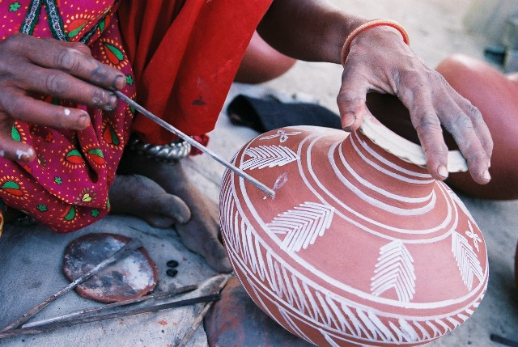](../../../../uploads/2011/07/painting-a-pot-Hodka.jpg)<figcaption class="wp-caption-text" id="caption-attachment-215">Painting a pot - Hodka, Gujarat</figcaption></figure>

<figure aria-describedby="caption-attachment-216" class="wp-caption aligncenter" id="attachment_216" style="width: 300px">

[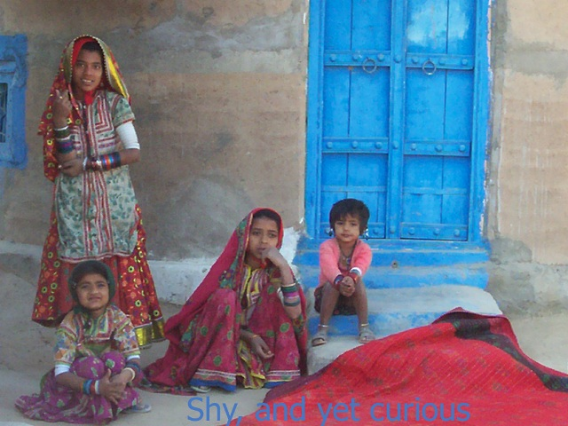](../../../../uploads/2011/07/villagers-in-Hodka.jpg)<figcaption class="wp-caption-text" id="caption-attachment-216">Villagers in Hodka</figcaption></figure>