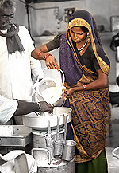
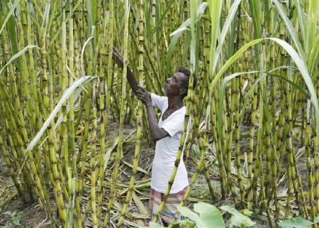

*\[Editor’s Note: This is part 2 of *a 7-part series on commodity cooperatives in drought prone regions, originally authored **as a pre-published paper** by* Dr. Trilochan Sastry (Academic Dean, IIM-Bangalore and social entrepreneur/activist). Dr. Sastry is shaping a new model for farmer owned-and-run commodity cooperatives in Andhra Pradesh through Center for Collective Development (CCD), a Hyderabad-based NGO he founded in 2003. Part 1 in this series was [Commodity Cooperatives in Drought Prone Regions](http://www.techsangam.com/2011/07/29/commodity-cooperatives-in-drought-prone-regions-part-1/).\]*

<figure aria-describedby="caption-attachment-231" class="wp-caption alignleft" id="attachment_231" style="width: 150px">

<figcaption class="wp-caption-text" id="caption-attachment-231">Scene from a typical village milk cooperative</figcaption></figure>

The two sectors where cooperatives have thrived on a large scale are dairy and sugarcane. Other agricultural commodity cooperatives have not seen such widespread success. One natural question therefore is, why have cooperatives not flourished in other sectors? There are external factors, as described in [Part 1](http://www.techsangam.com/2011/07/29/commodity-cooperatives-in-drought-prone-regions-part-1/), where the legal framework places obstacles. But there are other more fundamental differences which we explain below.

In the case of milk, we see successful cooperatives all over the world. Milk as a food has hardly any substitute – compared to say groundnut or soya – where several competing foods can be used. Milk demand remains steady and milk prices also remain fairly steady over the year. Other agriculture commodities show very high price fluctuations over the year – sometimes as much as 100%. The risk faced by a farmer or cooperative is therefore much higher.

Milk is also produced every day and is a perishable commodity. A dairy farmer cannot do anything with the surplus milk except sell it to the cooperative. However a groundnut farmer can keep the produce at home (if he has the financial muscle) and sell it when the prices rise. So his incentive to give his produce to the Cooperative is not so great. However, this is a relatively minor issue. The major issue is the frequency of interactions between a member and the cooperative. A member of a dairy cooperative interacts with the cooperative twice a day. Groundnut, on the other hand, is produced only once a year. Theoretically, a member of a groundnut marketing cooperative needs to interact only one day in the year. This is one fundamental reason non-dairy cooperatives in such regions are much harder to establish. For a vibrant cooperative, members must interact regularly with the cooperative, pouring milk, getting payments, attending meetings, electing their office bearers, scrutinizing accounts and so on. The interaction in groundnut (or any other single crop commodity) cooperatives is not so regular. This means that *institutionalizing* the cooperative will take far longer – as much as five years. Institutionalizing means a situation where members own the cooperative, both financially and psychologically.

Due to this very infrequent interaction between members and the cooperative, the scope for mid course correction is not there. For instance, in a new dairy cooperative, members may have a tendency to add water to the milk. However, the quality assessment is set up in such a way, that there is a heavy penalty for adding water. Within a short period, perhaps a week, a new member realizes that it is in her interest not to add water. However in a groundnut cooperative, if a farmer adds stones or mud, or does not bring in good quality produce, he may be penalized, but he can only correct himself next year. Meanwhile, he will quarrel with the cooperative’s office bearers, and harbor a feeling of injustice and badmouth the cooperative to others in the village. The only way to overcome this is to prevent this from happening. This means a lot more effort has to be made during the *social mobilization process* to educate members about the quality requirements, and make it clear that there will be penalties.

As said earlier, milk prices are steady. Commodity prices vary a lot from week to week and month to month. This places a much more difficult problem before the cooperative: what price do you pay the member when he brings in the produce? If the price later goes below the promised price, then there will be a loss, farmers will quarrel and the cooperative will be under a lot of strain.

When a farmer pours milk, each time she is pouring a very small proportion of her yearly production into the cooperative. On the other hand, when a farmer brings his entire annual produce to the cooperative, he has to bet in one shot that the cooperative will bring him greater benefits. Risking the entire annual agricultural income with the cooperative is not easy, especially for those who are poor. The risk taking capacity of the poor is very low in such situations. In the initial years he has to trade off a known source of income, the local trader, however much he cheats him, to a new concept that may or may not work.

Thus milk is perishable, produced daily, and its prices are steady. Only small quantities are poured every day. Agricultural commodities on the other hand are not as perishable, are produced once a year, and prices fluctuate a lot.

<figure aria-describedby="caption-attachment-232" class="wp-caption alignright" id="attachment_232" style="width: 300px">

<figcaption class="wp-caption-text" id="caption-attachment-232">A sugarcane farmer working his field.</figcaption></figure>

The other major success story in Cooperatives in India is sugarcane. It is not really a good comparison since it is an irrigated crop. Though it shares some of the problems of say a groundnut cooperative, it has one characteristic that is different – it is highly perishable. If it is not processed within 24 hours of harvesting, sugar cannot be extracted from it. This means that even a big farmer has no choice but to send his produce to the sugar cooperative’s factory. Sugarcane farmers in general are much better off than dry land farmers in drought prone regions. They are far more unlikely to be in the clutches of money lenders and in any *tied sale* type of arrangement. In addition, the surplus from the cooperative is attractive enough for him not to seek alternative markets for his produce.

Part 3 of this series continues here – [Establishing commodity cooperatives ](http://www.techsangam.com/2011/08/04/establishing-commodity-cooperatives-social-mobilization/)– social mobilization.