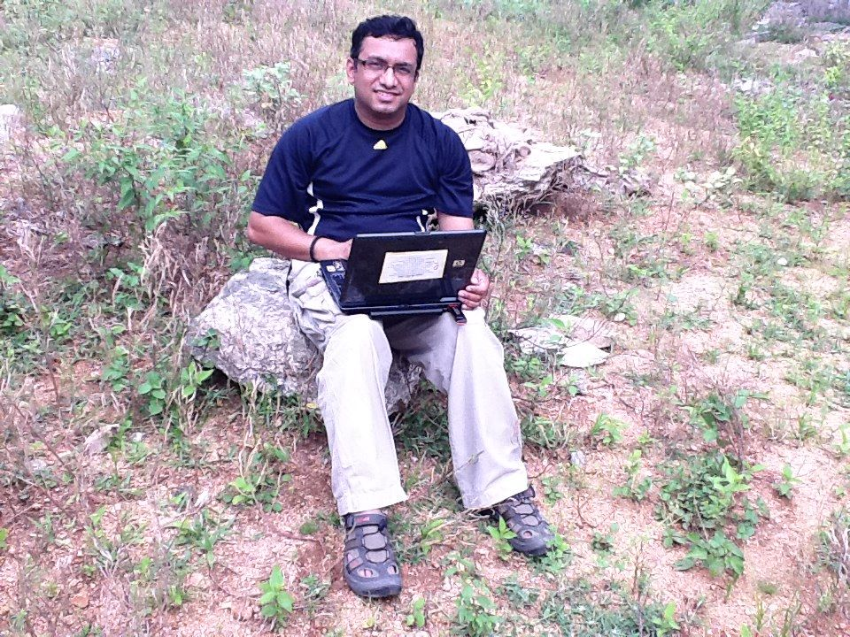
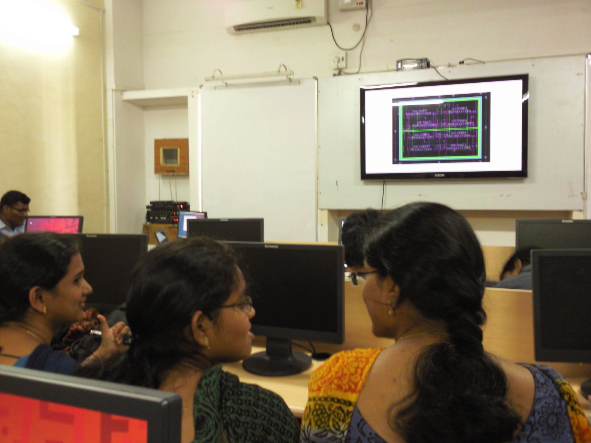
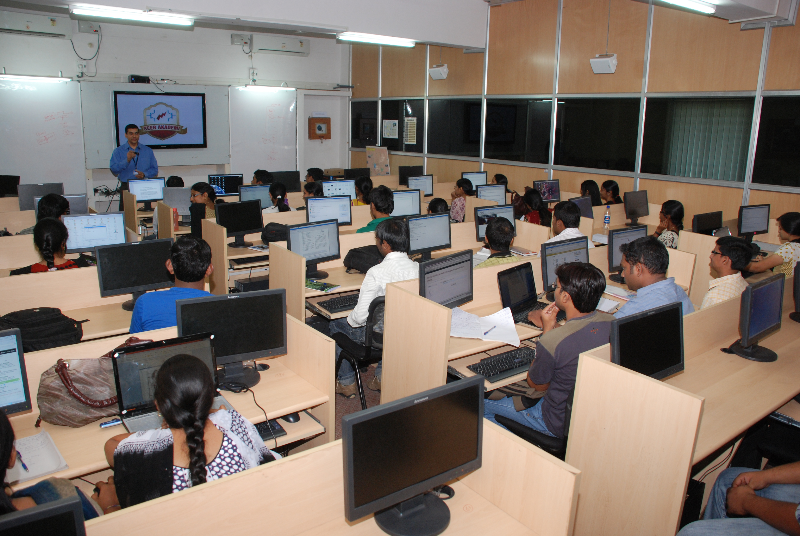

<figure aria-describedby="caption-attachment-234" class="wp-caption alignleft" id="attachment_234" style="width: 300px">

<figcaption class="wp-caption-text" id="caption-attachment-234">Srikanth Jadcherla, CEO of Seer Akademi, successfully using webex in a remote rural school in Nalgonda District.</figcaption></figure>

*\[Editor’s Note: Srikanth Jadcherla is a serial entrepreneur straddling the worlds of Silicon Valley, Bangalore and Hyderabad. After selling his 3-year old Bangalore-based chip design automation company (ArchPro Design &amp; Automation) to Synopsys in 2007, he moved back to Silicon Valley where, two years later, he started [Seer Akademi](http://seerakademi.com/index.htm), incorporated in California with offices in Bangalore and Hyderabad. When I spoke by phone with Srikanth 6 weeks ago, he and his family were living out of suitcases, having just shipped their belongings to Hyderabad. He and his family relocated to Hyderabad last week.\]*

[Geek Nation](http://www.amazon.co.uk/Geek-Nation-Indian-Science-Taking/dp/1444710141)‘s Angela Saini writes about legions of Indian engineering school students who *stare blankly, uninterested, at professors. If the lecture doesn’t help them pass their engineering exams, they don’t want to know*. These are not your garden-variety students – they are studying at the legendary Indian Institute of Technology. The overarching leitmotif of Geek Nation is that India’s geek credentials are alive and kicking but the march to *geekdom* (especially in engineering disciplines) is happening *in spite* of the education system. A tinkering culture, so essential for inquiring innovating minds, is singularly lacking in the Indian education system. Saini points to the Technocracy club at IIT-Delhi as the early stirrings of an underground revolution. *Technocracy provides a space for tinkering with gadgets and learning new computing languages without the pressure of tests. Of the sixty-one patents granted and 205 pending patent applications filed by IIT students and staff in its fifty-year history, forty were made in just the last year.*

Srikanth Jadcherla undertook his own journey into the world of engineering education in India – a staggering two-year journey where he visited **228** colleges across 11 states. An electronics engineering alumni of IIT-Madras and UC-Santa Barbara, Srikanth learned first-hand that the state of engineering education, specifically in electronics/VLSI, was in a pathetic state of affairs (and that’s putting it mildly). Srikanth shared one example, which illustrates how different the US and Indian education systems are. Last year, University of Michigan’s Education department received a grant of $23 million to research new learning paradigms. Meanwhile most Indian educators don’t know what a cognitive model is.

The inspiration from 2008, followed by a series of successful pilots gave Srikanth and his compatriots the impetus to start Seer Akademi – a global classroom with an online+local model for educational delivery. Seer Akademi’s vision is to ***make India self-sufficient in electronics through education, research and enterprises***. Seer Akademi’s flagship offering is a two-year Masters degree program with a curriculum that includes 12-15 courses and a project, styled around the US teaching model of lecture hours not exceeding 35% (remainder of the time assigned for assignments and practicals).

<figure aria-describedby="caption-attachment-235" class="wp-caption alignright" id="attachment_235" style="width: 300px">

<figcaption class="wp-caption-text" id="caption-attachment-235">Students in an IC Design class where remote professor is discussing a design.</figcaption></figure>

Seer offers the Masters degree via revenue-sharing partnerships with local Indian universities. Seer faculty, which includes experts from industry and universities in the fields of VLSI and embedded systems design, is responsible for teaching, evaluating assignments and projects. Faculty members from the local university set and conduct examinations. Seer uses a simulcast/Webex model for lecture delivery and interactions so their faculty size doesn’t need to increase as they add new Indian university partners. However, local faculty and teaching assistants do grow – about 2 per location are needed to run the program. Srikanth’s recruitment pitch to the Seer Akademi faculty (most of whom are Indian immigrants in US) was simple: *Do it for India*. Clearly they are committed to the cause because they routinely conduct lecture sessions from 8pm to 11pm, followed by student interaction sessions that extend to 1am US time.

<figure aria-describedby="caption-attachment-236" class="wp-caption alignleft" id="attachment_236" style="width: 300px">

<figcaption class="wp-caption-text" id="caption-attachment-236">Seer Akademi classroom with a local professor kicking things off.</figcaption></figure>

Seer currently runs India’s only enterprise grade VLSI lab with 24×7 remote access. It’s also the only institution in India with a published incubation investment template and guaranteed funding for its students up to the prototype stage. Seer is funded by private investors (including Srikanth himself). Srikanth is proud of the fact that the average experience (not age) of their management team is 27 years.

Within a relatively short period, Seer Akademi has made a ton of progress. During their pilot phase (2009-10), they conducted a certification program which reached almost 100 students – whoever succeeded in getting an A grade was offered placement assistance. The roster of affiliated institutes offering the Masters program is fast approaching 10.

What I love about Seek Akademi is that US-style higher education – with all its trappings (cutting-edge faculty, emphasis on practical applications, entrepreneurial vigor) – has come to India, in a sector that’s long been a laggard. The students at the Seer Akademi partner universities don’t need to create IIT-Delhi-style Technocracy clubs because… that culture is already embedded in their Masters program. Now it’s up to these universities to create a nation of electronics geeks.

Also read [UC Berkeley Brings Continuing Education to India via Partnership with Seer Akademi](http://www.techsangam.com/2011/12/18/uc-berkeley-brings-continuing-education-to-india-via-partnership-with-seer-akademi/)