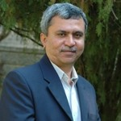

*\[Editor’s Note: This is part 3 of *a 7-part series on commodity cooperatives in drought prone regions, originally authored **as a pre-published paper** by* Dr. Trilochan Sastry (Academic Dean, IIM-Bangalore and social entrepreneur/activist). Dr. Sastry is shaping a new model for farmer owned-and-run commodity cooperatives in Andhra Pradesh through Center for Collective Development (CCD), a Hyderabad-based NGO he founded in 2003. Part 2 in this series was [How commodity cooperatives differ from milk or sugar cooperatives](http://www.techsangam.com/2011/08/01/how-commodity-cooperatives-differ-from-milk-sugar-cooperatives/).\]*

- Part 1: [Commodity cooperatives in drought prone regions](http://www.techsangam.com/2011/07/29/commodity-cooperatives-in-drought-prone-regions-part-1/)
- Part 2: [How commodity cooperatives differ from milk or sugar cooperatives](http://www.techsangam.com/2011/08/01/how-commodity-cooperatives-differ-from-milk-sugar-cooperatives/)

It is clear that a different approach is needed to establish commodity cooperatives. On the one hand poverty levels are high, and on the other hand, the market expertise required to establish them is higher since prices fluctuate. We discuss several different aspects of promotion under two broad categories – social mobilization and business. The former includes aspects like enrolling members, training and capacity building of members and leaders, role of trust and leadership, the role of subsidies and grants, rights and duties of members and leaders, the crucial role of *member stakes* (which we explain later). The latter includes well known aspects of running any business, including understanding of markets, quality, finance, deployment of funds, payment of bonus, retention of reserve funds, moving up the value chain and so on.

We delineate the various stages of promotion into four categories:

1. The early stage when a promoting organization enters a totally new territory where no one knows them
2. The growth stage when they try to cover nearby villages in subsequent seasons
3. The expansion stage when requests start coming from new villages to come and help them establish a cooperative
4. The value adding stage when food processing and branding takes place.

These stages are merely indicative and not water tight. For instance, value addition and expansion can go hand in hand. An organization with a track record in one region could go to a new region and quickly go to the *value adding stage* in the very first season. In this note, we only discuss the early and growth stages, and the kind of social mobilization that is more likely to work.

**Social Mobilization**

A well functioning cooperative delivers benefits to members on a regular basis. For this to occur, the business must be viable. At the same time, members must be united and mutually agree to abide by the rules they set for themselves. Lack of unity can lead to factions, quarrels and disputes, and in extreme cases, the closure of the cooperative.

Unity of purpose is possible only with trust. In the early stage, the first requirement is establishing trust. A cooperative cannot function without it. Members must trust the cooperative and vice versa. They must trust the outside agency that intervenes. In the current scenario, the very word cooperative carries a whole lot of negative connotations. The village level Primary Agricultural Cooperative Societies (PACS) are what farmers think of when the word cooperative is used. It does not inspire any confidence in them. Very often the small and marginal farmers are in the clutches of money lenders. They also see corruption at various levels – the Government officials, the local Panchayat leaders, the siphoning off of funds from various Government schemes and so on. This creates a peculiar atmosphere of distrust. Potential members think: can I really risk my entire produce to this new Cooperative? In the first two to three years, the membership will perhaps be small with only a few relatively well off farmers joining the cooperative.

External promoting agencies often make two types of mistakes in the early stage. One is to spend a lot of time describing the benefits of cooperation – the loss of income due to cheating by local traders, the higher prices available by selling at the right time in the right markets and the extra bargaining power due to having bulk quantities. Farmers quickly understand all this. They wonder how a cooperative will help overcome their problems, how it will run and whether this is really feasible. That doubt needs to be addressed in the initial stages. Often local trusted leadership can mobilize members far more effectively than any amount of impassioned pleas and arguments made by committed professionals working in external organizations promoting cooperatives. In the very initial days of Amul, it was the well respected local farmer-leader, Tribhuvandas Patel who enrolled members in large numbers, not Verghese Kurien. Mulkanur Cooperative in a sense went one step ahead, since the local leader, Vishwanath Reddy did not have any political or NGO backing. He was able to establish a well running commodity cooperative in 1955 because local farmers trusted him. It is still running today, nearly 25 years after he passed away. Some of the early members said later “we did not understand what he meant by a cooperative at that time. We simply trusted him.† If today it is difficult to find leaders like Tribhuvandas and Vishwanath Reddy, there are still more modest options. A local retired school teacher, or a well educated young man can sometimes fill the gap. How to allow them to emerge is a more subtle concept, and we discuss this later in the context of member stakes.

Part 4 of this series continues here – [Establishing commodity cooperatives – perils of using funds to mobilize people](http://www.techsangam.com/2011/08/08/establishing-commodity-cooperatives-perils-of-using-funds-to-mobilize-people/).