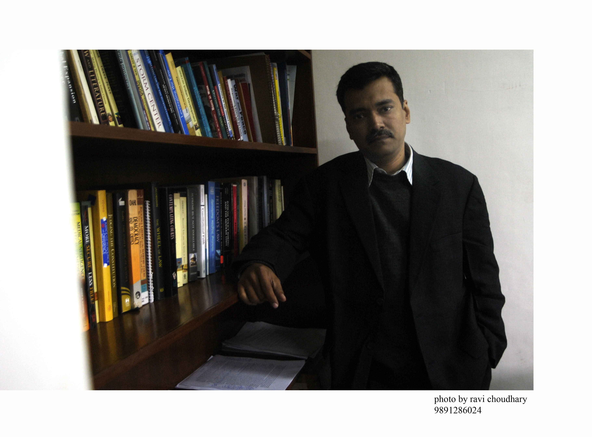
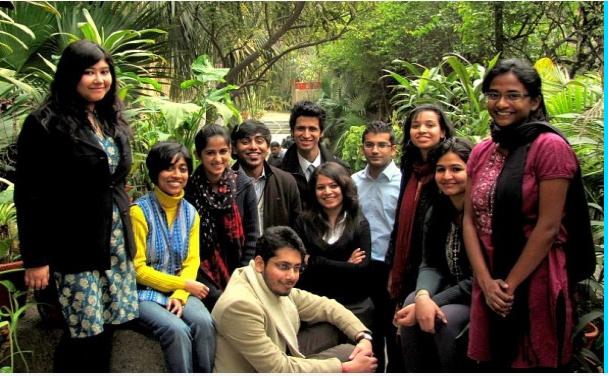

*\[Editor’s Note: It’s a pleasure to bring TechSangam’s first guest post, on PRS Legislative Research (PRS), from Yogesh Upadhyaya. Yogesh is co-founder of banking and financial services software startup FinEng, which he sold to 3i Infotech Limited in 2010 after ten successful years of operation. Here’s how Yogesh describes his association with PRS – “The founders of PRS are close friends. Regular interaction with them has given me a good insight into the work of PRS. This insight was enhanced when I did a couple of projects for them developing a five-year strategy and assistance in developing the outreach function. However, I still am enough of an outsider to not be bashful while praising the organization.” \]*

<figure aria-describedby="caption-attachment-248" class="wp-caption alignleft" id="attachment_248" style="width: 300px">

<figcaption class="wp-caption-text" id="caption-attachment-248">CV Madhukar (PRS co-founder and Echoing Green, Ashoka, and Eisenhower Fellow)</figcaption></figure>

**Imagine** that you are a newly elected member of the Lok Sabha. The year is 2004. Well-educated and motivated individual that you are, you decide to prepare yourself for your new job. You know that the bills that would come in the parliament in the next few years would be very diverse and complex. They would include new laws or amendments on Information technology (IT), food processing, limited liability partnerships and Right to Information to name just a few. You have a rudimentary idea on these topics and know that these can be far- reaching bills. You want to know more.

Your first step is to go the parliamentary library. The folks there are very helpful and give you a compilation of press clippings from the past six months on each of the topics. This is useful but you are wary of relying entirely on the expertise of newspaper reporters. You have observed gaps in the knowledge of reporters. Especially on topics where you know a little bit.

You then think of approaching an interested party. For example, you could talk to representatives of the food processing industry to get more understanding of issues surrounding the bill on food processing. However, there are two problems with such an approach. Firstly, you are reasonably sure that you would not get an unbiased view. Secondly, on some bills like Right to Information there aren’t too many industry bodies who could offer even biased advice. **You come to the sobering realization that you are supposed to make laws for more than one billion people without much in the way of help.**

It was in this context that CV Madhukar, one of the two founders of PRS, thought of the organization. He connected with Dr. MR Madhavan, then a Senior Currency Strategist for Asia region at Bank of America in Singapore, and together they started PRS in 2005.

The organization was incubated in the Centre for Policy Research with funding from the Ford Foundation. **One of the key early decisions made by the founding team was that PRS would provide only facts and analysis about issues in any new law.** **There would be no opinions from the analyst or the organization.** The aim was and still is to make the debate in the parliament more informed and not influence it. Thus for example, if PRS is presenting an analysis on The Limited Liability Partnership Bill, it would explain key provisions and maybe present similar laws in other key countries. It would also state what the potential benefits and pitfalls of key provisions could be. It would however, never say if the Bill or any specific provision is good or bad.

“Not providing an opinion has been one of our core principles since beginning,” Madhukar told me a few year back, “It is sometimes difficult to explain why we do this. It is even more difficult to be analytically good but make sure that we have not expressed an opinion even inadvertently. However, this principle has been a significant contributor to the trust we enjoy with Members of Parliament (MPs). They know that we are there to help them and not influence them.”

PRS does enjoy a lot of trust with MPs. A quick visit to the website of PRS ([www.prsindia.org](http://www.prsindia.org/)) shows that many MPs and other luminaries have whole- heartedly endorsed the work of PRS. What is remarkable is that the endorsements are from a cross section of MPs. MPs from the ruling Congress, the Bharatiya Janata Party (BJP), the Communist Party of India (CPI) and even parties with only one MP have praised the analytical depth and responsiveness of PRS.

“Many a times I have explained our research on a complex issue to a group of MPs from different parties. It is not uncommon to find members of BJP sitting together with CPI members and helping each other understand.”  Madhavan, Head Research told me, “Of course, their view on the legislation could be diametrically different from each other after the discussion! **But the difference is one of opinion and not on facts**.”

THAT is the essential value proposition of PRS – it has become a trusted source of facts and analyses for the parliamentarians. Once there is a common understanding on facts, the discussion becomes that much more productive. Reminds me of how the ferocity and duration of my own arguments on cricket with my friends has reduced with the easy availability of Internet and online databases.

<figure aria-describedby="caption-attachment-249" class="wp-caption alignright" id="attachment_249" style="width: 300px">

<figcaption class="wp-caption-text" id="caption-attachment-249">LAMP Fellows 2010-11</figcaption></figure>

PRS has taken up many other initiatives around the workings of the parliament. This year it would be recruiting, training and supporting a fifty-member team as Legislative Assistants for Members of Parliament (LAMP). These LAMPs are graduates of some of the best colleges in India who have decided to spend eleven months with individual MPs to provide them research support. Before PRS started this program, there wasn’t any research support program for MPs in India. In contrast, every United States Senator gets monetary support to employ 15-20 researchers.

PRS also initiated a program to consolidate the legislations from different state governments in one place – [www.lawsofindia.org](http://www.lawsofindia.org/). This initiative has gone live and is the only place where you can find all the laws of 27 states of India.

Another interesting initiative of PRS has been to track the contribution of MPs in parliament. The **MP Track section** of PRS website allows a visitor to see the actual text of interventions, questions and speeches made in the parliament. I was pleasantly surprised to learn that the MP representing my constituency in Mumbai had vigorously intervened in many debates on suburban railways. PRS is currently enhancing this facility to enable topic-level search.

What next?  This is a question that has been asked to Madhukar and Madhavan many times and is one I have been personally associated with.

**“An MP has four major roles in Parliament – making laws, oversight of the government, sanctioning and monitoring government finances, and representing the interests of the constituency**.” Madhavan has the habit of breaking into impromptu civics lessons at times, “We are right now supporting only the first one systematically. We want to build capabilities to systematically support the next two roles.”

These were also the recommendations of a pro-bono McKinsey study commissioned by PRS on the path it should take in the next few years. Senior members of the global consulting firm that volunteered for the assignment appreciated the achievements of PRS and urged it do much more. They recommended that PRS provide research and analysis on effectiveness of policies as well as provide research support to Members of state legislatures. PRS has also been asked to significantly increase its communications with the citizens of India.

“The thinking is that the quality of debate within the parliament would be significantly impacted by the quality of debate outside. This means providing our analysis and information to the electronic and print media and also directly to citizens.” Madhukar tells me, “That is the premise of our outreach function.”

What can WE do to help? I ask Madhukar the same question that I get asked every time I talk about PRS.

“First and foremost, be informed of happenings within the parliament. The parliament has the dual role of making laws as well as keeping a check on the executive and is a very important institution for our democracy.”  Madhukar promptly replies. “There are many channels of such information. PRS has products and services on the Internet, email, Facebook and Twitter in addition to working through many on-line and off-line newspapers. People could use those or any other credible sources of information to be more informed.”

“Additionally,”  Madhukar continues,”We would soon be launching an initiative with partner organizations that involve more directly with our projects.”

I have asked Madhavan and Madhukar the million dollar question. Do organizations like PRS matter? It is all very well to provide institutional support to MPs but do the politicians care? The answer is a surprisingly unambiguous yes.

“Even today, if you go behind the headlines, the quality of work done in parliament is very good. This is when most MPs work under the handicap of having to rely on government for data and the more serious issue of thousands of calls on their time.”  Says Madhukar, “A large number of MPs work very hard to prepare for their parliamentary duties. And this is when most of their constituents, including the very educated ones, are almost unconcerned with what their representative does in parliament. So yes, better institutional support does matter.”

In spite of the tremendous economic progress made by India in the last twenty years, I think that there is no guarantee that we will make a transition to a developed country in the foreseeable future.. There is no guarantee that the lives of millions of people who live in abject poverty without access to opportunities will change for the better. There is no guarantee that our institutions would work in a way that make us proud all the time and not sporadically. But, surely institutions such as PRS help tip the scale ever so slightly?