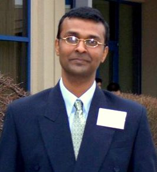
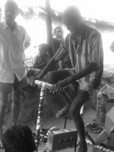

*\[Editor’s Note: An early blog subscriber and friend clued me onto an energy inclusion social enterprise started by one of her classmates from University of Michigan’s Ross School of Business. The entrepreneur is Ashish Gawade and the enterprise is [BOPEEI](http://www.bopeei.in/). This blog post is based on my phone conversation with Ashish and related research.\]*

<figure aria-describedby="caption-attachment-252" class="wp-caption alignleft" id="attachment_252" style="width: 266px">

<figcaption class="wp-caption-text" id="caption-attachment-252">Ashish Gawade (co-founder &amp; CEO of BOPEEI)</figcaption></figure>

How often have we joked about harnessing a 6-year old’s boundless energy to solve the world’s energy crisis! Okay… so this post is *not* about that invention but rest assured that if someone comes up with that solution, we’ll definitely write about it on this blog.

Now that we’ve dispensed with the rare joke that this post has been fortunate enough to garner, let’s switch to the main topic on hand – off grid electricity. Early in this blog’s journey, we wrote [why India needs to give more love to off-grid power](../2011/03/21/why-india-needs-to-give-more-love-to-off-grid-power/). Solar and wind energy are the top sources of renewal energy globally so it’s no surprise that India has an ambitious plan to increase energy production from these sources. But what about perennially cloudy areas and hilly regions that receive sporadic sunlight?

Enter BOPEEI (Bottom of Pyramid Energy &amp; Environmental Innovations), a Pune-based social enterprise co-founded by Ashish Gawade and Aniruddha Atre (graduates of University of Michigan’s Ross School of Business) in Apr 2008. The duo has invented an innovative pedal-operated generator (Chakra Generator) that can charge LED-based lamps with a mere 10-12 minutes of pedaling.

When Ashish and Aniruddha came up with the idea and created a prototype, the big question was whether people would actually pedal. The answer from their market research was YES – a whopping 95% of their target customers were willing to pedal! Armed with the crucial validation, the duo charged ahead with their plans to take the concept to market.

<figure aria-describedby="caption-attachment-253" class="wp-caption alignright" id="attachment_253" style="width: 226px">

<figcaption class="wp-caption-text" id="caption-attachment-253">Chakra Pedal Generator in action (with a Prakhar lamp plugged in)</figcaption></figure>

The BOPEEI lighting system comprises of the Chakra Pedal Generator and two rechargeable lamps. The Chakra Generator, priced at 7,000 INR (rural) and 8,000 INR (urban), has been designed for shared usage among multiple families – sweet spot expected to lie between 10 and 30 families. Based on the assumption that the Chakra Generator would be used for 5 hours daily, its projected lifetime is 10 years – BOPEEI founders pride themselves on their “Build Ford Tough”  lineage. The Prakhar 50 operates for 10 hours before requiring a recharge and its light intensity is 27X more than a candle. The Prakhar 100 is brighter than the 50 (with light intensity 45X more than a candle) and is good for 4 hours. The Prakhar 50 and Prakhar 100 are priced at 780 INR and 999 INR respectively.

BOPEEI’s lamps are currently being used in 250 homes in Rural Pune district, Kolhapur, and Konkon. With an Aug 2011 target to manufacture 50 lamps and 10 chakra generators per day, BOPEEI is ready for the post-pilot phase – to reach their initial target customers in Konkon, Western Maharashtra, and Arunachal Pradesh. Their big ambitious plan is to reach 10 lakh households within 5 years and they realize that they need good distribution partnerships (and some funding) to execute on that plan.

<figure aria-describedby="caption-attachment-254" class="wp-caption alignleft" id="attachment_254" style="width: 233px">

<figcaption class="wp-caption-text" id="caption-attachment-254">Prakhar 50 - up close!</figcaption></figure>

Ashish is pretty clear that BOPEEI’s core competency is in ***energy storage* and fast charging**. While their initial go-to-market strategy centers on the pedal-driven Chakra Generator, they’ll likely have other products (like support for solar panels) in future.

*\[If you’ve been a regular reader of this blog, you’d have noticed that I haven’t talked about the entrepreneur’s backstory yet. For some odd reason, the story just seemed to flow better having it at the end instead of the customary beginning. Read on.\]*

Ashish’s heart was always gravitating towards helping people. This predilection became stronger through his association with [Manashakti Center for Peace of Mind](http://www.manashakti.org/) – an organization with an interesting blend of spirituality and scientific inquiry. During their years at University of Michigan, Ashish and his friend/co-founder Aniruddha were influenced heavily by CK Prahalad. By the time they graduated, they were both convinced that their entrepreneurial effort simply *had to* target the Bottom of Pyramid. The ‘*what’ * manifested itself within the first year of Ashish’s return to Pune once he became aware of the staggering number of rural households that did not have access to electricity.

Seeing how big a ‘Prahalad fan’  Ashish was, I was curious about his take on the [Prahalad vs. Karnani debate](../2011/03/31/the-various-connotations-and-implications-of-bop-bottom-of-pyramid/). Ashish had a pithy response – *The debate can go on forever but Prahalad was the first one to point out how the MNCs should *look at and respect the poor as consumers. As usual, the beauty of Prahalad is that he didn’t just do the theory,* **he made the world follow his theory – that’s the nub**!*