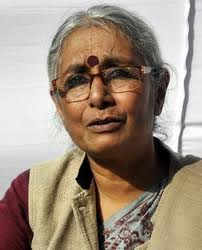

<figure aria-describedby="caption-attachment-1576" class="wp-caption alignleft" id="attachment_1576" style="width: 202px">

<figcaption class="wp-caption-text" id="caption-attachment-1576">Aruna Roy (Founder - MKSS, NCPRI and National Advisory Council member) - Pic courtesy thehindu.com</figcaption></figure>

This Saturday as I drove to the grocery store to pick up my wife and kids, I was pleasantly surprised that Radio Indigo (Bangalore’s rock radio station) was airing an interview with Ashwin Mahesh and Prithvi Reddy (two leading social activists associated with [Saaku](http://saaku.in/) (Karnataka Against Corruption), an ‘affiliate’ organization to Anna Hazare’s [India Against Corruption](http://www.indiaagainstcorruption.org/) movement). In recent weeks, I had not been paying close attention to the divergence between the Government-drafted Lok Pal and Team Anna’s Jan Lokpal so the well-articulated views from Ashwin and Prithvi were a great refresher on the topic. Some nostalgia about KQED/NPR/Terri Gross followed by wistful thoughts on “Why can’t Bangalore get a similar listener-supported radio station” but… that’s a different post.

I first wrote about the [Anna Hazare affair](http://ulaar.wordpress.com/2011/04/12/the-curious-and-unexpected-affair-of-anna-the-hazare/) a few days after the ruling UPA government came to an ‘agreement’ with Hazare. I was deeply skeptical about the Jan Lok Pal and the ethics and morality of precedent-setting fasts-unto-death. My position on these views hasn’t changed in the past 4 months. If anything, my views are stronger now.

The Indian National Interest’s (INI) FAQ post [Why Anna Hazare is wrong and Lok Pal is a bad idea](http://acorn.nationalinterest.in/2011/08/14/faq-why-is-anna-hazare-wrong-and-lok-pal-a-bad-idea/) answers 12 questions related to the Anna Hazare debate and I’m in strong agreement. As I followed the discussion on Twitter, I wondered aloud how it came about that Aruna Roy and Arvind Kejriwal, who were at the center of the Right to Information Movement and notably didn’t need to resort to fast-unto-death blackmail theatrics to get the RTI bill passed, were now using these very tactics for the Jan Lokpal.

Turns out, I had missed a crucial detail. Aruna Roy (and Mazdoor Kisan Shakti Sangathan) were NOT part of Team Anna — from the very beginning. In a candid Tehelka interview, Aruna Roy (who also wears the hat of a National Advisory Council member) opens up about the reasons why she (&amp; MKSS) didn’t join Team Anna. She characterizes Team Anna’s hardline position as “democratically immature” and, along with her colleagues from NCPRI (National Campaign for People’s Right to Information), believes that a plenipotentiary central Jan Lokpal is definitely NOT the way to fight corruption. She also expresses serious reservations on fasting in general and specifically she doesn’t think it’s right to dictate that Parliament should pass a Bill by a certain date.

Most importantly, Aruna Roy and her NCPRI colleagues have proposed an alternative to the Jan Lok Pal, what they are calling a **basket of measures**. The key design goal of their plan is to have a multiplicity of decentralised institutions, to avoid the concentration of too much power, especially unaccountable power, in any ONE institution or authority. This July 23 Tehelka piece, [Lokpal – an option without a fast or fuss](http://www.tehelka.com/story_main50.asp?filename=Ne230711lokpaal.asp) gets into the nitty gritty of the basket of measures.

The rest of this post are key excerpts (italicized) from Aruna Roy’s Tehelka interview:

*The trouble is, Team Anna is trapped in the trapeze act of hard positions necessary to keep the issue hot and theatre of interest alive (in an electronic era, the challenge is not just to grab attention but to sustain it). Yet, it also wishes to seem open and receptive to suggestions on changing its draft law. These are untenable positions: how can they deride the government for not accepting the Jan Lokpal draft exactly as they have conceived it and yet keep changing and improving it themselves at the same time? How can it urge other civil society stakeholders to send in suggestions for improvement yet insist they will not change the basic structure of their draft or consider any alternatives no matter what the rationale? What kind of corralled debate is this? And why take to the streets before all the finer deliberations were done and a satisfactory draft Bill was ready? Why shoot before you have picked the best cannon?*

*Nothing can be totally right or totally wrong and one does not know what further nuancing might arise out of an open debate but I think it’s democratically and politically immature to demand that one take a simplistic and black-and-white position on this. This is what governments have always been doing with us. You are seen as either with them or against them. For instance, if you fought for land rights you were described as a Maoist and a votary of violent revolution. We cannot do the same thing ourselves, but we are. We are not allowing ourselves the luxury of the rich debates and nuanced thinking that has been our strength. Pluralism has been the strength of so-called civil society. We cannot sacrifice that. I don’t care what happens to the government but it’s wrong for the people of this country, it’s wrong for democracy and that’s why we have decided to speak from the NCPRI.*

*The point is, if you reduce big complex issues to their simplest formulations, it will of course invoke a strong response and this is always a tightrope walk. Slogans and simplistic formulations are important at one level to galvanise public involvement and get more visibility but that is just a small percent of the aim. If you reduce the public discussion on the Jan Lokpal Bill to its most common minimum and then ask everyone else to take a position based on that, it becomes a travesty. How many people have really read either drafts or thought deeply about any alternative approaches to the same goal? If you ask people whether they want a strong curb on corruption or want to hold the powerful to book, the answer will naturally and rightly be yes, but the deeper questions and issues involved in lawmaking are much more difficult to solve.*

*As far as fasting goes, again, this is a democracy and every citizen should be allowed to protest peacefully in whatever way they want. The government has no right to stop Anna Hazare’s fast. Having said that though, over the years the MKSS has revised its position on fasts as a strategy of protest. Irom Sharmila has been on a fast for 10 years, Medha (Patkar) has been on so many fasts, sometimes to little avail because there’s been no media attention and no response from government. Why should one protest in a way that de-energies and harms oneself? Perhaps the Hazare team does not have that worry because there is enough media attention tied into their campaign. But I don’t think it’s right to dictate that Parliament should pass a Bill by a certain date. It sets a bad precedent. If another set of people comes tomorrow and says, you must amend the Constitution as we demand, what do you do? So I’d say abiding by due process but sustaining continual moral pressure on the government to see the Bill is passed by the winter session after enough deliberation and discussion would seem a more reasonable option.*

*Nikhil (Dey) and I wrote a piece in Outlook where we had cautioned that in its current form, the Lokpal could become a Frankenstein’s monster. It is too large and trying to take on too many simultaneous powers and responsibilities and no matter what new institution you set up, ultimately it will become bureaucratic, so you have to put in the necessary checks and balances, and you have to decentralise the power to curb corruption rather than concentrate that power in a few — or new — hands. This concern should not be misunderstood: remember Frankenstein’s monster was created by a good man who didn’t have any evil ideas but what he created became evil.*

*For me, the framework of the Jan Lokpal Bill as it stands now does not have commonsensical wisdom. See, the RTI got accepted by a cross-section of people — that is why it got space. You can’t say that integrity or honesty only lies in the hands of people outside government. We all know so many corrupt NGOs, even corrupt people’s movements, corrupt professionals, corrupt judges, lawyers, jurists, teachers, professors, academics, and of course, corporations, so it is not tenable to be holier than thou. If corruption is across the board then we have to build alliances across the board to weed it out. The struggle is to resurrect and correct existing institutions, not only create a fresh one.*

*Our other key argument with the Jan Lokpal Bill is over democracy itself. You know how easily one can become almost fascist in this country under its democratic overlay. To prevent that, one has to make sure the parliamentary process and legislative process is strengthened. If there is something wrong with that process, we have to cleanse it and that’s why electoral reforms is very important, Right To Information is very important, even the Lokpal is very important. But if you bypass the institution or the right of a ministry to formulate a Bill, you create very serious worries. In that sense, by creating the Joint Drafting Committee, the government has set a precedent. Tomorrow, if three lakh RSS workers want a Joint Committee to look at changing the Constitution into a theocratic one, will there be space for them? Or a particular community comes in a large majority and demands reservation, will it be possible to set it up? These are questions we have to ask ourselves.*

*In any case, as a woman and a feminist, I believe the process is as important as the end result. As a Gandhian, I’d say the means and ends have to match. You cannot bypass a process. Instead of having referendums and TV debates that reminds one of cock-fights, we should be asking for a rich and nuanced debate. After all, the country is a collective responsibility for all of us; not just the government alone, nor just of us alone. So, it has got to be a collective looking at how it should function and what are the real impediments. And if there are some real concerns and impediments — even from the government side — we should take cognisance of it. Otherwise we will suggest a plan that will never get off the ground. Then we must bear the blame for proposing a law that was so badly drafted or so lacking in common sense that it failed. It might be very good in its ideological positions, but it would fail completely in its commonsensical application. If that happens, the law will not be used. In a country like ours, everything begins with plurality.*

If you’re still reading this post, then you absolutely must read the complete Tehelka interview – [The Third Flight Path](http://www.tehelka.com/story_main50.asp?filename=Ne130811COVERSTORY.asp).

Aug 16 Update: Another must-read article is Pratap Bhanu Mehta’s [Thuggish State, Unreasonable civil society](http://www.indianexpress.com/news/time-to-step-back/832365/0).