I’m still halfway through my post on Greenway Grameen Infrastructure ([published here](http://www.techsangam.com/2011/08/18/greenway-smart-stove-a-cleaner-smarter-stove-for-150-million-bop-households/)). The Greenway Grameen Infra crew has done a fair amount of market research and have amassed a veritable photo collection that shows the diversity of mud *chulhas* (stoves) being used in different parts of India. I present to you those pictures (courtesy Greenway Grameen Infra).

<figure aria-describedby="caption-attachment-258" class="wp-caption aligncenter" id="attachment_258" style="width: 720px">

[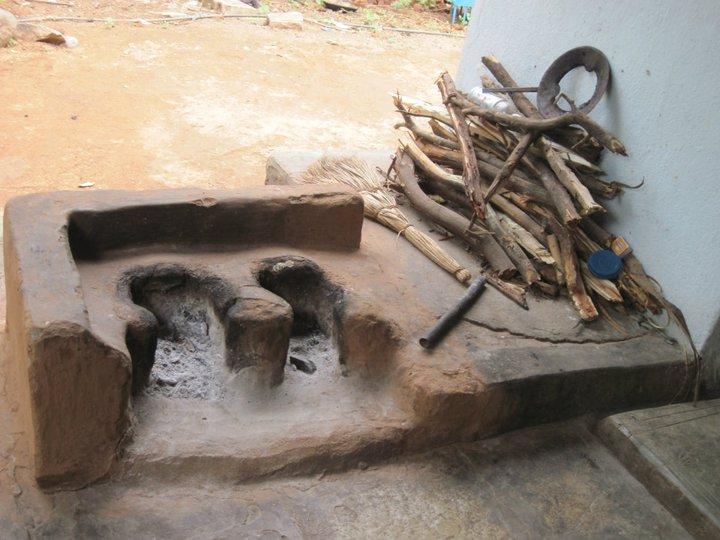](../../../../uploads/2011/08/chulha_ap.jpg)<figcaption class="wp-caption-text" id="caption-attachment-258">Mud chulha in Andhra Pradesh</figcaption></figure>

<figure aria-describedby="caption-attachment-259" class="wp-caption aligncenter" id="attachment_259" style="width: 720px">

[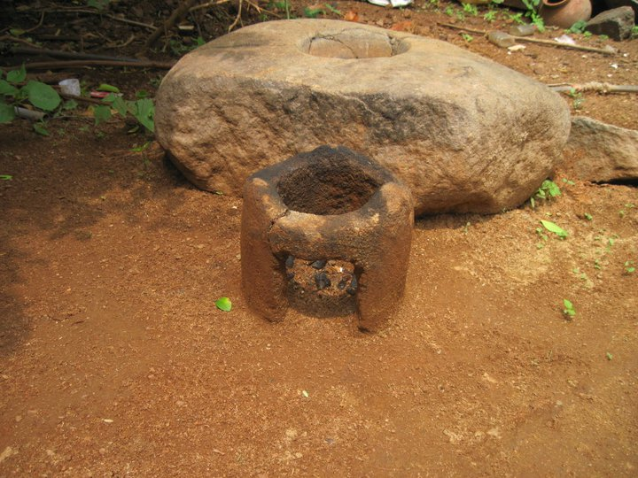](../../../../uploads/2011/08/chulha2_ap.jpg)<figcaption class="wp-caption-text" id="caption-attachment-259">Another mud chulha in Andhra Pradesh</figcaption></figure>

<figure aria-describedby="caption-attachment-260" class="wp-caption aligncenter" id="attachment_260" style="width: 752px">

[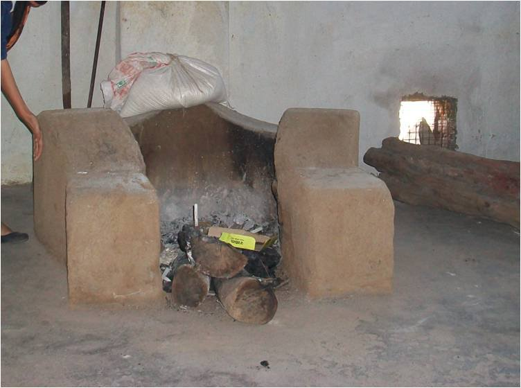](../../../../uploads/2011/08/chulha_anandwan_ma.jpg)<figcaption class="wp-caption-text" id="caption-attachment-260">Chulha in Anandwan, Maharashtra</figcaption></figure>

<figure aria-describedby="caption-attachment-261" class="wp-caption aligncenter" id="attachment_261" style="width: 720px">

[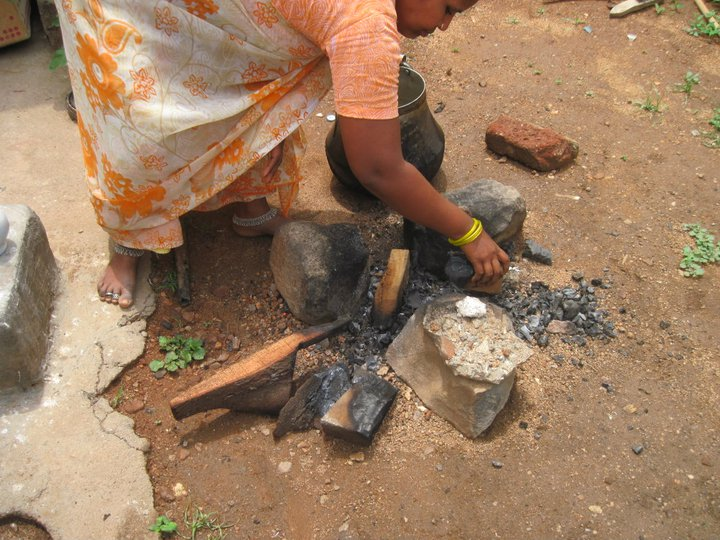](../../../../uploads/2011/08/chulha_karimnagar_ap.jpg)<figcaption class="wp-caption-text" id="caption-attachment-261">Chulha in Karimnagar, Andhra Pradesh</figcaption></figure>

<figure aria-describedby="caption-attachment-265" class="wp-caption aligncenter" id="attachment_265" style="width: 916px">

[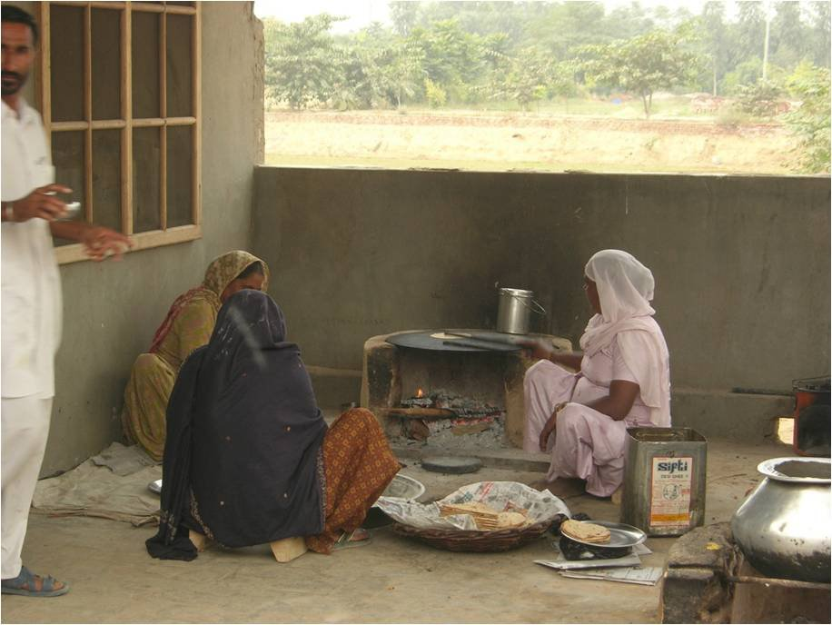](../../../../uploads/2011/08/chulha_kotbhai_giddarbaha_pb.jpg)<figcaption class="wp-caption-text" id="caption-attachment-265">Chulha in Kotbhai village in Giddarbaha mandal of Punjab</figcaption></figure>

<figure aria-describedby="caption-attachment-266" class="wp-caption aligncenter" id="attachment_266" style="width: 300px">

[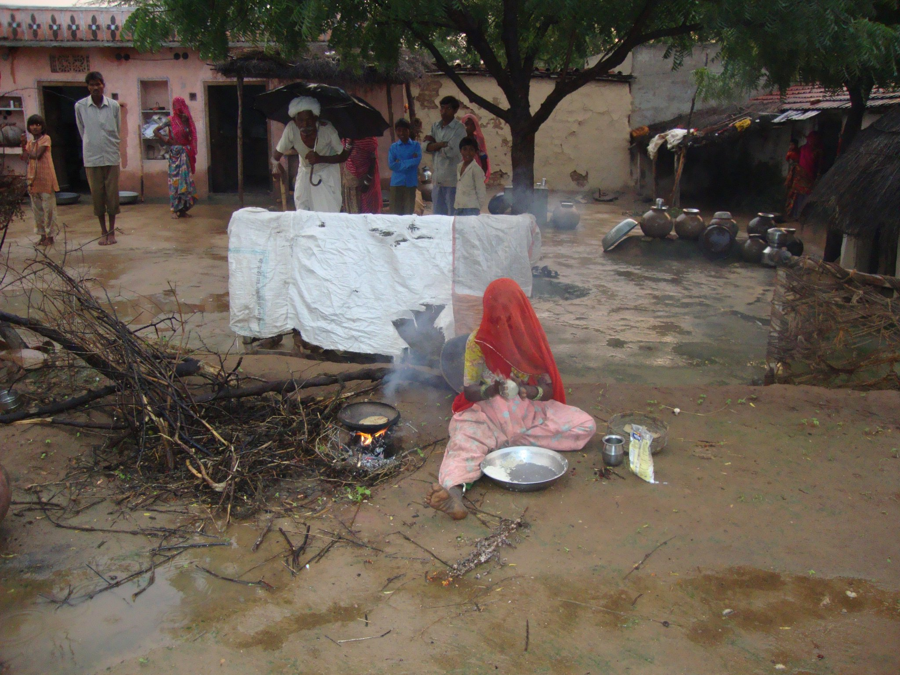](../../../../uploads/2011/08/chulha_madela_pali_rj.jpg)<figcaption class="wp-caption-text" id="caption-attachment-266">Chulha in Madela village in Pali district, Rajasthan</figcaption></figure>

<figure aria-describedby="caption-attachment-267" class="wp-caption aligncenter" id="attachment_267" style="width: 300px">

[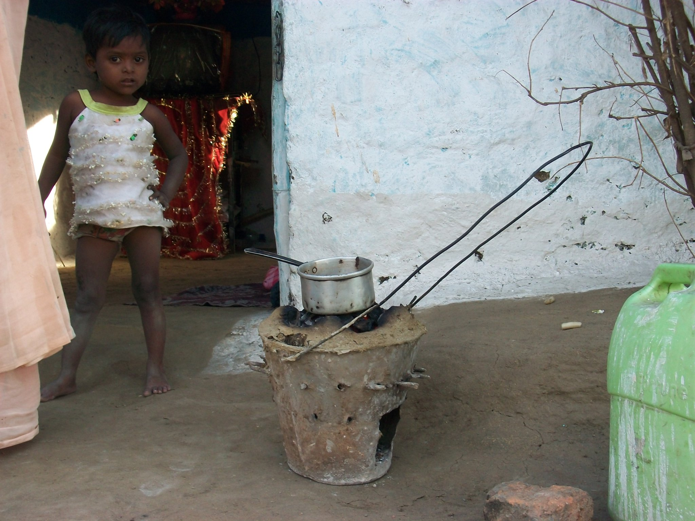](../../../../uploads/2011/08/chulha_metal_meets_mud_warora_ma.jpg)<figcaption class="wp-caption-text" id="caption-attachment-267">'Metal meets mud' chulha in Warora, Maharashtra</figcaption></figure>

<figure aria-describedby="caption-attachment-268" class="wp-caption aligncenter" id="attachment_268" style="width: 300px">

[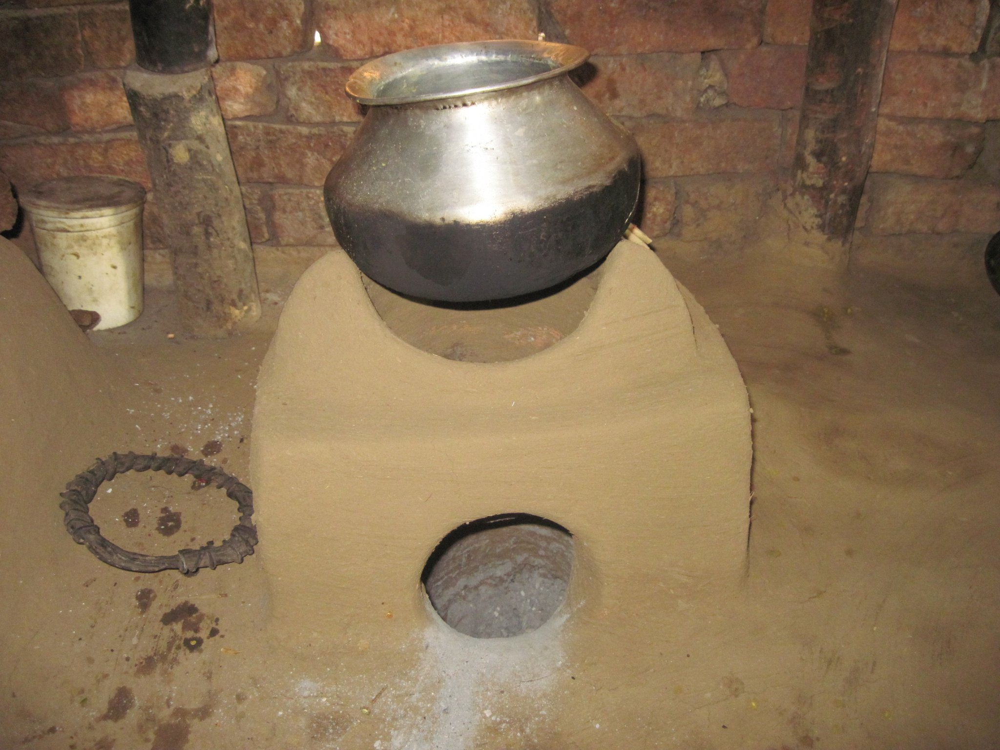](../../../../uploads/2011/08/chulha_natai_baran_rj.jpg)<figcaption class="wp-caption-text" id="caption-attachment-268">Chulha in Natai village in Baran district, Rajasthan</figcaption></figure>

<figure aria-describedby="caption-attachment-269" class="wp-caption aligncenter" id="attachment_269" style="width: 300px">

[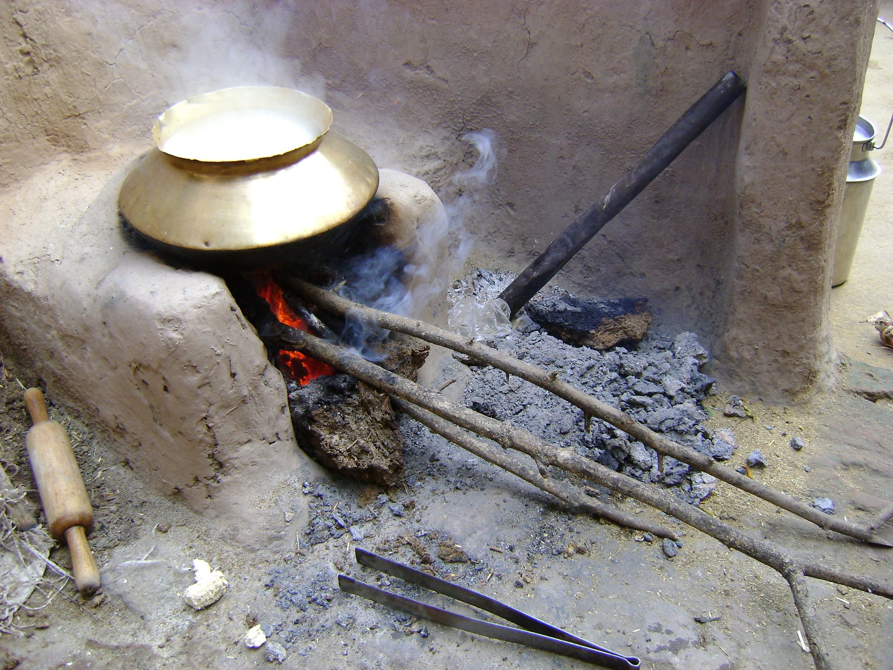](../../../../uploads/2011/08/chulha_nawanshahr_pb.jpg)<figcaption class="wp-caption-text" id="caption-attachment-269">Chulha in Nawanshahr, Punjab</figcaption></figure>

<figure aria-describedby="caption-attachment-270" class="wp-caption aligncenter" id="attachment_270" style="width: 300px">

[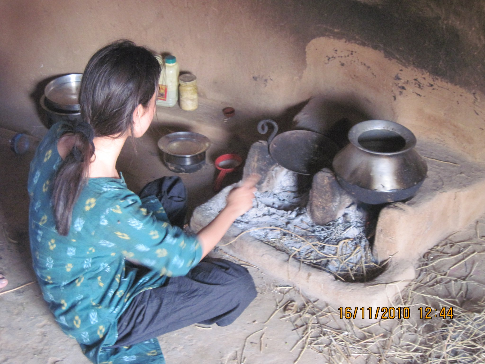](../../../../uploads/2011/08/chulha_rawra_rj.jpg)<figcaption class="wp-caption-text" id="caption-attachment-270">Chulha in Rawra, Rajasthan. Also in pic: Neha Juneja (Greenway Grameen co-founder)</figcaption></figure>

<figure aria-describedby="caption-attachment-271" class="wp-caption aligncenter" id="attachment_271" style="width: 538px">

[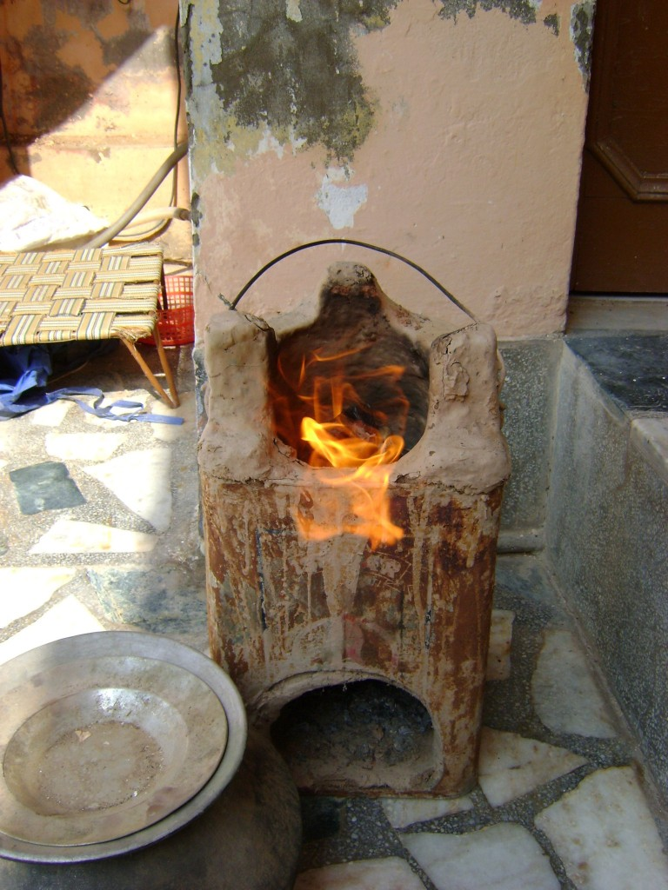](../../../../uploads/2011/08/chulha_rupnagar_pb.jpg)<figcaption class="wp-caption-text" id="caption-attachment-271">Chulha in Rupnagar, Punjab</figcaption></figure>

<figure aria-describedby="caption-attachment-272" class="wp-caption aligncenter" id="attachment_272" style="width: 300px">

[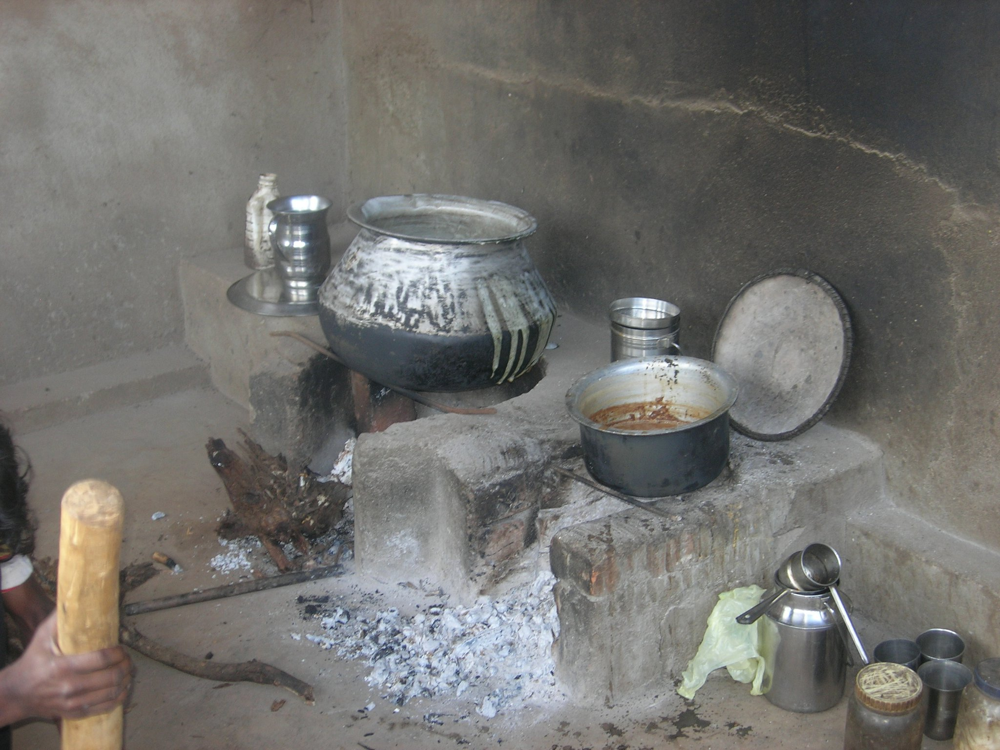](../../../../uploads/2011/08/chulha_shivpuri_mp.jpg)<figcaption class="wp-caption-text" id="caption-attachment-272">Chulha in Shivpuri, Madhya Pradesh</figcaption></figure>

<figure aria-describedby="caption-attachment-273" class="wp-caption aligncenter" id="attachment_273" style="width: 300px">

[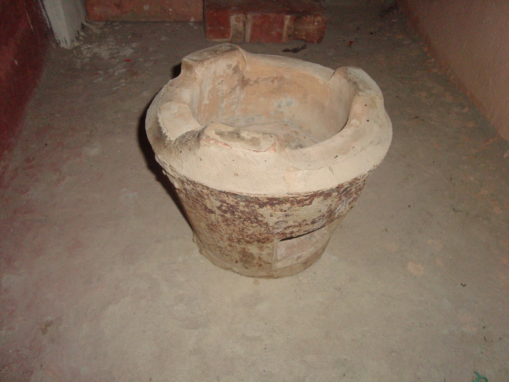](../../../../uploads/2011/08/chulha_ukhrul_manipur.jpg)<figcaption class="wp-caption-text" id="caption-attachment-273">Artistic chulha in Ukhrul, Manipur</figcaption></figure>

<figure aria-describedby="caption-attachment-274" class="wp-caption aligncenter" id="attachment_274" style="width: 300px">

[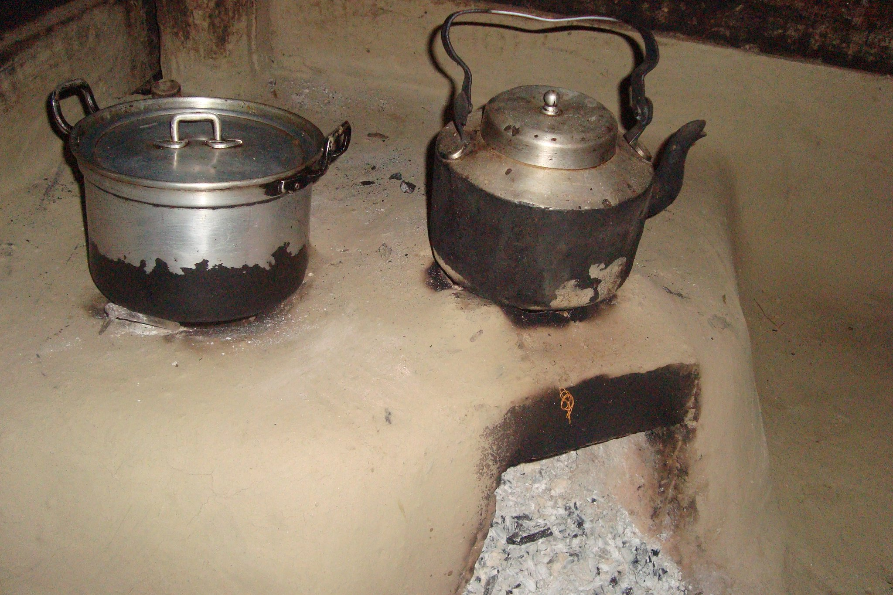](../../../../uploads/2011/08/chulha_ukhrul2_manipur.jpg)<figcaption class="wp-caption-text" id="caption-attachment-274">Multi-burner chulha in Ukhrul, Manipur</figcaption></figure>

<figure aria-describedby="caption-attachment-275" class="wp-caption aligncenter" id="attachment_275" style="width: 640px">

[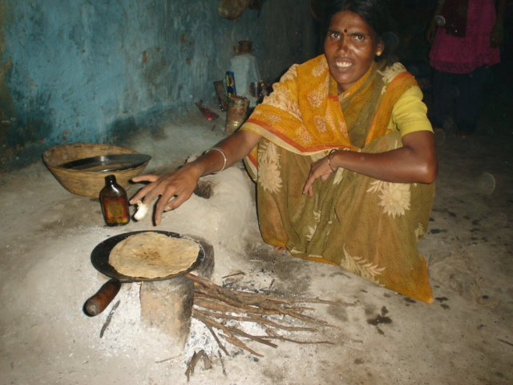](../../../../uploads/2011/08/chulha_wardha_ma.jpg)<figcaption class="wp-caption-text" id="caption-attachment-275">Chulha in Wardha, Maharashtra</figcaption></figure>

<figure aria-describedby="caption-attachment-276" class="wp-caption aligncenter" id="attachment_276" style="width: 300px">

[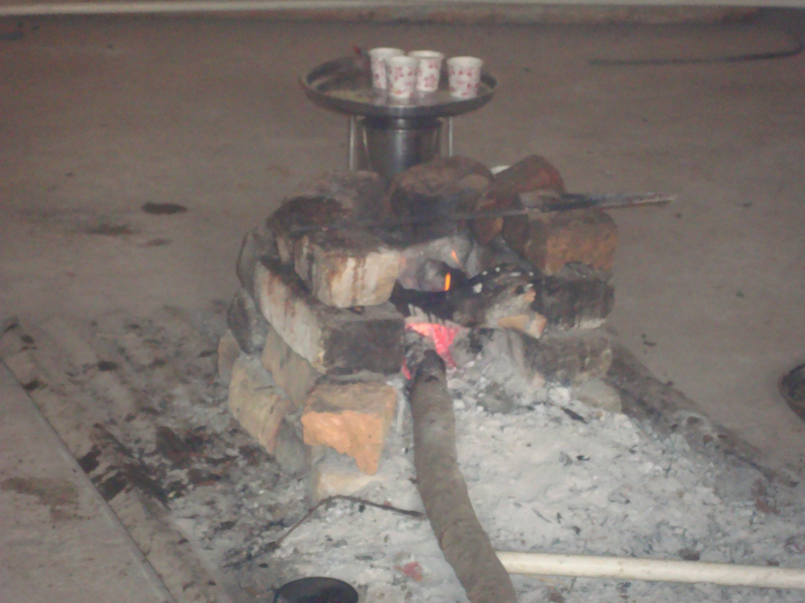](../../../../uploads/2011/08/chulha_bricks_sujalpur_mp1.jpg)<figcaption class="wp-caption-text" id="caption-attachment-276">Brick chulha in Sujalpur, Madhya Pradesh</figcaption></figure>