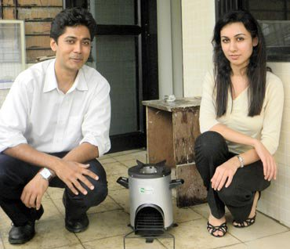
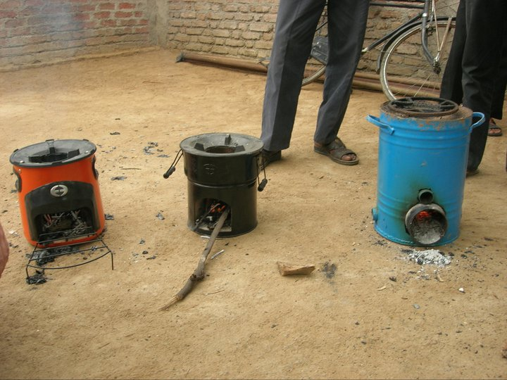
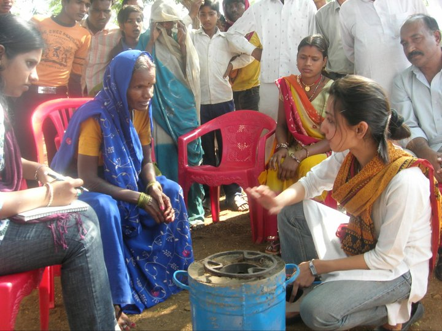

*\[Editor’s Note: I briefly met Neha Juneja, co-founder of Mumbai-based Greenway Grameen Infra, on the sidelines of Sankalp Forum (covered [here](http://www.techsangam.com/2011/05/09/if-i-was-looking-for-inspiration-i-found-it-at-sankalp-forum/)). I followed up with a phone conversation with her last week. This post is based on our conversation and related research. Greenway Grameen was one of the Sankalp finalists in the Agricultural, Food &amp; Rural Business category. Neha Juneja and Ankit Mathur also won the Businessworld Young Entrepreneur award a few months ago.\]*

<figure aria-describedby="caption-attachment-278" class="wp-caption alignleft" id="attachment_278" style="width: 300px">

<figcaption class="wp-caption-text" id="caption-attachment-278">Ankit Mathur &amp; Neha Juneja (Co-founders of Greenway Grameen) posing with their Smart Stove</figcaption></figure>

Newly minted MBA graduates in their mid-20’s, especially from top-tier business schools, are supposed to be working at a multi-national bank or maybe a Hindustan Lever, right? Not if you are Neha Juneja and Ankit Mathur who decided to take the less beaten path of social entrepreneurship by founding Greenway Grameen Infra.

**Zeroing in on the stove**

Their journey started innocuously enough. A series of consulting gigs in the environment domain gave Neha and Ankit exposure to rural markets. They internalized that they’d much rather address the problem of lack of access to simple utilitarian consumer products instead of capital-intensive ideas like biomass plants or sanitation infrastructure. After visiting villages in Andhra Pradesh, Maharashtra, Rajasthan, Punjab, and Madhya Pradesh, they observed that the centuries-old venerable mud *chulha* (stove) still ruled the rural kitchen. ([The mud chulhas of India](http://www.techsangam.com/2011/08/17/the-mud-chulhas-of-india/) provides a pictorial view of the diverse chulhas they saw during their village sojourn.)

Around 70 percent of India’s population use some type of stove. Up until the mid 1990’s, rural India used the mud stove or a kerosene stove or an LPG stove. As the cost of kerosene made the use of kerosene stoves increasingly untenable, and with LPG prices rising disproportionate to rural income, LPG stoves have also become unaffordable for most rural households. Across 150 million (mostly rural) Indian households, the mud *chulha* continues to be widely prevalent for the only reason that nobody has cared enough about these households to build a better product. Ankit and Neha had found the seeds of their first product for rural customers – a cooking stove that would be significantly cleaner and significantly more efficient, a stove that would reduce harmful emissions and increase the productivity of rural women.

**Co-Creation Process = Easy Adoption**

<figure aria-describedby="caption-attachment-279" class="wp-caption alignright" id="attachment_279" style="width: 300px">

<figcaption class="wp-caption-text" id="caption-attachment-279">Early prototypes that village women used during co-creation process</figcaption></figure>

A cooking stove that retails for 1,100 INR? Why would the poor pay so much when they already have a free solution (the mud stove)?  Nearly all of Greenway Grameen’s well-wishers had asked this question. As various social enterprises targeting the Bottom of Pyramid have demonstrated, the poor might be cautious buyers but they *do* buy new products if they see value. The Greenway Smart Stove is a single-burner high efficiency cooking stove which saves up to 70% in fuel cost (compared to the mud stove), minimizes harmful emissions, and reduces cooking time.

Adopting the co-creation process, the Greenway Grameen team took very early product prototypes to their beta  villages and invited women to use them. The key advantage of the co-creation process (over a traditional market trial) is that the prototypes are far from being “fully baked”  and the product designers are not “married” to their designs. This might sound like a subtle difference but it’s an important one. The initial users of the prototypes (village women in this case) became co-designers and provided valuable suggestions on design and usability. In Greenway Grameen’s case, not only did the village women provide some excellent suggestions (many of which made it to the final design), but also gave feedback on pricing. The result is that the Greenway Smart Stove (product’s brand name) is seeing brisk sales. It’s been barely 6 months since product launch and they are already averaging 5,000 unit sales per month with a plan to hit 15,000 per month before the end of 2011.

<figure aria-describedby="caption-attachment-280" class="wp-caption alignleft" id="attachment_280" style="width: 300px">

<figcaption class="wp-caption-text" id="caption-attachment-280">Demo &amp; feedback session with village women</figcaption></figure>

The Greenway Smart Stove supports different materials as fuel – wood, agro-waste, cow-dung, and charcoal (wood is reportedly the most widely used fuel). Currently a firm in the NCR region manufactures the stove.

**What competition?**

I asked Neha about competition and her reaction was “What competition?” She wasn’t being arrogant. Her point was that the cooking stove product category for BOP households is being “created” today so they don’t have to worry about competition (at least not just yet). In our previous [coverage of Sakhi Retail](../2011/07/12/sakhi-retail-maharashtra-rural-distribution-and-marketing-network/), we wrote about the Oorja cooking stove which uses biomass pellets as fuel.

Philips (a surprising player in the cooking stoves category) designed low-emission high-efficiency Woodstoves as part of its Philanthropy by Design initiative in 2009. They announced plans to introduce two models of Woodstoves – a battery-pack version for Rs. 2500 and a natural-draft stove for Rs. 1000 in partnership with a distributor. Another global player that sells clean-burning cooking stoves in India is Colorado-based Envirofit – their G-Series model (priced at $25) targets other emerging countries as well.

**Fundraising**

Greenway Grameen is a 5-member operation today. Ankit and Neha have bootstrapped their way up to this point thanks in large part to the consulting gigs in their first year. They intend to seek an institutional round of funding, primarily to strengthen their manufacturing partnership and amplify their marketing. But first they want to close the loop on their business model. The remaining item on their checklist is to establish a few key distributors after which they’ll hit the fundraising trail.