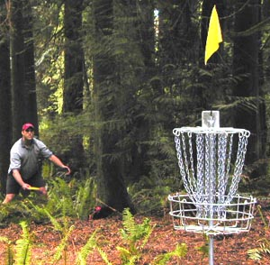

Following is an excerpt from PG Wodehouse’s **A Mixed Threesome** – one of many beautiful golf stories from [The Golf Omnibus](http://www.amazon.com/Golf-Omnibus-P-G-Wodehouse/dp/0517057948). The scene being described is that of the story’s protagonist (Mortimer Sturgis) executing that perfect golf swing. In the narrative below, the inimitable Oldest Member (who stars in many of Wodehouse’s golf stories) is speaking in the first person view and Mortimer Sturgis is speaking in the third person view.

*A moment before he had surveyed his blistered hands with sombre disgust.*

*“It’s no good,” he said. “I shall never learn this beast of a game. And I don’t want to either. It’s only fit for lunatics. Where’s the sense in it? Hitting a rotten little ball with a stick! If I want exercise, I’ll take a stick and go and rattle it along the railings. There’s something in that! Well, let’s be getting along. No good wasting the whole morning out here.”*

*“Try one more drive, and then we’ll go.”*

*“All right. If you like. No sense in it, though.”*

*He teed up the ball, took a careless stance, and flicked moodily. There was a sharp crack, the ball shot off the tee, flew a hundred yards in a dead straight line never ten feet above the ground, soared another seventy yards in a graceful arc, struck the turf, rolled, and came to rest within easy mashie distance of the green.*

*“Splendid!” I cried.*

*The man seemed stunned.*

*“How did that happen?”*

*I told him very simply.*

*“Your stance was right, and your grip was right, and you kept your head still, and didn’t sway your body, and never took your eye off the ball, and slowed back, and let the arms come well enough, and rolled the wrists, and let the club-head lead, and kept your balance, and pivoted on the ball of the left foot, and didn’t duck the right knee.”*

*“I see,” he said. “Yes, I thought that must be it.”*

*“Now let’s go home.”*

*“Wait a minute. I just want to remember what I did while it’s fresh in my mind. Let me see, this was the way I stood. Or was it more like this? No, like this.” He turned to me, beaming. “What a great idea it was, my taking up golf! It’s all nonsense what you read in the comic papers about people foozling all over the place and breaking clubs and all that. You’ve only to exercise a little reasonable care. And what a corking game it is! Nothing like it in the world! I wonder if Betty is up yet. I must go round, and show her how I did that drive. A perfect swing, with every ounce of weight, wrist, and muscle behind it. I meant to keep it a secret from the dear girl till I had really learned, but of course I have learned now. Let’s go round and rout her out.”*

I could wax eloquent about the sheer beauty of Wodehouse’s writing but that’ll have to wait for another day. The quintessential sporting truth in this story is that the amateur sportsman, every once in a blue moon, experiences that “moment of perfection”. If you’ve read the above account carefully, you’d have noticed that Mortimer Sturgis doesn’t *really* know how he hit that perfect drive. He’s trying his best to recall (&amp; desperately hit the *Record* button in his brain) all the things he did right in pulling off that effortlessly perfect drive. The tragedy is that he might never hit a drive like that for the rest of his life.

I’ve been fortunate in experiencing two “moments of perfection” in two separate sports. Read on.

**Perfect drive on hole #9 in Schaumburg**

<figure aria-describedby="caption-attachment-1126" class="wp-caption alignright" id="attachment_1126" style="width: 300px">

<figcaption class="wp-caption-text" id="caption-attachment-1126">A disc golfer preparing to putt</figcaption></figure>

A well-kept secret in USA is the sport of disc golf. For the uninitiated, disc golf (or “frisbee golf” as fondly referred by the non-puritanical) is a sport modeled on golf. Instead of metallic clubs and a ball, one uses different types of aerodynamically specialized flying discs (driver discs, approach discs, putter discs – you get the idea). Instead of a hole in the ground, you have a metallic basket with a receptacle and chains. Disc golf aficionados refer to regular golf as *stick golf*. Unlike stick golf, which require large areas of water-guzzling well-manicured grass and legions of golf course designers, disc golf is one of the more environment friendly sports. A colleague and good friend (Gary Smith) introduced me to this sport in the fall of 1995. For the next three years in Chicago I played disc golf every opportunity I got and, believe me, I created many opportunities as well.

As you can imagine, there’s an entire science behind the making of these flying discs. There are *understable* discs (that curve from right to left on a right-hander’s backhand throw), *overstable* discs (that curve from left to right on a right-hander’s backhand throw), beveled edges and harder plastic for driver discs, softer plastic for putter discs, heavier discs for windy conditions, you get the drift…

In the early days, my friend (Gary) had already invested in a complete set of flying discs while I was making do with a very light yellow-colored 99 cents Frisbee (bought from a K-Mart or a Walgreens). We were playing at a Schaumburg 9-hole course for the first time. By the time we reached hole#9, Gary had a comfortable lead and I was playing for — what else — pride. And then it happened. In a manner similar to Mortimer Sturgis above, I took up position and let it rip. And watched – with frozen feet and widening eyes – as the dainty yellow butterfly-esque disc soared majestically like a Jonathan Livingstone Seagull belying its humble plastic moorings and landed — a mere 10-feet away from the hole. Gary and our two other friends watched with dumb disbelief. It turned out to be the only time I out-drove Gary that day — with my cheap, light and sub-optimal flying disc. Powerful emotions coursed through me.

**Unreal 10k run on Feb 7, 2010**

Three weeks after I had successfully run my third full marathon (and my first Mumbai Marathon), I resumed my short runs. Those days, most of my non-weekend running was done in the late evenings (when I generally tend to run faster) – on the concrete driveway around Raheja Residency. 7 rounds for a 5k, slightly under 14 rounds for a 10k. On that eventful evening, I realized after a few rounds that I *was* running faster than usual – my Garmin told me it was a 4:40ish pace but I wasn’t huffing (strange I thought!) I passed the 5k mark at 23:04 and that’s when it hit me. I had run my fastest 5k (as part of a 10k run) and I was not going all out – something special was afoot. I did slow down during my final 2-3 rounds but I still finished in an unbelievable 47:26 – beating my previous best by more than 2 minutes. There’s no danger of my repeating (forget beating) this performance in this lifetime. The high resolution Exhibits (A and B) below are courtesy my pal Dheeraj.

<figure aria-describedby="caption-attachment-1123" class="wp-caption alignleft" id="attachment_1123" style="width: 300px">

<figcaption class="wp-caption-text" id="caption-attachment-1123">Garmin Forerunner 305: unreal 10k on Feb 7, 2010</figcaption></figure>

<figure aria-describedby="caption-attachment-1124" class="wp-caption alignright" id="attachment_1124" style="width: 300px">

<figcaption class="wp-caption-text" id="caption-attachment-1124">Sustaining a 4:45 pace for 10k? No way I can repeat that!</figcaption></figure>

