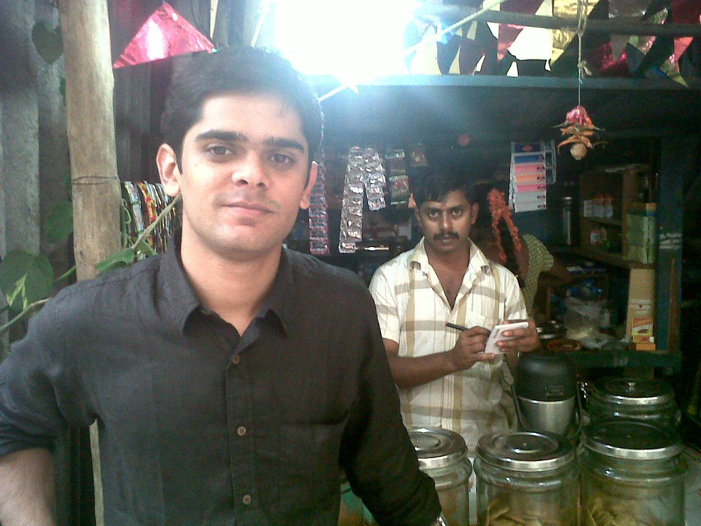

*\[Editor’s Note: It’s a pleasure to bring you TechSangam’s second guest writer – Srijan Kaushik. After graduating from DAIICT (Dhirubhai Ambani Institute of Information and Communication Technology) in 2007, Srijan has been working in *Bangalore-based* Ujjivan – a Micro Finance Institution (MFI) focused on urban poverty alleviation. He works on financial product design and development through market and customer research. Currently, he heads the Individual Lending product vertical at Ujjivan.\]*

<figure aria-describedby="caption-attachment-289" class="wp-caption alignleft" id="attachment_289" style="width: 300px">

<figcaption class="wp-caption-text" id="caption-attachment-289">Srijan Kaushik (in front of the chai-shop where we last chatted in person)</figcaption></figure>

In what can be described as a watershed Annual Policy Statement, the RBI in 2005-06 called upon Indian banks to design a “no frills account” – a no precondition, low *minimum balance maintenance* account with simplified KYC (Know Your Customer) norms. To understand the ramifications and the sheer magnitude of possibilities, conjure up an image of a daily wage earner with a savings bank account. The idea is to have a level playing field in its absolute sense. Low income groups having no access to formal banking systems can well be brought under the umbrella of credit &amp; savings – key factors which form the basis of the idea of financial inclusion. While there is no shortage of credit programs, the equally important savings aspect can rightly be dubbed as the **forgotten half of microfinance**. “No frills” savings accounts appear capable, at least on paper, to cater to the small and irregular income flows of the poor.

At the same time, the feasibility of implementation depends on the common denomination in all banking operations – financial sustainability. The minimum expectation of banks would be to break-even, i.e. recover account opening and account maintenance costs. Measures such as limited number of facilities associated with no-frills accounts suggest consideration to the above. It’s noteworthy that the transaction behavior of this market segment is largely unknown, barring microfinance forays.

Till now, the no-frills approach to financial inclusion can be dubbed as ineffective. One of the earlier and better reports on the financial inclusion drive was prepared by Mr. S Thyagarajan ([PDF link](http://ifmr.ac.in/cmf/news/Thyagarajan_No%20Frills_Cuddalore.pdf)). Speaking of the banks, the report identifies a few ailments which have hindered the financial inclusion drive – notably great distance between the bricks-and-mortar bank branches and account holders and lack of any technological solutions to address this problem. Banks have also been reluctant participants in the drive for financial inclusion. Reservations on profitability, greater manpower requirements, and a general banking apprehension to serve someone with no record of savings are symbolic of the gap in implementation.

The concept of no-frills should be viewed through the dual prism of social responsibility and profitability. In today’s banking system, branch managers are rewarded based on their annual business targets and branch profitability instead of the number of financially-excluded customers brought into the banking network. Is it a wonder that motivation to implement such projects has tended to be the exception rather than the norm?

**Savings 101: Regulation should trust MFIs**

Financial literacy, or the lack thereof, seemed an obvious hindrance even before implementation. It has been confirmed now. Initial gaps in implementation aside, for no-frills to act as an active tool for inclusion, it has to be supported by formal financial education. Partnerships with Non-Governmental Organizations (NGOs) and Micro-Finance Institutions (MFIs), who have pre-established platforms and experience in serving the low-end customer segment, is an obvious and effective linkage. These ecosystems, which have developed organically over a period of time, need to be trusted and used to accelerate financial inclusion. A starting point would be to remove the restriction that Non-Banking Financial Company (NBFC) MFIs cannot become Business Correspondents for banks.

In the wake of last year’s crisis, MFIs are under greater pressure to strike the right balance between *reaching the very poor* and *achieving sustainability*. A big shot-in-the-arm for MFIs could be to permit them to collect deposits from the customers. Currently, most MFIs have a **12-14% funding cost** and an additional **10-12% operating cost** (average figures for sustainable NBFC MFIs). At these cost levels, even considering the offsetting of funding costs by private equity, it is unreasonable to expect MFIs to function at less than their current **20-26% interest rates**. Allowing MFIs to rotate their funds, through savings collected from their depositors, is a step in the right direction. Moreover, now that the regulatory scope on the NBFC-MFIs is a lot more well-defined (relevant [RBI link](http://www.rbi.org.in/scripts/BS_CircularIndexDisplay.aspx?Id=6381)), it’s extremely difficult for the MFIs to indulge in any skulduggery with the savings of their customers. <del></del>This regulatory change will also make MFIs more accountable on the tradeoff between gaining width (customer outreach) versus depth (availability of financial services). MFIs with lower operating costs will have fewer excuses to acquit themselves of this responsibility.

**The mobile phone wallet – MFIs make a case again**

Based on sheer numbers in India (604 million as of March 2010), mobiles seem to have broken the social barrier in terms of outreach and could prove to be an extremely effective alternative channel for banking service delivery. Customers will have easy access to their no-frills accounts via their mobile phone. The Eko-Saija partnership is an example of the types of collaborative models possible between mBanking-based Business Correspondents and MFIs. Through Eko’s mBanking platform, Saija is offering its customers a savings account on top of their core micro credit product. Going one step further, Saija also offers a mobile-based repayment option to its clients which means substantial reduction in operating cost. (We wrote about Eko’s branchless banking solution [here](http://www.techsangam.com/2011/05/01/khata-kholo-har-darwaza-kholo-ekos-branchless-banking-part-1/) and [here](http://www.techsangam.com/2011/07/13/eko-race-to-profitability-received-a-few-booster-shots/)).

Giving the poor access to savings can be a truly transformative solution to ending poverty. No frills is a start, yet it needs to go beyond the basics. And logic says that MFIs have a big role to play!