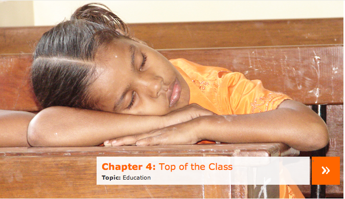
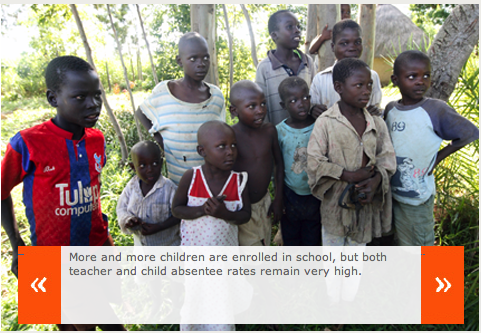

*\[Editor’s Note: The best non-fiction book I ever borrowed used to be Jared Diamond’s Guns, Germs and Steel. That distinction is in real danger of being usurped by Abhijit Banerjee and Esther Duflo’s [Poor Economics](http://pooreconomics.com/). There are many reasons to read this book cover to cover but if you are looking for that ONE reason, it’s chapter 4 (on education policy) – Top of the Class. This post is the first of a series of six excerpts from that chapter — mandatory reading for practitioners in the education domain.\]*

<figure aria-describedby="caption-attachment-292" class="wp-caption alignleft" id="attachment_292" style="width: 300px">

<figcaption class="wp-caption-text" id="caption-attachment-292">Enrollment rates are good, but what about teacher abseentee rates &amp; quality of education?</figcaption></figure>

> Education policy, like aid, has been the subject of intense policy debates. As in the case of aid, the debate is not about whether education per se is good or bad. It centers instead on whether governments ought to, or know how to, intervene. And though the specific reasons invoked are different, the fault line divides the field essentially in the same place it divides on the subject of aid, with the aid optimists being generally education interventionists, and the aid pessimists being in favor of laissez-faire.
> 
> A large majority of policy makers, at least in international policy circles, have traditionally taken the view that the problem is essentially simple: We have to find a way to get the children into a classroom, ideally taught by a well-trained teacher, and the rest will take care of itself. We will call these people, who emphasize the “supply of schooling”, the “supply wallahs”, appropriating the Indian term for “purveyor of”, to avoid confusing them with supply-siders, the economists who are largely opposed to any form of government intervention.
> 
> Perhaps the most visible articulation of the supply wallah position can be found in the UN’s Millenium Development Goals (MDG), the eight goals that the world’s nations agreed in 2000 to reach by 2015. The second and third MDGs are, respectively, to “ensure that, by 2015, children everywhere, boys and girls alike, will be able to complete a full course of primary schooling” and to “eliminate gender disparity in primary and secondary education, preferably by 2005, and in all levels of education no later than 2014.” Most national governments seem to have bought into this idea. **In India, 95 percent of children now have a school within a half mile or so**. Several South African countries (including Kenya, Uganda, and Ghana) have made primary education free, and children have flooded the schools. According to UNICEF, between 1999 and 2006, enrollment rates in primary school in sub-Saharan Africa increased from 54 percent to 70 percent. In East and South Asia, they increased from 75 percent to 88 percent over the same period. Worldwide, the number of children of school age who were out of school fell from 103 million in 1999 to 73 million in 2006. **In our eighteen-country data set, even among the extremely poor (those who live on less than 99 cents a day), enrollment rates are now above 80 percent in at least half the countries for which we have data**.
> 
> Access to secondary school (ninth grade and above) is not part of the MDGs, but even there, progress has been made. Between 1995 and 2008, secondary gross enrollment ratios increased from 25 percent to 34 percent in sub-Saharan Africa, from 44 percent to 51 percent in South Asia, and from 64 percent to 74 percent in East Asia, despite the fact that the costs of secondary school are much higher: Teachers are expensive, because they need to be better qualified, and for parents and children the value of the foregone earnings, and the foregone labor-market experience, is much larger because teenage children can work and earn money.
> 
> Getting children into school is a very important first step: This is where learning starts. But it isn’t very useful if they learn little or nothing once they’re there. Somewhat bizarrely, the issue of learning is not very prominently positioned in international declarations: The Millennium Development Goals do not specify that children should learn anything in school, just that they should complete a basic cycle of education. The implicit assumption, presumably, was that learning would follow from enrollment. But unfortunately things aren’t that simple.
> 
> In 2002 and 2003, the World Absenteeism Survey, led by the World Bank, sent unannounced surveyors to a nationally representative sample of schools in six countries. Their basic conclusion was that teachers in Bangladesh, Ecuador, India, Indonesia, Peru, and Uganda miss one day of work out of five on average, and the ratio is even higher in India and Uganda. Moreover, the evidence from India suggests that even when teachers are in school and are supposed to be in class, they are often found drinking tea, reading the newspaper, or talking to a colleague. **Overall, 50 percent of teachers in Indian public schools are not in front of a class at a time they should be. How are the children supposed to learn?**

The next excerpt post in this series is the [“demand wallahs” perspective](http://www.techsangam.com/2011/09/06/the-supply-demand-wars-in-education-policy-part-2/) on the education policy debate.