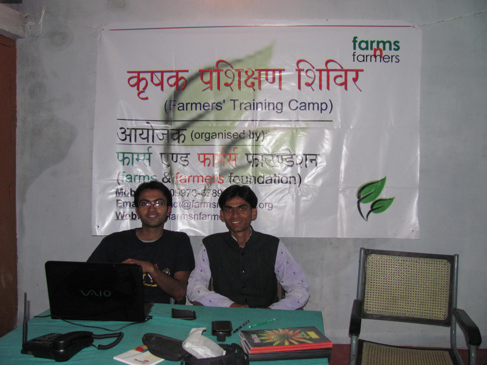

<figure aria-describedby="caption-attachment-297" class="wp-caption alignleft" id="attachment_297" style="width: 300px">

<figcaption class="wp-caption-text" id="caption-attachment-297">Farms n Farmers co-founders: Shashank Kumar (left) and Manish Kumar (right)</figcaption></figure>

*\[Editor’s Note: A few weeks ago, I had an engaging conversation with Shashank Kumar, co-founder of [Farms N Farmers](http://farmsnfarmers.org/), an end-to-end farmer consulting-and-marketing social enterprise with the goal to maximize profits for small plot farmers. This post is based on our conversation and subsequent email exchanges.\]*

After 5 long months, I was finally reminded of a metaphor from one of my past lives – the world of advertising, media campaigns, and full-service ad agencies. A “full-service”  advertising (ad) agency is responsible for managing all aspects of the client account’s media campaign – from deciding the media mix (online vs. TV vs. print) to creative types that best exemplify brand imagery to conversion goals for different campaigns. In return for a successful multi-channel (and often, multi-year) ad campaign, the client pays the ad agency a flat percentage of the entire media spend.

I present to you **Farms n Farmers** (**FnF**) – a nimble young Bihar-based social enterprise employing a full-service approach to maximizing profits of small plot farmers. As you can imagine, crafting a “full-service” approach for subsistence farmers is quite different from the glitzy world of advertising. The FnF team uses a holistic approach- from soil testing and crop finalization to leveraging government subsidies &amp; training to farm monitoring and finally taking the crop to market for superior profits. The working model graphic (below) illustrates this full-season engagement model between the FnF team and the farmers. In exchange for the full-service basket of services, the farmers agree to pay FnF **10%** of their total sale value.

<figure aria-describedby="caption-attachment-296" class="wp-caption aligncenter" id="attachment_296" style="width: 750px">

<figcaption class="wp-caption-text" id="caption-attachment-296">FnF working model</figcaption></figure>

The co-founders of FnF (Shashank Kumar and Manish Kumar) were friends from high school days with deep roots in Bihar. Even before he had graduated, Shashank had decided he wanted to do something related to natural farming. A brief stint at a management-consulting firm enabled him to crystallize his (and friend Manish’s) ideas and also provided the seed capital to launch FnF.

Manish and Shashank got their first validation from a group of 18 farmers in a village in Vaishali district, 30km from Patna. Persuaded by FnF, the farmers adopted cluster farming in six acres of land and planted *rajma* (instead of the usual wheat). The resulting 2X financial return (compared to prior wheat crops) was a huge vote of confidence for FnF in the eyes of their first (beta) farmer customers. Their second proof point came from a village in Purnia district where the primary crops are corn and potato. Since land was unused from June to September, FnF advised the farmers to plant baby corn (a crop with a mere 50-60 day harvest cycle). An incremental revenue of Rs. 300 per *kattha* (approx. 60 sq. ft), especially for small plot farmers, is not an insignificant amount. With a team of agriculture experts accessible through partnerships with IIT Kharagpur, Rajendra Agriculture University (Pusa), Birsa Agriculture University (Ranchi), and BAMETI (Patna), FnF was off to the races.

While market trials were already underway in 2010, FnF was formally incorporated as an NGO in Feb 2011. Within a very short time, they have signed up more than 500 farmers, of which ½ are enrolled for their entire landholding with the rest enrolled on a crop-by-crop basis (like the Purnia baby corn farmers). Manish, whose roots are in Vaishali, manages the FnF field offices in Vaishali (their biggest center), Sitamarhi and Muzaffarpur while Shashank manages the remaining field offices (in Banka and Purnia) and scouts new village prospects. Shashank wasn’t kidding when he told me “I’m on the road. Everyday!”

FnF’s current theater of operations is in Bihar but they are looking at Jharkhand and Delhi NCR as the next areas of expansion. On the go-to-market side, the strategy is to sell directly to food processing companies (currently the best paying segment). When I asked Shashank about FnF’s fundraising plans, he had a simple answer: *If we are not making money for the farmers, then we don’t make money and the business model is not proven, right? So why take funding before that?*

FnF is incorporated as an NGO in order to leverage government subsidies and support/training infrastructure for the farmers in their network. Incorporating a separate for-profit corporate entity is on the cards and might happen as early as year-end. We will be watching and reporting their progress with a great deal of interest.