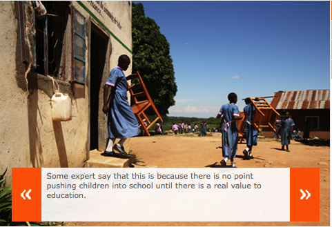

*\[Editor’s Note: *This post is the second in a series of six excerpts from*  Abhijit Banerjee and Esther Duflo’s [Poor Economics](http://pooreconomics.com/), specifically from chapter 4 (on education policy) – Top of the Class. [Part 1](http://www.techsangam.com/2011/09/02/supply-demand-wars-in-education-policy-part-1/) provided the supply-wallahs perspective. This excerpt provides the demand-wallahs perspective.\]*

**The Demand Wallahs’ Case**

For the “demand wallahs”, a set of critics (including William Easterly) who believe that there is no point in supplying education unless there is a clear demand for it, these results encapsulate everything that has been wrong with education policy in the last few decades. In their view, the quality of education is low because parents do not care enough about it, and they don’t because they know that the actual benefits (what economists call the “returns” to education) are low. When the benefits of education become high enough, enrollment will go up, without the state having to push it. People will send their children to private schools that will be set up for them, or if that is too expensive, they will demand that local governments set up schools.

The role of demand is indeed critical. School enrollment is sensitive to the rate of returns to education: During the Green Revolution in India, which raised the level of technical know-how needed to be a successful farmer and thereby increased the value of learning, education increased faster in regions that were better suited to the new seeds introduced by the Green Revolution. More recently, there is the example of the offshore call centers. In Europe and the United States, they are usually vilified for taking away local jobs, but they have been part of a small social revolution in India by dramatically expanding young women’s employment opportunities. In 2002, Robert Jensen of the University of California at Los Angeles teamed up with some of these centers to organize recruiting sessions for young women in randomly selected villages in rural areas where recruiters would typically not go, in three states in northern India. Not surprisingly, compared to other randomly chosen villages that did not see any such recruiting efforts, there was an increase in the employment of young women in business process outsourcing centers (BPO) in these villages. Much more remarkably, given that this is the part of India probably most notorious for discrimination against women, three years after the recruitment started, girls age five to eleven were about 5 percentage points more likely to be enrolled in school in the villages where there was recruiting. They also weighed more, suggesting that parents were taking better care of them: **They had discovered that educating girls had economic value, and were happy to invest**.

Since parents are able to respond to changes in the need for an educated labor force, the best education policy, for the demand wallahs, is no education policy. Make it attractive to invest in business requiring educated labor and there will be a need for an educated labor force, and therefore a pressure to supply it. And then, the argument continues, since parents will start to really care about education, they will also put pressure on teachers to deliver what they need. If public schools cannot provide quality education, a private-school market will emerge. Competition in this market, they argue, will ensure that parents get the quality of schooling that they need for their children.