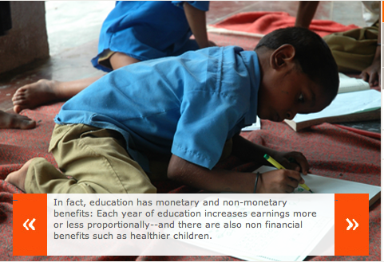

*\[Editor’s Note: *This post is the third in a series of six excerpts from*  Abhijit Banerjee and Esther Duflo’s [Poor Economics](http://pooreconomics.com/), specifically from chapter 4 (on education policy) – Top of the Class. [Part 1](http://www.techsangam.com/2011/09/02/supply-demand-wars-in-education-policy-part-1/) provided the supply-wallahs perspective, [Part 2](http://www.techsangam.com/2011/09/06/the-supply-demand-wars-in-education-policy-part-2/) was the counterpoint from the demand-wallahs. This post presents the middle ground.\]*

> At the core of the demand wallahs’ view is the idea that education is just another form of investment: People invest in education, as they invest in everything else, to make more money — in the form of increased earnings in the future. The obvious problem with thinking of education as an investment is that parents do the investing and children get the benefits, sometimes much later. And though many children do, in effect, “repay” parents for the investment by taking care of them in old age, many others do so only reluctantly, or they simply “default”, abandoning their parents along the way. Even when the children turn out to be dutiful, it is not always clear that the extra bit of money that they earn because they spent that extra year in school transfers into that much more for the parents — we have certainly come across parents who rue the day when their children became rich enough to move out to their own house, leaving them to their lonely elderly lives. T. Paul Schultz, a Yale economist, talks about his father, the famous economist and Nobel Laureate Theodore Schultz, whose parents were against educating him, because they wanted him to stay back on the farm.
> 
> It is true that many parents do take pride and pleasure in the fact that their children are doing well (and in sharing the good news with their neighbors). In this sense they may feel more than adequately repaid even when they don’t get a penny from their children. So from the point of view of the parent, education is partly investment but also partly a “gift” that they offer their children. But there is also the flip side: Most parents are in a position of power relative to their children — they decide who goes to school, who stays home or goes out to work, and how their earnings are spent. Parents who are cynical about how much they would get out of a son’s earnings once he is old enough to push back, and who do not value education for its own sake, may prefer to take him out of school and send him to work when he is ten. In other words, although the economic return to education (as measured by the extra earnings of an educated child) clearly matters, lots of other things probably matter as well, things like our hopes about the future, our expectations about our children, even how generous we are feeling toward them.
> 
> “Exactly,” says the supply wallah. “This is why some parents need a push. A civilized society cannot allow a child’s right to a normal childhood and a decent education to be held hostage to a parent’s whims or greed.” Building schools and hiring teachers is a necessary first step to lower the cost of sending a child to school, but it may not be enough. This rationale explains why most rich countries simply give parents no choice: Children have to be sent to school until a certain age, unless parents can prove they are educating them at home. But this clearly does not work where state capacity is more limited and compulsory education cannot be enforced. In such cases, the government must make it financially worthwhile for parents to send their children to school. This is the idea behind the new tool of choice in education policy: the conditional cash transfer.