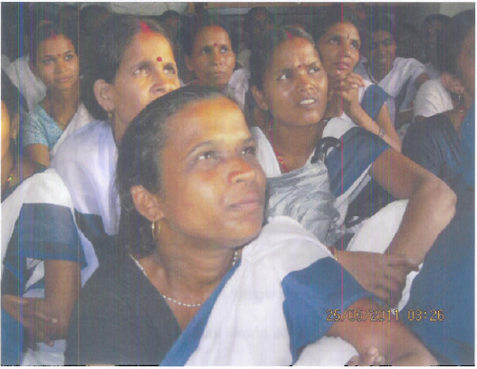
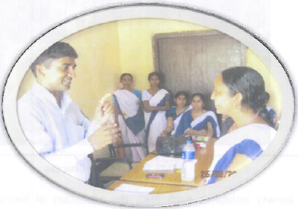

*\[Editor’s Note: Since Jan 2011, Norway India Partnership Initiative (NIPI) has been leading the implementation of a mobile money transfer pilot for ASHAs in Bihar’s Sheikhpura district. At the pilot’s 5-month mark, Lalitha Iyer (Gender Advisor to NIPI) created an interim findings report based on her field visit and interactions with 80 ASHAs and other pilot stakeholders. This blog post is based on the Iyer-authored NIPI report that Abhishek Sinha (CEO of Eko) shared with me. UNOPS/NIPI gave a grant to Eko to support their involvement in this pilot.\]*

<figure aria-describedby="caption-attachment-306" class="wp-caption alignleft" id="attachment_306" style="width: 300px">

<figcaption class="wp-caption-text" id="caption-attachment-306">ASHAs attending a training session in Sheikhpura</figcaption></figure>

Ask an expecting mother in rural India the doctor’s name at the local Public Health Center (PHC) and she might draw a blank. However, it’s a cinch that she would know her local village ASHA (Accredited Social Health Activist). ASHAs are a new band of female community-based functionaries conceived and funded by National Rural Health Mission ([NRHM](http://india.gov.in/citizen/health/national_rural.php)) to serve as the interface between the community and the public health system. The public health system comprises of a three-tier structure – PHC, Sub-Center, and ANM (Auxiliary Nurse Midwife).

**ASHA Background**

ASHAs are typically semi-literate (i.e. formal education up to class eight) married women in the 25-45 age range. Empowered with knowledge and a drug-kit to deliver first-contact healthcare, every ASHA is expected to be a fountainhead of community participation in public health initiatives in her village. As of 2010, there were more than 830,000 ASHAs across 18 Indian state. The 71,350 ASHAs in Bihar (state of focus for this post) were instrumental in the safe delivery of 1.1 million babies. The ASHAs receive performance-based incentives for promoting universal immunization, referral and escort services for Reproductive &amp; Child Health (RCH) and other healthcare interventions like tuberculosis and leprosy. For example, an ASHA receives Rs. 200 for every PHC delivery she helps facilitate.

**Pain Points**

The Bihar State Health Society, having created equal opportunities for participation of semi-literate women, as ASHAs in Bihar, was in search of a process to help them receive their payments *on time*, *with dignity* and *in their community*, thereby ensuring equity. Mobile money transfer was identified as the option to trial but first let’s understand what’s wrong with the old process. Hint: a lot!

For starters, the accounting process at the PHCs is manual because of poor power connectivity. PHC needs to prepare 500 cheques per month for each district block. A cheque volume of 500 may not sound onerous except for the fact that there are only 70 ASHAs, so each ASHA (on average) is receiving 7 separate cheques per month! They are separate cheques because incentive schemes differ based on the types of services rendered by ASHAs (facilitating deliveries vs. vaccination camps). To further complicate things, the cycle of payments is longer than a month for some health interventions provided by ASHAs. On the PHC end, 11 bank accounts need to be maintained because program funding comes from different sources.

**Add 7 cheques per ASHA, 11 bank accounts per PHC, and a manual accounting process and you have a perfect storm of inefficiency!** Who bears the full brunt of it? ASHAs of course. Waiting to meet the PDS accounts officer, standing in queue at the bank to cash several small-amount cheques, and being ridiculed (and sometimes persecuted) by family members for not getting paid on time – these are the pain points borne by the ASHAs. It is thus to Bihar State Health Society’s credit that they started a program with a mission to help ASHAs receive their payments *on time*, *with dignity* and *in their community*.

<figure aria-describedby="caption-attachment-307" class="wp-caption alignright" id="attachment_307" style="width: 300px">

<figcaption class="wp-caption-text" id="caption-attachment-307">Eko agent showing ASHA interest accrued on her no-frills savings account</figcaption></figure>

**Mobile Money Transfer Pilot**

Sheikhpura’s District Health Society (DHS) along with Sadar PHC and Chewara PHC began a pilot program in Jan 2011 in partnership with SBI Patna and Eko Financial Services to test mobile payments to the district’s 440 ASHAs. \[We first wrote about Eko’s mobile banking solution [here](http://www.techsangam.com/2011/05/01/khata-kholo-har-darwaza-kholo-ekos-branchless-banking-part-1/).\] A few simple preparatory steps kicked off the pilot:

- Sheikhpura’s DHS opened an SBI account specifically for ASHA incentive payments.
- ASHAs opened no-frills savings accounts with SBI (powered by Eko’s mobile bankin infrastructure). A neat usability trick that SBI &amp; Eko pulled off was to set the ASHAs’ account numbers to be the same as their mobile numbers.

The new mobile money transfer works in just four easy steps:

1. PHC compiles an Excel sheet with \[Name, mobile#, service-delivered, amount\] and forwards to DHS and Eko.
2. DHS verifies and transfers the requisite funds to a specially created SBI Account.
3. Within 24 hours of funds transfer, Eko transfers appropriate amounts to each of the individual ASHAs on the Excel sheet.
4. Each ASHA receives an SMS with their updated bank balance. She can then go to the nearest Eko CSP (Customer Service Point) to withdraw the money *whenever* she wants using a unique secure Eko booklet password-pin combination. In this context, *whenever* includes holidays, weekends and even late evenings – basically any time the CSP location is open. No more trips to banks.

**Conclusions**

Even the basic “voice”  functionality of the mobile phone has made a significant impact on the efficacy of the ASHAs in Sheikhpura. Besides staying connected with their families, they now interact with their supervisors as needed, help colleagues, and most importantly, communicate with the mother and their families – providing information on nurse visits, reminders on immunization schedules, etc.

Mobile money transfer, the pilot’s key value proposition, has been a rousing success – significant hours of time saved for the 440 ASHAs in the district, a vastly superior payment solution for the PHCs, and most importantly, an increased sense of empowerment to the ASHAs. The sense of empowerment is best captured in the following quote from one of the ASHA’s:

*Although we share details on the total incentives earned with our family/husband and subsequently the money itself, we still feel the power of having the code give us an identity. Using the special pin code (Eko/SBI security code for money transfers ) is in my hands; if I do not want to, I need not withdraw cash.*

Sadly, the quote is also a reminder of how far India, as a society, needs to progress on gender equality.