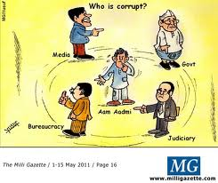

<figure aria-describedby="caption-attachment-1572" class="wp-caption alignleft" id="attachment_1572" style="width: 245px">

<figcaption class="wp-caption-text" id="caption-attachment-1572">Aam aadmi confused.. (Pic: courtesy milligazette.com)</figcaption></figure>

*\[Editor’s Note: This post was making the rounds on Facebook during the frenzied days of the Anna Hazare movement. Other folks had made this point but nobody had nailed it as well as Sourabh did. Reproduced here with his permission. A very interesting comment thread also ensued after I shared this post on Facebook – am including that thread within the comments (after anonymizing my friends of course).\]*

> Am I corrupt? Yes I am.
> 
> I put up a certain self-image in society to gain acceptance, money and power. I lie to my loved ones, protecting my self-image on the pretext of not hurting their feelings. I curb my anger in public to protect that image. I curb all the corrupt thoughts, lie to myself just to get a self-proclaimed label of a nice human being. Even my honesty comes with a carrot of an ego boost or spirituality.
> 
> If I am caught drinking and driving, I pay a little money to get away. I try to avoid paying duty while carrying my expensive camera or laptop back home. I produce fake documents to reduce my taxes. I jump waiting lines whenever I can. I use pirated softwares. I pay my maid a piddly amount of money while I make big bucks myself. I take advantage of situations for my own good. I manipulate situations. I do emotional blackmailing. I use influential people in my life to get things done for me. I like free stuff.
> 
> If I am a father I bribe my kids to get good marks in exams. I bribe my dog to be a good dog (whatever that is). If I am a kid I bribe my parents by being a good kid. If I am a political party I bribe you with progress, protection and such vague stuff. If I am a religion I bribe you with god / nirvana / heaven to become good human beings. I even bribe god for good things to happen in my life. And most of the time I am bribing myself.
> 
> If I am a CEO I can draw huge amount of moolah for myself, as I deserve it. If I want engineering seat I don’t mind paying donation, but at the same time condemn those who come from quota because they don’t deserve it. If I am a cricketer I can take money to influence match results. If I am a doctor I can get commission from pharmaceuticals to prescribe their drugs. If I run a newspaper I can take fee to publish certain news and suppress others. If I am a cop I can take money to register your FIR. If I am in advertising I can make money by lying to people about my product and trying to feed their fears. If I am an armyman I can rape powerless tribal women, and if I have permission I kill the men. If I am a multinational company I can make huge profits while running sweatshops. If I am a manager I can work to increase my company’s profit, with little regard about people working under me, while protecting my own personal life. If I earn hugely disproportionate amount of money compared to majority of the world I can give some of it as a charity and go gaga over my divine intensions. If I am social activist I can honestly work for social welfare while tirelessly filling my pockets with foreign funding.
> 
> I am corrupt in different degrees in different situations according to the circumstances and my capacity. More the power I have, more the capacity to be even more corrupt. I am corrupt in the context of nature, world, nation, society, family and friends or just pure moral self. I am corrupt for money, status, acceptance, praise, power, pleasure, love, sex, nirvana, god, self-image, ego etc etc.
> 
> I live in a society where we need laws so that we don’t cheat each other. We need police so that we don’t kill each other. We need armies so that we don’t destroy our civilizations. We need democracy to tell us that we are all equal. We need false identity of a nation so that we can unite each other. And we need government to take care of all this and more for us, because if left on our own we desire attached power hungry selves would destroy everyone and everything around us. So we elect few amongst us, who seem capable or more like who promise to fulfill our hopes and dreams and visions, to run things for us. We give them power to run things for us and with that capacity to be more corrupt. We expect them not to take advantage of the powers that they have got while I continue to be corrupt in my own capacity. So I want to elect another mortal amongst us to police them, who will be totally honest, or create a system, which will not allow him to be otherwise. How and who are to choose such a person or create such a system? Who has such a keen understanding of human psychology to elect a person with all good intensions and honesty? If there can be such a system why isn’t it employed to elect the leader itself. And if this police become corrupt after all this, which is more likely looking at the history, are we to invent another police to police them?
> 
> So I feel like a hypocrite shouting out against corruption, just because it is of a larger proportion and context. Who is to draw this imaginary line and where? Everybody have their own justifications for doing right or wrong things.
> 
> I don’t want this unending loop of policing. I don’t want another hero who can change others. I want to change myself.