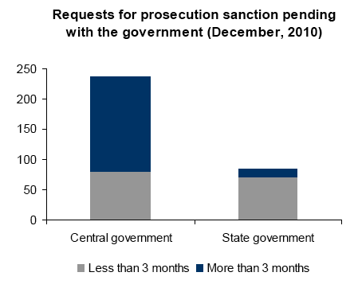
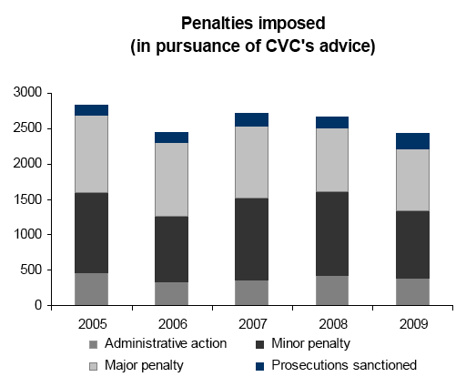
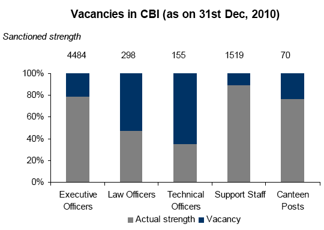
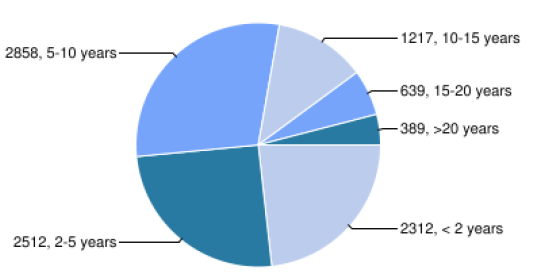

Regular readers of this blog may have noticed a publishing hiatus during the Anna Hazare movement. Along with hundreds of millions of other Indians, I was following the ebb and flow of the movement and participating in numerous discussions on Twitter and Facebook. Some of my opinions became posts on [my other blog](http://ulaar.wordpress.com/). While the topic of ‘corruption in high places’ is not directly germane to this blog, the implications of major policy changes stemming from the anti-corruption movement will be felt by the key stakeholders of social enterprises, especially those working on Private Public Partnerships (PPP).

PRS Legislative Research, covered by guest blogger Yogesh Upadhyaya [here](http://www.techsangam.com/2011/08/09/working-for-informed-and-participatory-democracy-the-prs-story/), analyzed data on corruption prosecution cases from the websites of Central Vigilance Commission (CVC) and Central Bureau of Investigation (CBI) and created a research note. In this blog post, I’m reproducing the key insights from their research note.

<figure aria-describedby="caption-attachment-309" class="wp-caption alignleft" id="attachment_309" style="width: 300px">

<figcaption class="wp-caption-text" id="caption-attachment-309">\# of prosecution sanction requests pending with Govt</figcaption></figure>

**FINDING #1: Government has frequently delayed sanction for prosecuting officials**

- As of Dec 2010, Central Govt had not responded to 236 requests. Of these, 66% were pending for more than 3 months.
- State Governments had not responded to 84 requests, of which 15% were pending for more than 3 months.
- Prosecution of public servants can only be taken up after respective govt provides sanction. Provision purports to protect honest officials from harassment.

<figure aria-describedby="caption-attachment-310" class="wp-caption alignleft" id="attachment_310" style="width: 300px">

<figcaption class="wp-caption-text" id="caption-attachment-310">\# of Penalties imposed (CVC's advice)</figcaption></figure>

**FINDING #2: While only 6% of cases taken up for prosecution, departmental penalties were given in 94% of those cases.**

- Between 2005 and 2009, penalties were imposed on 13,061  
  cases (averaging 2612 per year) based on CVC’s advice.
- Major penalties (include dismissal, reduction to lower rank &amp; pension cuts) imposed in 4895 cases (annual average 979).
- Minor penalties (censure) were imposed on 5356 cases (annual average 1071), and administrative action was taken in 1964 cases (annual average 393).

<figure aria-describedby="caption-attachment-311" class="wp-caption alignleft" id="attachment_311" style="width: 300px">

<figcaption class="wp-caption-text" id="caption-attachment-311">Vacancies in CBI (as of Dec 31, 2010)</figcaption></figure>

**FINDING #3: CBI (the main investigating agency) is seriously understaffed.**

- As of December 2010, 21% of the sanctioned posts in CBI  
  were vacant.
- This includes 52% of the posts of law officers, 65% of technical officers and 21% of executive officers.

<figure aria-describedby="caption-attachment-312" class="wp-caption alignleft" id="attachment_312" style="width: 300px">

<figcaption class="wp-caption-text" id="caption-attachment-312">Pending cases by # of years</figcaption></figure>

**FINDING #4: Courts have been excruciatingly slow in deciding CBI cases.**

- As of end-2010, there were 9,927 CBI cases pending in courts.
- Of these, 2,245 cases (23% of the total) were pending for more than 10 years.
- 50% of the cases were pending for more than 5 years