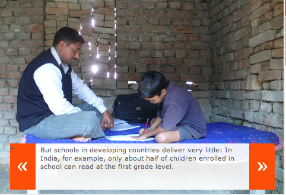
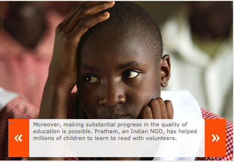

*\[Editor’s Note: *This post is the fourth in a series of six excerpts from*  Abhijit Banerjee and Esther Duflo’s [Poor Economics](http://pooreconomics.com/), specifically from chapter 4 (on education policy) – Top of the Class. The first three excerpts covered the debate between the supply-wallahs and demand-wallahs. The fourth covers the strong contributions of Pratham (possibly India’s largest NGO in the education vertical). \]*

- [Supply Demand Wars in Education Policy – Part 1](http://www.techsangam.com/2011/09/02/supply-demand-wars-in-education-policy-part-1/)
- [Supply Demand Wars in Education Policy – Part 2](http://www.techsangam.com/2011/09/06/the-supply-demand-wars-in-education-policy-part-2/)
- [Middle ground between the supply-wallahs and demand-wallahs](http://www.techsangam.com/2011/09/07/middle-ground-between-the-supply-wallahs-and-demand-wallahs/)

> In 2005, Pratham, an Indian NGO focused on education, decided to go one step further and find out what children were really learning. Pratham was founded in 1994 by Madhav Chavan, a US-educated chemical engineer with an unflappable belief that all children should and can, learn to read and read to learn. He has taken Pratham from a small Mumbai-based UNICEF-sponsored charity to one of the largest NGOs in India, perhaps in the world: Pratham’s programs reach close to 34.5 million children all over India and are now venturing into the rest of the world. Under the banner of the Annual State of Education (ASER), Pratham formed volunteer teams in all 600 Indian districts. These teams tested more than 1,000 children in randomly chosen villages in every district — 700,000 children overall — and came up with a report card. Close to 35 percent of children in the seven-to-fourteen age group could not read a simple paragraph (first-grade level) and almost 60 percent of children could not read a simple story (second-grade level). Only 30 percent could do second-grade mathematics (basic division). The math results are particularly stunning — all over the Third World, little boys and girls who help their parents in their family stall or store do much more complicated calculations all the time, without the help of pen and paper. Are schools actually making them unlearn?
> 
> …
> 
> Pratham not only exposes the deficiencies of the educational system but also tries to fix them. We have been working with them for the last ten years, evaluating almost every new edition of their program for teaching children arithmetic and reading. Our association started in the year 2000 in western India, in the cities of Mumbai and Vadodara, where Pratham was running what they called the *Balsakhi* (meaning “children’s friend”) program. The program took the twenty children in each classroom who most needed help and sent them to work with the balsakhi, a young woman from the community, on their specific areas of weakness. Despite an earthquake and communal riots, the program generated very large gains in test scores for these children — in Vadodara, about twice the magnitude of the average gains from private schooling that have been found in India. Yet these balsakhis were much less educated than the average private- (or public-) school teacher — many of them had barely ten years of schooling, plus a week’s training by Pratham.
> 
> Given these results, many organizations would have rested on their laurels. Not Pratham. The idea of resting anywhere, least of all on their laurels, is entirely foreign to Madhav’s personality or that of Rukmini Banerji, the human dynamo who is the driving force behind Pratham’s spectacular expansion. One way in which Pratham could reach more people was by having communities take over the program. In the Jaunpur District in the eastern part of Uttar Pradesh, India’s largest state and one of the poorest, Pratham volunteers went from village to village testing children and encouraging the community to get involved in the testing to see for themselves what their children knew and didn’t know. The parents were not thrilled by what they saw — their first instinct often was to try to smack their children — but eventually a set of volunteers from the community emerged, ready to take on the job of helping their little brothers and sisters. They were mostly young college students who held classes in the evening in their neighborhoods. Pratham gave them a week of training but no other compensation.
> 
> We evaluated this program as well, and the results were quite dramatic: **By the end of the program, *all* the participating children who could not read before the program could at least recognize letters (in contrast, only 40 percent of those in the comparison villages could read letters by the end of the year)**. Those who could read only letters at the beginning 26 percent more likely, by the end, to be able to read a short story if they had participated that if they had not.
> 
> More recently, Pratham has shifted its focus to working with the government school system. In Bihar, India’s poorest state and the state with the highest measured teacher absentee rate, Pratham organized a set of remedial summer camps for schoolchildren in which the teachers from the government school system were invited to come and teach. The results from this evaluation were surprising: **The much-maligned government teachers actually taught, and the gains were comparable to the gains from the Jaunpur evening classes**.
> 
> Pratham’s results are striking enough that many school systems in India and around the world are reaching out to the organization. A version of the program is now being tested in Ghana, in a large-scale RCT run as collaboration between a research team and the government: Youth who are looking for a first job experience will be trained to provide remedial education in school. Delegations from the Ministry of Education in Senegal and Mali have visited Pratham’s operations and are thinking of replicating the program.
> 
> This evidence poses a set of puzzles: If volunteer and semi-volunteer teachers can generate such large gains, private schools can clearly adopt the same kinds of practices and should do even better. Yet we know that in India a full one-third of fifth-graders in private schools cannot read at first-grade level. Why not? **If government teachers can teach so well, why don’t we see it in the school system? If such large learning gains are so easily available, why don’t parents demand them?** Indeed, why was it that in Pratham’s Jaunpur program, only 13 percent of the children who could not read attended the evening classes?