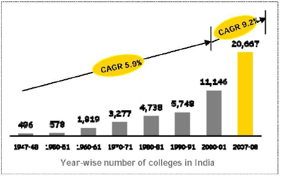
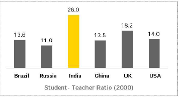
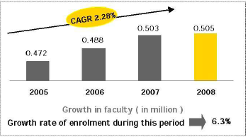
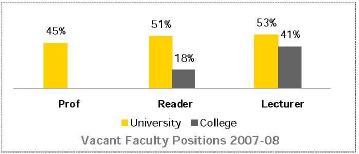

*\[Editor’s Note: Earlier this year, academic collaborators from Rutgers University, Penn State University and Tata Institute of Social Sciences published an insightful study that quantified the severe gap in higher education faculty in India and, after surveying nearly 1,000 Indians who are either pursuing or have completed graduate study in the U.S, came up with results that are surprising and encouraging for Indian universities. The key findings from that study are presented as a two-part series. In this (Part 1) post, we’ll be looking at key trends around higher education in India. Kudos to the study authors (TISS’s Venkatesh Kumar, Penn State’s David Finegold, and Rutgers’ Ann-Laure Winkler)* *for a high quality research study.\]*

**India has more than 20,000 colleges, with almost 10,000 being setup in current decade**

**Steady **enrollment** increase in higher education system over the past two decades**

Perhaps the biggest constraint on being able to meet these ambitious growth targets while improving, rather than diminishing, quality is the availability of a sufficient supply of well-qualified faculty members with advanced degrees. India already has one of the worst student-to-faculty ratios of any nation: at 26:1, it is roughly twice the ratio of China.

**India’s student-teacher ratio is twice that of USA, China &amp; Brazil**

**Faculty growth (CAGR 2.28%) trailed student growth (CAGR 6.3%)**

**Whopping percentage of faculty positions in higher education not filled**

<figure aria-describedby="caption-attachment-324" class="wp-caption aligncenter" id="attachment_324" style="width: 359px">

<figcaption class="wp-caption-text" id="caption-attachment-324">In 2003, engineering institutions had a shortage of 33,574 Ph.Ds and 42,831 M.Techs</figcaption></figure>

India is very far from developing a sufficient supply of PhDs or Masters graduates interested in becoming academics who could educate the growing number of students the government is seeking. The number of PhD students has failed to keep pace with the growth in overall student numbers – PhD students accounted for 0.7% of all students in 1985, falling to 0.5% by 2000 and then rebounding to 0.64% by 2005. If this ratio were maintained, that would suggest that roughly 100,000 of the 13.6 million students in India in 2010 were in PhD programs. If the average student takes three years to complete their studies, there is no attrition, and all of these doctoral students chose to pursue academic careers (all assumptions that are likely far too optimistic), this would suggest there are roughly 33,000 PhD graduates ready to enter faculty positions. **At this rate of PhD production, it would take 30 years to meet the projected need for faculty growth, by which time many of the existing faculty will have retired or left the system**.

India needs to **recruit at least one million new faculty members for its college and universities** if it is to meet the government’s ambitious target to offer a higher education (HE) place to 20% of all young people by 2020. The number of PhDs being produced by the current Indian HE system falls far short of meeting this need. The most promising way to fill this gap is to recruit back many of the over 100,000 Indians who are studying in the US each year to obtain a graduate degree and the many others who are studying in other nations or who have completed their degrees and begun academic careers abroad. Â Stay tuned for Part 2 where we present results from a survey of approximately 1,000 of these potential future faculty members to explore their willingness to return to India and the key factors affecting their decisions. \[Update: here is [Part 2](http://www.techsangam.com/2011/09/13/attracting-diaspora-to-address-indias-higher-education-faculty-gap/).\]