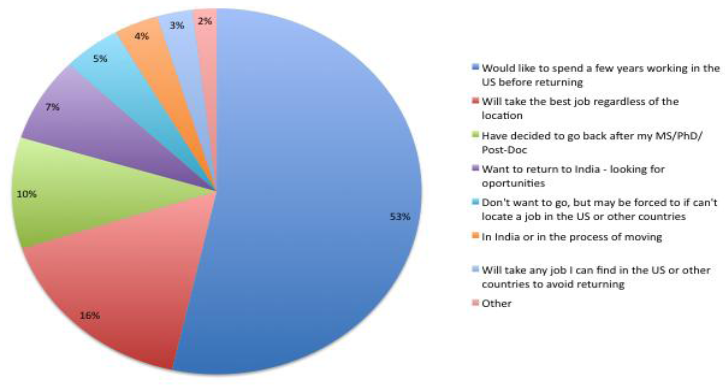
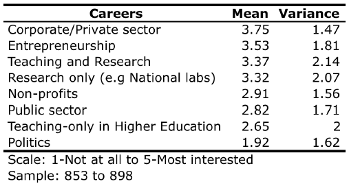
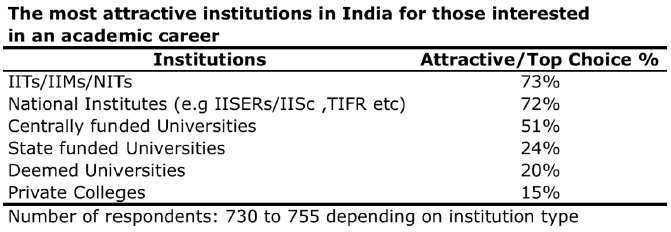
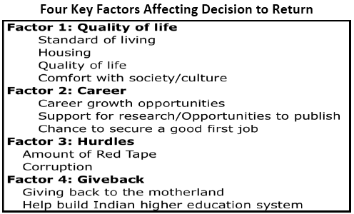

*\[Editor’s Note: Earlier this year, academic collaborators from Rutgers University, Penn State University and Tata Institute of Social Sciences published an insightful study that quantified the severe gap in higher education faculty in India and, after surveying nearly 1,000 Indians who are either pursuing or have completed graduate study in the U.S, came up with results that are surprising and encouraging for Indian universities. In [Part 1](http://www.techsangam.com/2011/09/12/will-they-return-insights-on-attracting-higher-education-diaspora-faculty/), we looked at key trends around higher education in India. In this post, we’ll present key trends around the willingness of Indian graduates to return to India.\]*

**Why They Left for US in the First Place?**

A combination of factors – high-quality teaching, cutting-edge research, professionalism and post-graduation options – were all deemed to be very important in attracting young people to study in the US. High quality teaching was the single most important factor for half of the respondents, but a number of factors were rated as “important”  or “most important”  by roughly four-fifths of all those taking the survey. A surprisingly low percentage (8%) reported that the desire to find a job and settle in the US after graduation was the most important factor in their decision to study abroad.

**What if Indian Universities had US Faculty?**

To try to retain some the more than $4 billion that Indian students are now spending on education abroad, and to increase domestic capacity to offer high-quality Higher Education (HE) to a greater number of Indian students, the government has proposed reforms to allow foreign universities to offer degrees in India. The IITs have also petitioned the HRD Ministry to allow them to hire permanent foreign faculty to help fill the estimated 40% shortfall in qualified professors needed to achieve the ambitious growth targets they have been set. With these reforms in mind, we asked respondents whether they would have preferred to study in India if they could have done so with US faculty: 21% indicated they would, while 35% preferred to go to the US, with the highest percentage (44) choosing “maybe”.

**Desire to Return to India** (Hint: **money chart #1**)

Nearly three-quarters of respondents (74%) plan to return to India eventually or had already done so (categories 1, 3, 4 &amp; 6 in pie chart above). In contrast, only 8% of respondents said either that they preferred not to return; with half of these indicating they’d take any job they could to avoid returning.

**Interest in Types of Careers in India**

Three-quarters or more of respondents are interested in corporate jobs or entrepreneurship opportunities in India, and HE opportunities that offer the chance to do research are also very attractive. In contrast, teaching-only positions, which historically have constituted most of India’s HE sector, are not as attractive to the majority of respondents. While Masters’ students are attracted to private-sector jobs in India, the vast majority of PhDs and Post Docs are most interested in pursuing positions that combine teaching and research in an Indian university (79% and 81% respectively) or research-only careers (64% and 76%).

The other encouraging finding for Indian policymakers is that 84% of those who have decided to return to India are potentially interested in HE careers. When asked which specific types of institutions they would find most attractive, not surprisingly the IIT/IIMs/and NITs topped the list, along with the National Institutes. Centrally funded universities were attractive to about half of all those interested in HE careers.

**Key Factors Affecting Decision to Return**

The most significant reasons individuals cited for wanting to return to India are family and a desire to give back to the motherland, while corruption, red tape, and the academic work environment were the strongest deterrents to returning, and instead remaining in the US. The study authors conducted a factor analysis to determine the underlying structure of individuals’ preferences on what is most or least important to them when deciding where to live and work. This analysis yielded natural grouping of 11 of the 18 items into four factors, eliminating the other seven that overlapped among 2 or more of the factors. These factors are shown in the table below (**money chart #2**):

**Just one of these four factors – the desire to give back – is strongly associated with a desire to return to India**. Quality of life and career factors are more mixed, but tend to be seen as more positive in the US, while red tape  and corruption  are what we label the major ‘hurdles’  that need to be removed or at least addressed if institutions are to succeed in attracting the most able academics back to India.

The study authors also asked respondents to write in the most important factors that would lead them to go back to India. Confirming the results of the items on the -2 to +2 scale, nearly three-quarters indicated that family and giving back to the motherland were the key reasons they would return to India, while nearly half were keen to help build India’s HE system. These results shouldn’t surprise us. One proof point comes from Seer Akademi’s Srikanth Jadcherla (whom I interviewed a few months ago for [Creating a Nation of Electronics geeks](http://www.techsangam.com/2011/08/02/creating-a-nation-of-electronics-geeks/)). The winning argument for recruiting &amp; retaining Seer Akademi’s US-based faculty (and have them conduct 4-6 hour interactive webex sessions with students in India) is simple – **Do it for India!**

*(Closing note: The authors of the study also had some specific credible suggestions for reform of the Indian higher education system. My copy editor (err..that would be “me”) pruned that section from this post. It might well make it as a separate post in the future. If you are the impatient type, here’s the [PDF link](http://smlr.rutgers.edu/will-they-return) – if you enjoy statistics, regression and the like, the report has a ton of those details as well.)*