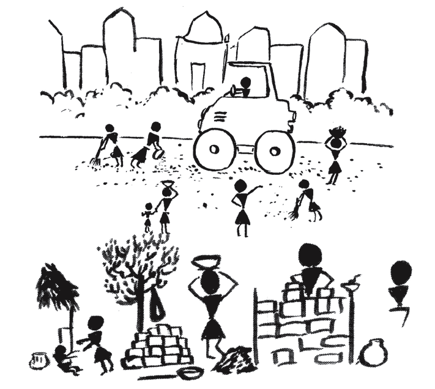
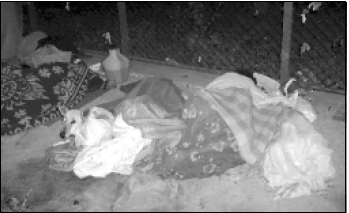

*\[Editor’s Note: When I was researching for this [post on CSTEP](http://www.techsangam.com/2011/07/05/cstep-world-class-research-meets-policy-and-decision-making/), I came across an exhaustive 98-page report (authored in 2010) on the homeless in Bangalore. The research was done in collaboration with **29*** *Bangalore-based NGOs (including CSTEP). There are numerous insights and many heart-breaking stories of homelessness in the study. I’ve stayed away completely from the stories and cherry-picked some thematic insights. I like to minimize posts that just ‘state the problem’ so the post *concludes with* some inspiration from San Francisco.\]*

“Rome was not built in a day” goes the proverb. Yes! Much work goes in to the making and keeping of a City. Hands in the building and maintenance of a city are by and large migrant workers from less developed areas and the disadvantaged sections living in the city. That’s the reason why the study authors have given them the moniker *The Invisible City Makers.*

First some India-wide perspective: 170 million of India’s citizens (i.e. 17%) live in slums. The 2001 National Census reported that 78 million people across India were living without a home, many in crowded urban environments. Even if you do not read the rest of this post, reflect on just those two numbers **170 million** slum dwellers and **78 million** homeless!

The study collaborators used the following definition: *Homeless are those who sleep with mere plastic/tin sheet roof or without roofing (even if it’s for a few months of the year) in parks, railway stations, under Flyovers, on pavements, vacant sites (Private/Public), in front of temples, mosques, churches etc.*

In the cities, migrants might be able to fulfill their basic survival needs (to some extent) but they make a huge trade-off in terms of losing their political and civil rights, not to mention social capital and quality of life. This, in itself, is a violation of their Rights by the State – even in the cities migrants should have just as much a claim on their political and civil Rights as they do in the villages.

Since the Indian definition of a Census House is a *structure with a roof*, it fails to cover citizens living in temporary shelters, shelter homes, under tin sheets, etc. Also excluded in many cases are settlements of housing workers in the construction industry. It is no surprise then that any report on homelessness in India is likely to present figures different from governmental statistics.

**Rethinking the Social Contract in Bangalore**

<figure aria-describedby="caption-attachment-336" class="wp-caption alignright" id="attachment_336" style="width: 300px">

<figcaption class="wp-caption-text" id="caption-attachment-336">Homeless sleeping on pavement</figcaption></figure>

In Karnataka, the urban poverty rate (at 32.6%) is higher than the rural poverty rate and also higher than urban poverty rate of several other States. According to 2001 census there is a shortage of 1.76 lakh housing units in urban Karnataka. In 2002, India’s National Sample Survey Organization (NSSO) reported 1983 slums in Karnataka of which a third (614) are in Bangalore. However, NGOs and slum leaders are convinced that the Bangalore number exceeds 1000.

Even though there is a huge housing shortage for the poor, there is not much effort to fill the gap. Bangalore’s urban local body plans to spend 320 crores on housing in 2009-2010, all of these for ***redeveloping just 13 slums*** under the centrally funded JNNURM scheme. An analysis by the National Institute for Urban Affairs has shown that Bangalore Municipality, on average, has ***spent just 9 percent of their slum development budget*** from 2001 to 2007. The BDA, another para-statal agency in Bangalore, is currently developing 5 layouts with 1.74 lakh sites. The sites measure 20 feet X 30 feet and cost 1,050 per square foot – which works out to 6 lakhs for just the land, thus keeping them out of reach of majority of the city’s poor. As a result of such development, the urban poor are forced to a life in substandard slum dwellings (if they can afford it!) or a life of homelessness otherwise.

**National Policy on Street Vendors**

Bet you didn’t know this policy existed! The policy recognizes that to be able to practice any profession or to carry on any occupation, trade or business is a Fundamental Right to every citizen. A hawker is actually exercising such a right. This Right, to conduct business on street pavements, is enshrined in Article 19(1)G of the Indian Constitution. The National Policy on Street Vendors is implemented in many States in India, but not yet in Karnataka. The policy does not address political and citizenship rights but street vendors are able to claim a legal status and are entitled to legitimate hawking zones in city, master or development plans including zonal, local and layout plans and ensuring their enforcement. The policy also promotes the organization of street vendors into unions, cooperatives, or associations to facilitate their collective empowerment.

**Bangalore and San Francisco**

Besides software, there’s one other thing common between the two cities – homeless people. San Francisco’s homelessness problem has always confounded me. The [Wikipedia article on San Francisco](http://en.wikipedia.org/wiki/San_francisco) is revealing:

> San Francisco ranks third of American cities in median household income with a 2007 value of $65,519. Median family income is $81,136, and San Francisco ranks 8th of major cities worldwide in the number of billionaires known to be living within city limits. The city’s poverty rate is 11.8% and the number of families in poverty stands at 7.4%, both lower than the national average. The unemployment rate stands at 10.1% as of August 2009. Homelessness has been a chronic and controversial problem for San Francisco since the early 1980s. The city is believed to have the highest number of homeless inhabitants per capita of any major U.S. city.

As I researched San Francisco’s homeless problem more, I came across this rather encouraging [WalletPop article](http://www.walletpop.com/2010/02/25/san-francisco-mayor-says-city-is-solving-its-homeless-problem/).

> In 2004, San Francisco launched an ambitious ten-year plan aimed at ending homelessness in the city by greatly expanding its social services and creating 3,000 permanent housing units as substitutes for shelters. Now at the six-year mark, San Francisco’s mayor, Gavin Newsom, is claiming the city is more than halfway toward its goal, having thus far created almost 1,700 housing units. As a result, despite the recession, it’s managed to shrink its homeless population for the first time in 30 years.

Perhaps San Francisco will inspire Bangalore in more ways than one?

*For the truly brave, here’s the [PDF link](http://www.igsss.org/images/documents/22_865393812_InvisibleCityMakers.pdf) to the complete Invisible City Makers report.*