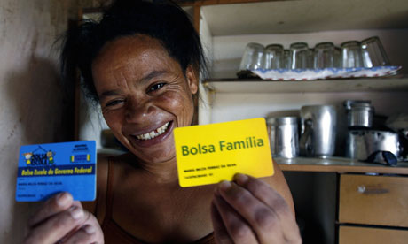

<figure aria-describedby="caption-attachment-1281" class="wp-caption alignleft" id="attachment_1281" style="width: 300px">

<figcaption class="wp-caption-text" id="caption-attachment-1281">Brazilian Maria shows off her "Bolsa Familia" social plan card (Pic: courtesy guardian.co.uk)</figcaption></figure>

*\[Editor’s Note: This is the fifth in a series of six excerpts from chapter 4 (education policy) of Abhijit Banerjee and Esther Duflo’s [Poor Economics](http://pooreconomics.com/). According to World Bank, more than 30 countries have some form of Conditional Cash Transfer (CCT) programs.\]*

In a recent interview, Harish Hande (Founder of SELCO) and 2011 Magsaysay Award winner, made a self-disparaging statement about his IIT pedigree. He said “*I got into an IIT because a lot of people who are intelligent did not sit for the entrance exam. Let us admit that 600 million people in India are not in competition with the other half. Imagine what will happen if you give the other half enough opportunities.” * Anand Kumar’s [Super 30 program](http://www.techsangam.com/2011/05/11/anand-kumars-super-30-journey/) provides a glimpse of what could happen. Without further ado, here’s Banerjee and Duflo on the history of conditional cash transfer programs and their efficacy in educating the poor in developing countries.

> Santiago Levy, a former professor of economics at Boston University, was deputy minister in the Mexican Ministry of Finance from 1994 to 2000, tasked with reforming the intricate welfare system, which was made of several distinct programs. He believed that by linking the receipt of welfare payments to investment in human capital (health and education), he could ensure that the money spent today could contribute to eradicating poverty, not only in the short term but in the long term as well, by fostering a healthy and well-educated generation. This inspired the design of PROGRESA, a transfer program “with strings attached.”  PROGRESA was the first conditional cash transfer program (CCT) program: It offered money to poor families, but only if their children regularly attended school and the family sought preventive health care. They got more money if the children were in secondary school than in primary school and if it was a girl who went to school rather than a boy. To make it politically acceptable, the payments were presented as “compensation”  to the family for the wages lost when their child went to school instead of working. But in reality, the goal was to nudge the family, by making it costly for the family to fail to send their children to school, regardless of what the family thought of education.
> 
> Santiago Levy had another goal – to make sure the program survived the change of government every few years, since each new president usually cancelled all his predecessors’ programs before launching his own. Levy calculated that if the program was demonstrably a great success, the new government would not find it easy to get rid of it. So he set up a pilot project, which was offered only in a randomly chosen group of villages, making it possible to rigorously compare outcomes in chosen and non-chosen villages. The pilot demonstrated beyond a reasonable doubt that such a program does substantially increase school enrollment, particularly at the secondary level. **Secondary school increased from 67 percent to about 75 percent for girls, and from 73 percent to about 77 percent for boys**.
> 
> This was also one of the first demonstrations of the persuasive power of a successful randomized experiment. When the government duly changed, the program survived, albeit renamed OPORTUNIDADES. But Levy probably did not anticipate that he had given birth to two new traditions. First, CCTs spread like wildfire all over the rest of Latin America, and subsequently to the rest of the world. Mayor Michael Bloomberg even gave them a try in New York City. And second, when other countries launch their own CCTs, they now usually also carry out a set of randomized trials to evaluate them. In some of these experiments, features of the program are varied, to try to understand how to design it better.
> 
> Paradoxically, it was one of these replications, in Malawi, that led us to rethink the success of PROGRESA. The conditionality in PROGRESA is based on the principle that increased income is not enough and that parents need to be given an incentive. Researchers and practitioners started to ask whether an *unconditional* program could have the same effect as a conditional transfer. A World Bank study found, provocatively, that conditionality does not seem to matter at all: The researchers offered the families of school-age girls a transfer ranging between $5 and $20 USD PPP per month. In one group, the transfer was conditional on enrollment. In another, it wasn’t. A third group (the control group) did not receive a transfer. The effects were large (after a year, dropout was 11 percent in the control group, and only 6 percent among those who benefited from the transfer), but they were the same for those who received the conditional transfer and for those who got the unconditional one, suggesting that parents did not need to be *forced* to send their children to school, they needed to be helped financially. Subsequently, another study that compared conditional and unconditional transfers in Morocco found similar results.
> 
> Several factors probably explain why the financial transfer made a difference in Malawi: Perhaps parents could not pay for school fees, or could not give up the money their children earned. Of course, borrowing to finance the schooling of their ten-year-old based on what she will make at twenty is entirely a pipe dream. The income transfer, by moving parents out of extreme poverty, may also have given the mental space to take a longer view of life: Schooling is something where the costs are paid now (you have to nag or drag your children into school now) and it only pays off when they are older.
> 
> Indeed, in our eighteen-country data set we find that the share of spending on education increases as we move up from those who live on under 99 cents a day to those in the $6-$10 category. Given that the number of children born to each family goes down sharply with income, this means that education spending per child grows much faster than total consumption. This is the opposite of what we would expect in a world where education is an investment like any other, unless we are willing to believe that the poor are just incapable of getting educated.
> 
> If parental income plays such a vital role in determining educational investment, rich children will get more education even if they are not particularly talented, and talented poor children may be deprived of an education. So leaving it purely to the market will not allow every child, wherever she comes from, to be educated according to her ability. Unless we can fully erase differences in income, public supply-side intervention that makes education cheaper would be necessary to get close to the socially efficient outcome: making sure that every child gets a chance.

 **Related Reading**

- [A revolution in global aid to the poor](http://www.guardian.co.uk/commentisfree/2010/jun/29/revolution-global-aid-poor) \[Aditya Chakrabortty in The Guardian\]
- [Conditional cash transfer success story in Phillipines](http://www.abs-cbnnews.com/nation/07/30/10/conditional-cash-transfer-helps-pinoys-beat-poverty-trap) \[David Dizon in abs-cbnNEWS.com\]