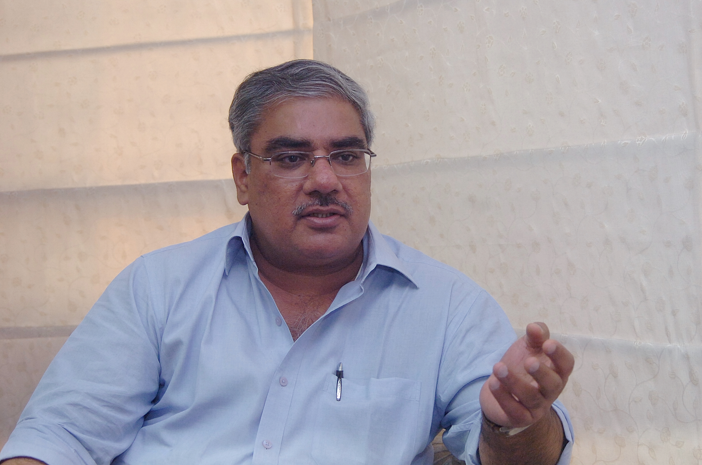
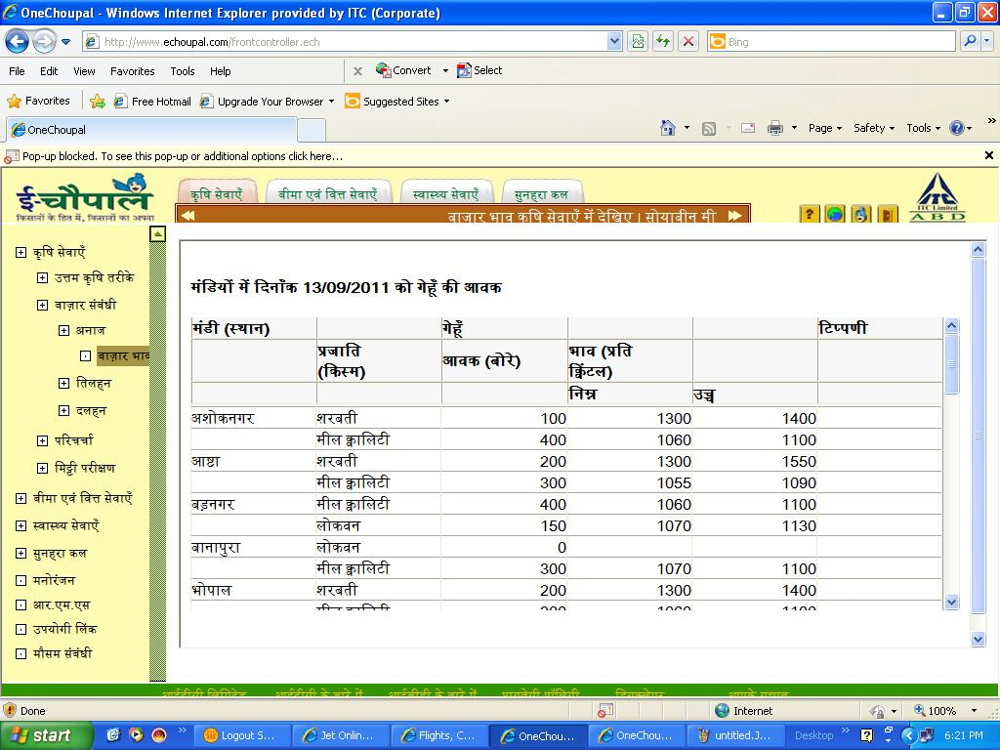
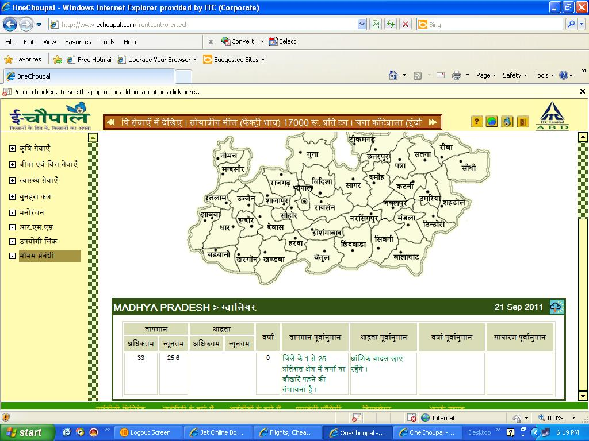

*\[Editor’s Note: Last month, I met with Sivakumar Surampudi, a 22 year ITC veteran, architect of e-Choupal, and head of their Agro Business Division (ABD) at his office in Hyderabad. This post is based on our conversation, email exchanges and related research.\]*

<figure aria-describedby="caption-attachment-346" class="wp-caption alignleft" id="attachment_346" style="width: 300px">

<figcaption class="wp-caption-text" id="caption-attachment-346">Sivakumar Surampudi, Divisional CEO of ITC Agri Business &amp; e-Choupal Architect</figcaption></figure>

ITC, among a handful of public Indian companies  
to adopt [triple bottom line reporting](http://en.wikipedia.org/wiki/Triple_bottom_line), started the ambitious e-Choupal initiative in 2000 with the dual goal of empowering Indian farmers and  
creating a unique source of competitive advantage in agro-sourcing for the company. Traditionally, farmers sell their produce to traders operating in government regulated wholesale agricultural markets (called *mandis*). The marketplace operates through an *open outcry ascending bid auction –* “the auction begins when a government employee visually inspects the quality and sets the initial bid” – from here, the traders bid upwards until the crop is sold. The traders in turn sell to food processing companies. Farmers rarely have any information on market conditions prior to the sale. The traders, on the other hand, are well informed about crop prices prevailing in different markets and the prices offered by processing companies. Clearly this is the single biggest reason why middlemen traders are able to exploit the farmers.

Enter e-Choupal – a unique hub-and-spoke intervention model that is causing a disruption of the trader-*mandi*-farmer dynamic. *Choupal* translates to gathering place (in Hindi). The hub-and-spoke model has two dimensions. The first dimension is the Internet kiosk (e-Choupal) – set up in villages to enable farmers to access daily wholesale prices of soybean, wheat, tobacco, and coffee, both in the local *mandis* as well as the price offered by ITC ABD – which processes these crops for its sister business unit (ITC Foods Division). The second dimension is the hub – which includes warehouses and farmer training centers to support every 40-60 e-Choupals. About 25 percent of these warehouse hubs are full-service *Choupal Sagars* – which also include retail stores, fuel stations, soil testing labs, and food courts.

***Sanchalaks***

<figure aria-describedby="caption-attachment-347" class="wp-caption alignright" id="attachment_347" style="width: 300px">

<figcaption class="wp-caption-text" id="caption-attachment-347">e-Choupal portal showing market prices</figcaption></figure>

Crucial to the success of the e-Choupal model is the *sanchalak* (manager in Hindi), a village entrepreneur selected by ITC to be the man-on-the-ground. The kiosk is installed in the *sanchalak’*s home and he plays the role of disseminating information about crop prices in major markets and weather information and also facilitates the purchase of farming inputs, crop sales, and non-ITC products such as insurance policies. The information dissemination is a free service. In all other cases where the *sanchalak* enables transactions, he gets paid a commission ranging from 0.25% (fertilizers) to 15% (insurance policies). A typical *sanchalak* would be an apolitical medium sized farmer with good communication skills having studied up to the 10th or 12th grade. Each *sanchalak* manages 3-6 villages while an *upa-sanchalak* (deputy manager) operates at the village level and shares the commission with the *sanchalak* for transactions enabled by him.

**How Farmers Use e-Choupal**

<figure aria-describedby="caption-attachment-348" class="wp-caption alignleft" id="attachment_348" style="width: 300px">

<figcaption class="wp-caption-text" id="caption-attachment-348">e-Choupal portal displaying weather map for Madhya Pradesh</figcaption></figure>

Every evening, ITC updates the *mandi* prices of soya bean (and other relevant crops) in the markets where they have e-Choupal presence. The mandi prices and the ITC hub point’s prices are accessible through any of the e-Choupal kiosks. Depending on the state, different language options are available for the *sanchalak* – Hindi, Telugu and Kannada in Andhra Pradesh, Tamil in Tamil Nadu, and Hindi for the Northern states. Interestingly, Karnataka is the only state where English is one of the options. An Madhya Pradesh-based *sanchalak* describes the process by which farmers transact:

> “Farmers usually come by in the evening to find the price. ITC usually matches the price in these mandis. Should the *mandi* price increase at any point the next day, the company also raises its price. However, if the *mandi* price falls, ITC still retains the price it indicated the previous day.”

If the price is suitable, the farmer comes by the next morning to collect tokens from the *sanchalak* – a prerequisite to completing the sale at the nearest hub.

**Impressive Stats**

Eleven years after ITC launched e-Choupal operations in Madhya Pradesh, there are now **6,500 e-Choupal** installations reaching **4 million farmers** across **40,000 villages** in 10 states. There are 110 warehouse hubs of which 25 are full-service *Choupal Sagars*. e-Choupal is the most important channel for ITC’s ABD division – driving two-thirds of their revenue with the contribution percentage increasing year-over-year. Lest we think that Sivakumar and team are resting on their laurels, the 2012 goal is to reach **10 million farmers** in **100,000 villages** via 20,000 e-Choupals in fifteen states.

**e-Choupal 3.0**

Moving ahead, ITC is now reshaping the e-Choupal model, in its version 3.0, to leverage the spread in mobile telephony and the growing aspirations emerging from the semi-urbanisation of some of the top tier villages. Recognising that the needs of rural India are changing, eChoupals are gearing up to provide a new spectrum of services that move from customization  to personalization . Analytical tools are being designed to examine uploaded data through mobile phones to provide individualized services. This will also help in providing direct services for sustainable agricultural practices that will also address issues emerging from climate change concerns.

Incidentally, ABD contributes 17% of the company’s overall revenue and its e-Choupal strategy, which hinges on three operating principles (low cost operating system, socially embedded operating system and variable cost operating system), seems to be paying off.

**Social Impact**

In late 2007, Aparajita Goyal (then PhD student at University of Maryland) performed an exhaustive study to evaluate the impact of information technology on rural markets. In order to evaluate the effect on prices, Goyal used historical geo-coded data from *mandis* and the locations and installation dates of the ITC kiosks. She found that the presence of kiosks in a district was associated with an instant and persistent increase of 1.7% in the average price paid at *mandis* in that district. As expected, the availability of price information increased the level of competition between the traders, raising prices and reducing the variation in prices between nearby *mandis*. **Farmers’ profits increased by 33%**, and the **cultivation of soyabeans increased by an average of 19%** in districts with kiosks. And by buying produce direct, ITC reduced its costs, which paid for the kiosks.