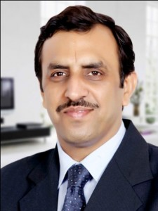

<figure aria-describedby="caption-attachment-350" class="wp-caption alignleft" id="attachment_350" style="width: 225px">

<figcaption class="wp-caption-text" id="caption-attachment-350">Manish Khera (Founder/CEO of FINO) - Pic courtesy fino.com</figcaption></figure>

*\[Editor’s Note: To date, Eko is the only one of five branchless banking players in India I’ve written extensively about . The other players are: FINO, A Little World, Nokia Mobile Money, and Paymate’s Green Mobile. Manish Khera (FINO’s CEO) and I have been sporadically exchanging emails for some time but unfortunately the stars haven’t aligned for a phone chat yet. Then I chanced upon an April 2010 CGAP study that goes into the FINO money transfer story in some detail. With a break in tradition, I’m writing this post without having spoken to their leadership team. However, you can be sure that there will be a Part 2 after I interview Manish.\]*

[FINO](http://fino.co.in/) describes itself as a business and banking technology platform combined with an extensive services delivery channel. Founded in 2006 and headquartered in Mumbai, its solutions are anchored around using biometric smart cart, hand-held devices and Micro Deposit Machines to perform field operations and biometric authentication. While FINO’s initial forays were in the branchless banking vertical, they have since broadened their service offerings to cover the whole gamut of financial inclusion including government welfare programs, micro-insurance, and retail.

**Different kind of agents**

At 10,000+ agents, FINO has the world’s largest agent network. Unlike Eko’s agent network which has leveraged existing FMCG retail establishments (*kirana* stores, pharmacy shops, etc.), FINO’s agents are also mobile, offering service at clients’ doorsteps. Incidentally this doorstep service is unique not just in India – such a model doesn’t exist in other branchless banking geographies such as Kenya, Brazil, and Philippines. Another differentiator for FINO is that their banking services are available through both mobile and regular channels.

FINO has interesting management tools, including a SMS-and internet-based dashboard for monitoring performance and identifying high/low performers in its field staff managing agents, and super clients who provide on-demand liquidity to agents.

**Not just branchless banking**

At the time of the 2010 CGAP study, FINO had acquired 12+ million customers across 21 states for their core products (SBI no-frills banking, money transfer, life insurance, NREGA electronic transfer, and microloans). *\[2012 Feb 16 update: Their website now lists their cumulative customer base at a whopping 44 million!\]* The CGAP research found that FINO was losing money on the money transfer business but FINO has a long-term view of their agent network with plans to amortize the channel building cost by offering additional services to its customers. Other products in the banking vertical include SHG (Self Help Groups) loans, JLG (Joint Liability Groups) loans, and micro recurring deposits.

In the government vertical, FINO has seen serious traction through the enabling of a payment solution for NREGS (National Rural Employee Guarantee Scheme) and Social Security Pensions (SSP) scheme. The FINO card functions as a pan-India card, which can be used for domestic payments across more than 50,000 villages in 12 states. FINO distributes NREGA/SSP benefits to more than 11.5 million customers.

FINO also provides various software systems for micro financing institutions’ operations. FINO Third Party Services is an exhaustive suite of products for the retail sector and include services such as: Mobile recharge, DTH recharge, railway/bus bookings, insurance premium collections, and utility bill payments. Across all these verticals, FINO serves a whopping 38+ million customers.

**Investors**

In its 5 year history, FINO has amassed a list of investors that reads like a who’s who in the financial world: Corporation Bank, HSBC, ICICI Bank, Indian Bank, Union Bank, ICICI Lombard, IFC, LIC, The Blackstone Group, Intel Capital, and IFMR Trust.

**Closing Thoughts**

As noted above, FINO and Eko have differing strategies in the branchless banking space. When I eventually have that chat with Manish, I’d be curious to learn about FINO’s profitability plans and also understand their categories of focus.