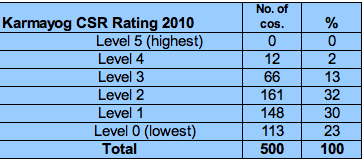
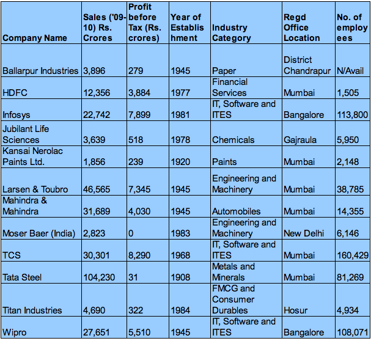
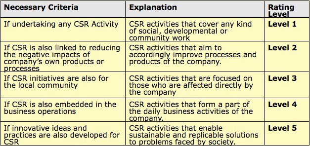
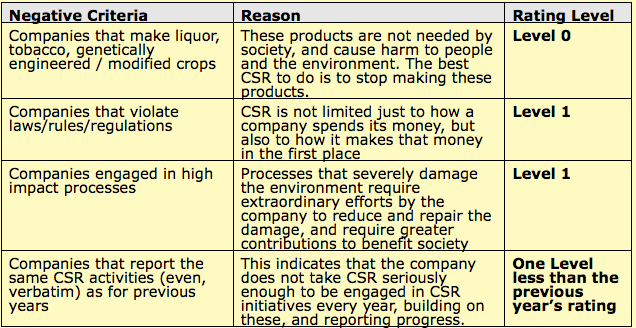

After writing the post on [ITC e-Choupal](http://www.techsangam.com/2011/09/20/itc-e-choupal-model-to-increase-farmer-revenue-and-its-own-bottomline/), I’ve been looking for the complete list of Indian public companies that do triple bottom line reporting. I still haven’t found it but came across an interesting CSR (Corporate Social Responsibilities) ratings list for the Top 500 public Indian companies from [Karmayog](http://www.karmayog.org/). Furthermore, they’ve been publishing this for four years now!

Karmayog has used a 6-point rating scale with Level 0 (lowest) and Level 5 (highest). The table below shows that no company has achieved Level 5 yet, 23% of companies are at Level 0 and only 12 (2%) are at Level 4.

Here’s the list of the 12 companies with Level 4 rating.

If you are like me, you know all the companies on this list barring three – Ballarpur Industries, Jubilant Life Sciences, and Kensai Nerolac Paints. 25% are IT majors. 25% are Tata companies. One bank. No Reliance group companies in list (not surprising!) What other patterns do you see?

Perhaps the biggest omission in Level 4 was ITC, especially considering their stellar work with e-Choupal. Turns out Karmayog gave them a Level 0 rating, which was really surprising so I went looking for the ratings criteria. Their **Minimum Necessary Criteria** (Necessary parameters that make a company eligible for a particular rating level) are listed below:

The criteria for Level 4 seems to match exactly what ITC has done with e-Choupal. Mystery deepens.

Which brings us to the final section **“Negative Criteria that usually determine the maximum possible Rating**”

“companies that make liquor, tobacco, etc.” = Level 0. Mystery solved!