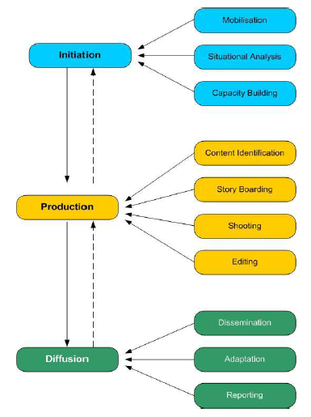
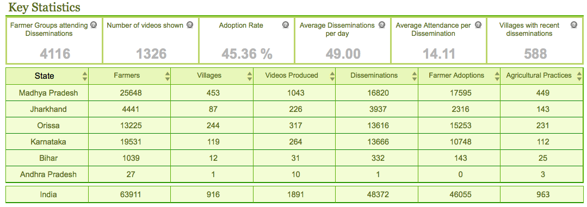

<figure aria-describedby="caption-attachment-360" class="wp-caption alignleft" id="attachment_360" style="width: 123px">

<figcaption class="wp-caption-text" id="caption-attachment-360">Rikin Gandhi (Founder &amp; CEO, Digital Green)</figcaption></figure>

*\[Editor’s Note: Early this week, I had an engrossing phone conversation with Rikin Gandhi (CEO of agricultural extension pioneer [Digital Green](http://www.digitalgreen.org/)). Born and raised in the U.S. and educated at Carnegie Mellon University and MIT, Gandhi “reverse-migrated” to India in 2006 to help start a biodiesel venture in the wastelands of Maharashtra. The venture didn’t pan out but Gandhi stayed back, joining Microsoft Research India to do exploratory research in agricultural extension. The research evolved into a system (Digital Green) that uses participatory videos and mediated instruction to train smallholder farmers in sustainable agricultural practices and technology.\]*

A first-time visitor to Digital Green’s website could be forgiven for thinking she stumbled on to a Web 2.0 video sharing site. A crisp and clean UI with dynamic menus, an appealing 5X4 featured videos grid on the left, and 3 prominent engagement metrics on the right present a spiffy picture. Upon close examination, the videos turn out to be all farming related and you then notice that the 3rd engagement metric is “Farmers Involved”  (an impressive 63,895). So it must be a video sharing site for farmers! The orange Donate button and a prominent link to the 2010-11 Annual Report are the eventual giveaways to the fact that Digital Green is not a commercial entity – it’s incorporated in the U.S. as a 501(c)3 non-profit organization and in India as a charitable trust. The video embedded below is one of 1,892 videos produced by Digital Green in the past 2+ years (for the Indian linguistic buffs out there, can you guess which dialect is being spoken?)

<iframe frameborder="0" height="315" src="http://www.youtube.com/embed/pmXiH9-12Sg" width="420"></iframe>  
Wikipedia defines agricultural extension as the *application of scientific research and new knowledge to agricultural practices through farmer education*. In recent times, the field of extension now encompasses a *wider range of communication and learning activities organized for rural people by professionals from different disciplines, including agriculture, agricultural marketing, health, and business studies*. There are numerous NGOs in India working closely with small holding farmers to promote new agricultural practices to improve their yields. For various reasons, farmers (especially poor farmers) are not easily convinced. On average, it costs an NGO $30 to convince a group of farmers to adopt a new agricultural practice. Digital Green’s innovation, through its unique video production and mediated dissemination formula, has been to dramatically bring this cost down to $3 per adoption.

**DG’s Video Formula and Why it Works**

In an Indian farming landscape where context changes every 5-10 km due to climate, language, soil, culture, etc., creating a video that’s relevant to its audience is vital. The recordings are made by experts at the grassroots level – scientists from government institutions, NGO experts, field staff, progressive farmers, and other enthusiastic volunteers from the local community.

Videos are recorded in local languages and dialects, making it easier for the farmers to understand them on their own. Local farmers, individually or in groups, often act in the videos – this makes it easier for farmers to identify the practice as authentic, reliable and replicable in their context. Delivering the content by a local farmer in his own local dialect is DG’s twin-prong value proposition and also the reason why they don’t resort to blind translations. Majority of the 1892 videos have been recorded in Hindi, Oriya, and Kannada. The next tier of popular dialects include Neemadi, Bhilli, narsinghpuria, Mundari, Gondi, Ho, and Thethi. Majority of videos (80%) are demonstration of some kind of technique, 8% are success stories, and 8% are discussion videos.

In the diffusion stage, dissemination of videos takes place by organizing an event in which a mediator from the community screens the produced video through Self Help Groups and village development committees – using Pico projectors or TVs (whatever is available). The TV and DVD player or Pico projector used for the purpose are circulated around different areas of the village- bus stands, temples, schoolhouses, panchayat offices, streets etc. Screenings usually involve small groups of 10 to 20 farmers.

**Razor Focus on Metrics**

Gandhi has a lucid vision for Digital Green (DG) – use technology and social organizations to improve cost effectiveness and broaden community participation of agricultural extension. As is very evident from Digital Green’s website, Gandhi and his team are obsessed about metrics. Here’s a sampling of metrics that I found interesting from the four different dashboards:

- Adoption rate (45.3%) 
  - (Possibly their most important efficiency metric) Farmers who adopted agricultural practice/Farmers who watched a DG video in last 60 days
- 1892 unique videos produced across 16 languages/dialects
- 1327 unique videos screened which reached a total of 64,017 farmers
- Average time to produce a video: 9.9 days
- Average attendance per dissemination session: 14
- Average disseminations per day: 50

Here’s a snapshot of one of their dashboards:

**NGO Partners**

Digital Green is currently partnering with the following NGOs:

- Access Development Services, ASA, PRADAN, and SSP (Samaj Pragati Sahayog) in Madhya Pradesh
- BAIF Development Research Foundation in Karnataka
- Pragati Koraput, PRADAN, and VARRAT in Orissa
- PRADAN in Jharkhand
- SERP (Society for Elimination of Rural Poverty) in Andhra Pradesh

**Technology**

Digital Green has built an impressive two-layer software technology stack which they are also making available (for free) to NGOs with a sizable field operation. The first layer, COCO (Connect Online | Connect Offline), is a sophisticated data input system (built using Google Web Toolkit and Google Gears) that allows the application to operate in low and limited bandwidth locations. The second layer is the Analytics System which provides day-to-day business intelligence on field operations, performance targets, etc. – the four dashboards on DigitalGreen.org are powered by this system.

In order to capture feedback from farmers, Digital Green is using technology from Awaaz.de (a voice-based question and answer service) to implement a “voice mailbox” feature.

**Fundraising**

Digital Green has raised a majority of its funds through grants from Bill and Melinda Gates Foundation, Deshpande Foundation, Ford Foundation, and Ministry of Rural Development. Furthermore, in the 63,000+ current Digital Green villages, the incremental recurring cost of producing and disseminating new videos is borne by the community.

**The Next 4 Years**

It took Digital Green five years to reach 900+ villages. The goal for the next 4 years is to reach 10,000 villages through its partnership with Ministry of Rural Development’s NRLM (National Rural Livelihoods Mission). Blaze away, Rikin and team!