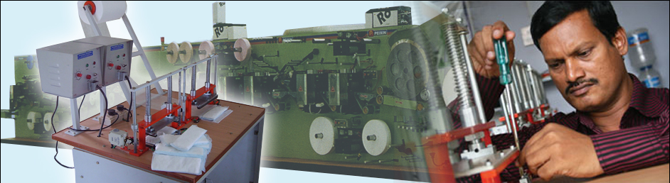
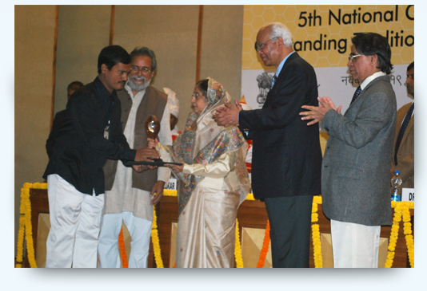
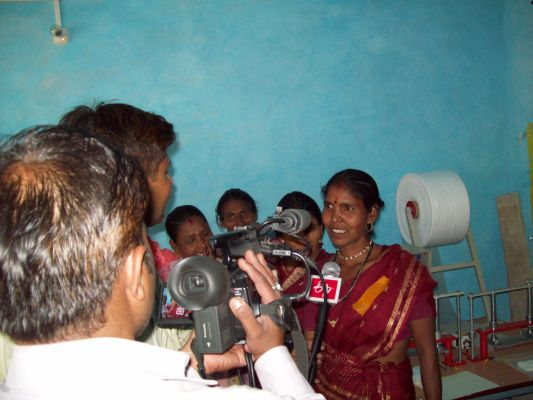

*\[Editor’s Note: A decade ago, if a soothsayer had predicted that I’d someday write about female sanitary napkins, I might have reacted violently. But this story is much more than that – it’s a story of job creation, of women’s empowerment, of a problem solver with the dogged stubbornness of an inventor. It’s the story of Muruganantham Arunachalam, a Coimbatore-based school dropout who’s sparking a second white revolution and spending more than half his time motivating business and engineering school students to think beyond a ‘big salary packet.’  I first heard Muruganantham talk about [Jayaashree Industries](http://newinventions.in/) at Sankalp Forum (covered [here](http://www.techsangam.com/2011/05/09/if-i-was-looking-for-inspiration-i-found-it-at-sankalp-forum/)). I followed up recently with a phone conversation to complete my research.\]*

**Reverse-engineering the Pad**

<figure aria-describedby="caption-attachment-365" class="wp-caption alignleft" id="attachment_365" style="width: 300px">

<figcaption class="wp-caption-text" id="caption-attachment-365">The inventor from Coimbatore - Muruganantham</figcaption></figure>

Muruganantham (M) didn’t set out to become a social entrepreneur. I refer to folks like Muruganantham (and Salman Khan of Khan Academy) as accidental social entrepreneurs. One day in 1999, M discovered that his wife was using a dirty rag instead of a napkin for her personal hygiene. He was doubly shocked because she (a ‘high-school pass’) should have known better! He was determined to get to the root of the problem. Commercially available napkins were just too expensive for his wife and sisters so he started thinking of cheaper alternatives. He ordered sample materials from a US-based manufacturer of napkins and discovered that cellulose fiber (from pinewood chips) was the ‘mystery’ material that absorbs and retains fluid. His next challenge was to come up with a cost-effective way of converting wood fiber cellulose to napkins since existing machines cost a whopping Rs. 4.5 crores.

In a country where “don’t ask don’t tell”  is an unspoken value system, imagine the reaction when a man hands out sanitary napkin samples to college girls and then wants to collect the used napkins to test how well his new machine and napkins were working! It took him several years and numerous trial-and-errors before he created, what became, the final product. Throughout most of his journey, he had been pilloried by nearly everyone (including his own family) as a mad man and a pervert but his dogged persistence finally paid off with the invention of a machine costing only Rs. 75,000. In 2005, the first validation came after he handed the machine to his wife and sisters. After two months, his wife informed him that they needed more raw materials after the entire supply of napkins had been sold, all within their neighbourhood. Things were only going to get better.

**Neither capitalism nor socialism**

<figure aria-describedby="caption-attachment-366" class="wp-caption alignright" id="attachment_366" style="width: 300px">

<figcaption class="wp-caption-text" id="caption-attachment-366">Muruganantham receiving the Best Innovation Award from President of India - Pratibha Patil</figcaption></figure>

In 2006, Muruganantham went to IIT-Madras to get his machine evaluated. Unknown to him, they entered his idea into a competition. He was awarded ‘Best Innovation for Betterment of Society’ , beating out 688 other entries. The award turned out to be a major inflection point. The deluge of coverage in print and TV media resulted in a barrage of orders for M’s machine. In rural India where a mere 3 percent of women used sanitary napkins, the opportunity was huge. But M wasn’t looking for commercial success – he wanted his innovation to be useful to society. He came up with a unique formula of supplying the machine only to poor rural women. Since he believes in neither capitalism nor socialism, he works with village Self Help Groups (SHGs) in identifying the right woman entrepreneur who would pay 10% of the machine cost (balance coming through bank loans). What gets M excited is that his invention is serving dual goals of promoting cost-effective female hygiene and job creation for poor rural women.

At the time of our conversation, total number of machines in the hands of rural women entrepreneurs had exceeded 500 across 21 states. Each machine has the capacity to manufacture 1,000 pieces a day, which maps to a minimum of 25,000 pieces a month.

**Err****… Right to Hygiene?**

As things sometimes play out on India’s policy landscape, success by an individual or social organization leads to government involvement. In mid-2010, the Government announced a plan to provide sanitary napkins to Below Poverty Line (BPL) at ‘highly subsidized’ rates. According to [this article](http://www.themedguru.com/20100616/newsfeature/govt-approves-low-cost-sanitary-napkins-scheme-rural-girls-86136600.html), the scheme is expected to cover 150 districts in six states in the first phase, targeting 1.5 crore girls in the 10-19 age bracket.

So what does Muruganantham have to say of the government’s well-meaning ‘Right to Hygiene’ scheme? He doesn’t mince words: “*The Union government is now talking about supplying free napkins to women by spending Rs 200 crore. With the same amount, we can create 100,000 units across India and each unit can have 10 women working in it. This way, we create employment for a million women.”*

He goes on to say that Jayaashree Industries is already making napkins at a cost of one rupee and fifty paise. With incremental orders from the government scheme, the average cost could be brought down even further. It remains to be seen whether the government will give Muruganantham’s idea due consideration or stay with the tried-and-tested status quo (yes! I’m being sarcastic!) which would simply line the coffers of Kimberley Clarke, Johnson &amp; Johnson, or Proctor &amp; Gamble. My recommendation to M would be to seek the counsel of Dr. Verghese Kurien or Naandi Foundation’s Manoj Kumar – some interesting parallels there.

**A Note to Women’s Empowerment Groups**

<figure aria-describedby="caption-attachment-367" class="wp-caption alignleft" id="attachment_367" style="width: 300px">

<figcaption class="wp-caption-text" id="caption-attachment-367">Rural entrepreneur showing off the napkin making machine</figcaption></figure>

The awards and recognition keep piling up. Massachussetts Institute of Technology (MIT) recognized his invention and bought machines for use in several African countries. For all future International enquiries, Muruganantham plans to do a simple technology transfer.

If you are an NGO or a social enterprise working for women’s empowerment, why wouldn’t you take a serious look at Jayaashree Industries’ [project proposal](http://www.newinventions.in/project.aspx) to transform a poor rural woman into a rural entrepreneur, change her family’s fortunes, and set off a virtuous cycle of prosperity.

Muruganantham Arunachalam, may your tribe increase!