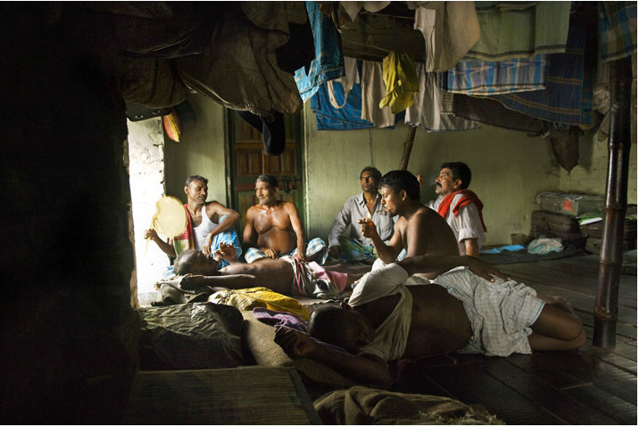
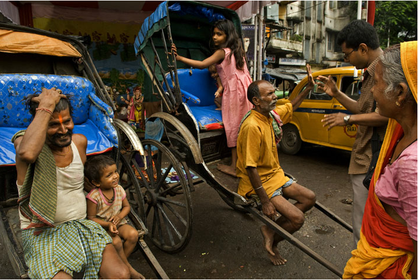
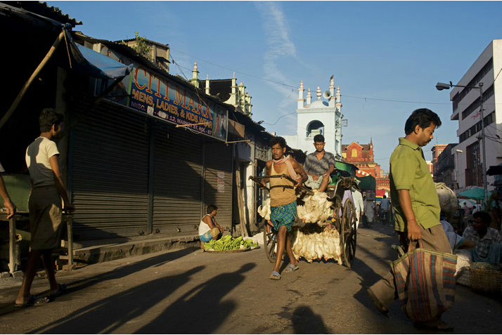
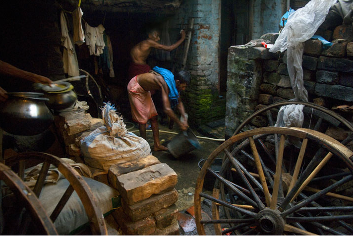
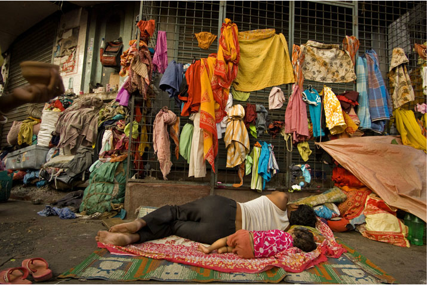
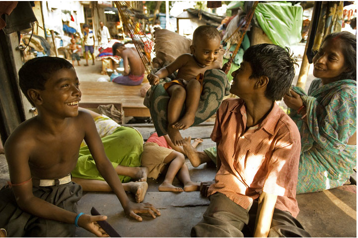

As part of my research for an upcoming post on SMV Wheels (a social enterprise serving the rickshaw puller community), I’ve read many articles and viewed several photoessays. A photo gallery from National Geographic (April 2008) on Calcutta’s dying breed of rickshaw pullers (called ‘human horses’) is a great piece of photo journalism. I’ve embedded below a subset of the pictures taken by photographer Ami Vitale. But first a description of Calcutta’s pull rickshaw-wallahs by Matt Brandon (from his recent Digital Trekker article [Rickshaw pullers of Kolkata](http://www.thedigitaltrekker.com/2011/09/rickshaw-pullers-of-kolkata/)):

> The pull rickshaws are the classic rickshaw image you think of:Â the ones with the driver or puller flanked on each side by long wooden pole-like handles, much like you would see on a horse drawn carriage or chariot. Many of these pullers work barefooted on the fiery hot asphalt roadways, plying their way through dense traffic to get the riders to their destination. It seems inhumane and cruel. In fact, five years ago the local government here made the use of such rickshaws illegal. The pullers union protested and said they are willing to give up this work only if the government provides them with new employment. That has yet to happen and so the pullers continue to work and defy the court order. Interestingly enough, I have seen no young pullers. All seem to be over the age of 45 to 50 years or older, sometimes years older. So, the job might be dying out by itself. These men, and it is only men, often sleep in rented bunks in a crowded bunk houses or on the streets to save what small amount of income they earn. Most of these pullers don’t own their rickshaws, they rent them for around 30 rupees a day. They told me their income can vary from nothing one day to 500 rupees on a great day. Most of these men come from families that live in other cities or even states. They came to Calcutta 20 to 30 years ago to make money to send back home to their families. Yet, they never seem to save much. Like everyone else, they have the expenses of food, lodging, doctor bill and medicine. Two or three of the men n the bunk house I visited were not working that day because they had a relapse of Malaria.

<figure aria-describedby="caption-attachment-373" class="wp-caption aligncenter" id="attachment_373" style="width: 716px">

<figcaption class="wp-caption-text" id="caption-attachment-373">Taking a break after lunch, rickshaw pullers crowd into their living quarters, called a dera. Though religious tensions often run high in India, Hindus and Muslims share the tight lodging.</figcaption></figure>

<figure aria-describedby="caption-attachment-374" class="wp-caption aligncenter" id="attachment_374" style="width: 716px">

<figcaption class="wp-caption-text" id="caption-attachment-374">A shopping expedition often begins with a rickshaw ride through downtown Kolkata's busy streets. Like these two women in pink, most passengers are middle class - the poor can't afford the fare, and the rich have posher ways to get around.</figcaption></figure>

<figure aria-describedby="caption-attachment-375" class="wp-caption aligncenter" id="attachment_375" style="width: 713px">

<figcaption class="wp-caption-text" id="caption-attachment-375">A rickshaw stand is also home to Dharmindra Singh (at left) and Bhanu Paswan, who brought their families with them to live on the street rather than visiting them once a year in Darbhanga, Bihar.</figcaption></figure>

<figure aria-describedby="caption-attachment-376" class="wp-caption aligncenter" id="attachment_376" style="width: 714px">

<figcaption class="wp-caption-text" id="caption-attachment-376">Live chickens ride on Gopal Shaw's rig from the wholesale New Market to a retail shop. A puller's day may begin with such early morning deliveries and end after midnight with passengers.</figcaption></figure>

<figure aria-describedby="caption-attachment-377" class="wp-caption aligncenter" id="attachment_377" style="width: 712px">

<figcaption class="wp-caption-text" id="caption-attachment-377">In the middle of his dera Mohammed Razzak washes his one extra set of clothes in a simple bucket. Accommodations for rickshaw pullers are primitive, with no modern conveniences or privacy, but at least they offer a safe place to sleep and stash belongings.</figcaption></figure>

<figure aria-describedby="caption-attachment-378" class="wp-caption aligncenter" id="attachment_378" style="width: 717px">

<figcaption class="wp-caption-text" id="caption-attachment-378">Outside a temple, with all his worldly possessions hanging in the open, Pankaj Pasman beds down with his son on the sidewalk. His family moved from Bihar to an empty area of Kolkata in the 1960s and built shacks to live in. When they were evicted to make way for development, they made the street their home.</figcaption></figure>

<dl class="wp-caption aligncenter" id="attachment_379" style="width: 727px;"><dt class="wp-caption-dt">

</dt></dl>