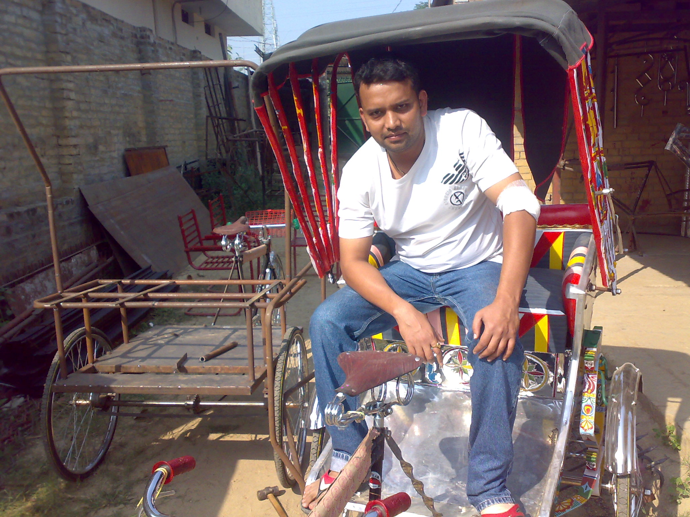
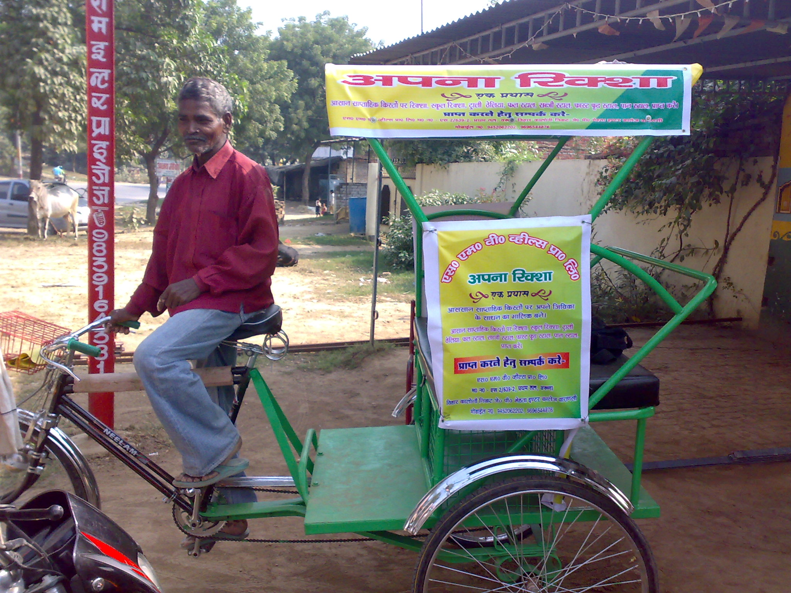

<figure aria-describedby="caption-attachment-384" class="wp-caption alignleft" id="attachment_384" style="width: 300px">

<figcaption class="wp-caption-text" id="caption-attachment-384">Naveen Krishna (Managing Director, SMV Wheels)</figcaption></figure>

*\[Editor’s Note: Last week I had a phone conversation with Naveen Krishna, Managing Director of [SMV Wheels](http://www.smvwheels.com/Home.aspx) (a Varanasi-based social enterprise with an innovative business model that steers cycle rickshaw pullers away from exploitative rickshaw merchants). Naveen is a Masters in Social Work graduate from Banaras Hindu University (BHU) who learnt all about the rickshaw pulling community during his assignment in Guwahati (2006-09).\]*

**Rickshaws a dying breed?**

One would think that the exploding increase in cars and motorized two-wheelers on Indian roads would have put the rickshaws on the endangered species list. Barring Calcutta, with its [quirky and inhuman brand of dying horses](../2011/10/03/calcuttas-dying-breed-of-human-horses/), rickshaws are seeing healthy usage in Uttar Pradesh, Bihar, Jharkhand, Madhya Pradesh, Delhi, and Punjab. According to SMV Wheels, an estimated 10 million rickshaws are plying on urban Indian roads. These numbers are not just inclusive of Tier 2 and Tier 3 cities. After New Delhi’s metro rail got deployed, contrary to people’s expectations, rickshaw usage increased by 10-15%. People had started using it for last mile connectivity, from metro stations to final destination.

**The lot of the rickshaw pullers**

In Homer’s mythological epic poem Odyssey, Scylla and Charybdis were sea hazards located close enough to each other that they posed an inescapable threat to passing sailors – avoiding Charybdis (a whirlpool) meant passing too close to Scylla (a six-headed sea monster) and vice versa. The cycle rickshaw pullers in Varanasi, Gorakhpur, Allahabad (and other towns in Uttar Pradesh), most of whom are migrants from Bihar and Orissa, face a similar predicament. The migrants have moved to the cities to escape extreme poverty so it stands to reason that they can’t afford to buy the rickshaws. While rickshaw pulling is a fairly unskilled vocation, it still requires a license. Corrupt municipal bodies have ensured that licenses are issued only to rickshaw merchants who’ve become a one-stop-shop (renting and getting a license). A rickshaw puller can earn between 200 and 250 Rupees daily, so forking out a rental fee of 30-35 Rupees (around 15%) is not terribly exploitative. It’s in the area of cash management that a rickshaw puller’s life gets really tricky. With no access to banking services, the rickshaw puller has two options – either leave his savings with the merchant or carry it on his person for months until it’s time to visit his village. In the former case, the merchant never fully returns his cash, always keeping some as “retention incentive”. Maverick rickshaw pullers who’ve attempted the latter approach have learnt the hard way that keeping their savings with the merchant is the only safe option – the merchant knows when the rickshaw puller is returning to his village so, with nary a compunction, he uses hired goons to rob the poor rickshaw puller and also teach him a lesson. In this very Indian of stories, Scylla and Charybdis are one and the same.

**The end of exploitation**

<figure aria-describedby="caption-attachment-385" class="wp-caption alignright" id="attachment_385" style="width: 300px">

<figcaption class="wp-caption-text" id="caption-attachment-385">A proud owner and rickshaw puller</figcaption></figure>

It was clear to Naveen that the only way to end the exploitation was to bypass the merchants, which meant that the rickshaw pullers would have to own  their rickshaws. Ludhiana-based KW &amp; Neelam are the only two manufacturers of cycle rickshaw parts whose dealer network in the relevant cities do the final rickshaw assembly as orders come in. In 2010, SMV Wheels started offering a unique product + services value proposition to the rickshaw pullers. After they formed a 3-5 member group, not unlike a [Joint Liability Group](http://en.wikipedia.org/wiki/Joint_and_several_liability) (JLG), each group member could purchase a cycle rickshaw from SMV Wheels through a deferred loan scheme. It’s an interest-free deferred loan with weekly payments for 12-15 months, at the end of which the rickshaw puller owns the rickshaw. SMV Wheels procures the rickshaws at a cost of 11,000 INR and sells to the rickshaw pullers at a price between 13,000 and 14,000. The rickshaw puller also joins the SMV Wheels network which includes the following benefits and services:

- License and uniform
- Accident insurance (from New India Insurance &amp; Oriental Insurance)
- Access to no-frills banking services
- 20% share of advertising revenue during the loan repayment period and 60% after the repayment period (the SMW Wheels rickshaws have been designed to be outdoor advertising friendly)

The advertising revenue-share model is arguably the most innovative aspect of SMV Wheels’ business model. Besides providing a recurring revenue blend, it provides a compelling reason for the rickshaw pullers to stay with the SMV Wheels network.

**Closing Notes**

SMV Wheels was one of the winners at this year’s [Sankalp Forum](../2011/05/09/if-i-was-looking-for-inspiration-i-found-it-at-sankalp-forum/). Naveen was also selected by Dasra for their Social-Impact program (an executive education program targeted at social entrepreneurs). SMV Wheels has sold 130 rickshaws to date and has a healthy backlog of 400 orders from eager rickshaw pullers in Varanasi.

Naveen is in final stages of closing a Series A round following which the SMV Wheels network is expected to grow rapidly within Varanasi and beyond. The expansion plan is simple – Uttar Pradesh cities will keep them busy for the next 5 years!

SMV has six employees today. In early November, they’ll have their seventh (and first American ) employee when Joyce joins them as CFO. Naveen Krishna, take a bow. May your tribe increase!