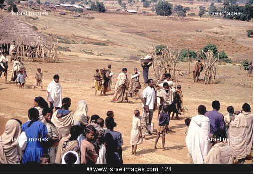
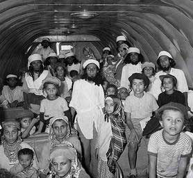

<figure aria-describedby="caption-attachment-389" class="wp-caption alignleft" id="attachment_389" style="width: 300px">

<figcaption class="wp-caption-text" id="caption-attachment-389">Ethiopian Immigrants Waiting In A Camp Before Immigrating To Israel (Pic: courtesy www.israelimages.com)</figcaption></figure>

In Abhijit Banerjee and Esther Duflo’s book [Poor Economics](http://pooreconomics.com/), they describe a remarkable social experiment which demonstrates that making sure every child learns the basics well in school is not only possible, it is in fact fairly easy (even in the most adverse conditions), as long as one focuses on doing exactly that, and nothing else. Here’s that story from Poor Economics:

> A remarkable social experiment from Israel shows how much schools can do. In 1991, 15,000 more or less indigent Ethiopian Jews and their children were airlifted out of Addis Ababa in a single day and dispersed into communities all over Israel. There, these children, whose parents had had on average between one and two years of schooling, entered elementary schools with other Israeli children, both long-term settlers and recent immigrants from Russia, whose parents had had on average 11.5 years of schooling. The family backgrounds of the two groups could not have been more different. Years later, at the point when those who entered school in 1991 were about to graduate from high school, the differences had narrowed considerably. Sixty-five percent of the Ethiopian children had reached twelfth grade without grade repetition, compared to the only slightly higher 74 percent among the Russian emigrants. It turns out that even the most severe disadvantage in terms of family background and early life conditions can largely be compensated for, at least in Israeli schools, where the right conditions are met.

<figure aria-describedby="caption-attachment-388" class="wp-caption alignright" id="attachment_388" style="width: 278px">

<figcaption class="wp-caption-text" id="caption-attachment-388">45,000 Yemenite Jews (mostly children) airlifted to Israel on 380 flights - Operation Magic Carpet (Pic: courtesy jewishvirtuallibrary.org)</figcaption></figure>

You are probably dying to know what the “right conditions” are. Banerjee and Duflo believe that successful experiments in education intervention have given them several ideas on how to create these conditions. More on that in a subsequent post but I need to explain the background to “Operation Magic Carpet”. The airlifting operation described above was actually the second of its kind. The first one (actually called Operation Magic Carpet) happened in September 1949 – a rescue operation to airlift the entire Yemenite Jewish community to Israel. By the end of the operation in early 1950, approximately 50,000 Yemenite Jews had been flown to the new state of Israel.

Economists Eric Gold, Victor Lavy and Daneile Paserman wrote the research paper [Sixty Years after the Magic Carpet Ride: The Long Run Effect of the Early Childhood Envrironment on Social and Economic Outcomes](http://restud.oxfordjournals.org/content/early/2011/04/16/restud.rdq038.full). The paper’s abstract (pasted below) is tantalizing enough to make you want to read the whole thing.

> This paper estimates the effect of the early childhood environment on a large array of social and economic outcomes lasting almost 60 years. To do this, we exploit variation in the living conditions experienced by Yemenite children after being airlifted to Israel in 1949. We find that children who were placed in a more modern environment (i.e. with better sanitary and infrastructure conditions) were more likely to obtain higher education, marry at an older age, have fewer children, and work at age 55. They were also more likely to be assimilated into Israeli society, to be less religious, and have more worldly tastes in music and food. However, these effects are found mainly for women and not for men. We also find an effect on the next generation—children who lived in a better environment grew up to have children with more education.