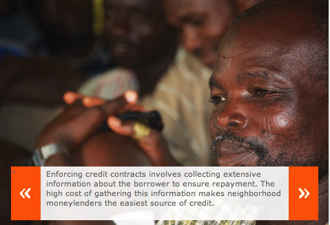
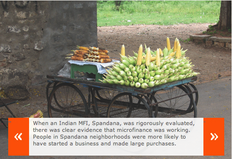
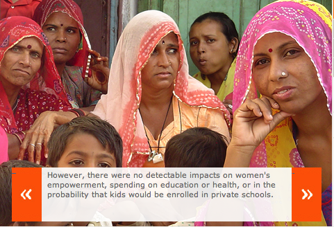

In chapter 7 of Abhijit Banerjee and Esther Duflo’s [Poor Economics](http://pooreconomics.com/chapters/7-men-kabul-and-eunuchs-india), they delve into the economics of lending to the poor and, among other things, proceed to answer the question “Does Microfinance work for the poor?” The answer depends on the definition of “work”. Banerjee and Duflo (B &amp; D) found that no independent research had been done to answer this question. What was being presented by supporters of microfinance as “evidence” turned out to be case studies, often produced by the MFIs themselves. Sometime in 2008-09, Padmaja Reddy, Spandana’s founder and CEO, agreed to work with B &amp; D on an evaluation of their program. The evaluation took advantage of Spandana’s expansion into some areas of the city of Hyderabad. Out of the 104 neighborhoods, fifty-two were chosen at random for Spandana to enter. The rest were left as a comparison group. Below is the excerpt from B &amp; D’s book describing the results and the knee-jerk reaction by the “big six” MFIs.

> When we compared the households in these two sets of neighborhoods, some fifteen to eighteen months after Spandana started lending, there was clear evidence that microfinance was working. People in the Spandana neighborhoods were more likely to have started a business and more likely to have purchased large durable goods, such as bicycles, refrigerators, or televisions. Households that did not start a new business were consuming more in these neighborhoods, but those who started a new business were consuming less, tightening their belts to make the most of the new opportunity. There was no clear evidence of the reckless spending that some observers feared would happen. In fact, we saw exactly the opposite; households started spending less money on what they themselves saw as small “wasteful”  expenditures such as tea and snacks, perhaps a sign that, as Padmaja has predicted, they now have a better sense of where they are heading.
> 
> On the other hand, there was no sign of a radical transformation. We found no evidence that women were feeling more empowered, at least along measurable dimensions. They were not, for example, exercising greater control over how the household spent its money. Nor did we see any difference in spending on education or health, or in the probability that kids would be enrolled in private schools. And even when there was detectable impact, such as in the case of new businesses, the effect was not dramatic. The fraction of families that started a new business over the fifteen-month period went up from about 5 percent to just over 7 percent – not nothing, but hardly a revolution.
> 
> As economists, we were quite pleased with these results: The main objective of microfinance seemed to have been achieved. It was not miraculous, but it was working. There needed to be more studies to make sure that this was not some fluke, and it would be important to see how things panned out in the long run, but so far, so good. In our minds, microcredit has earned its rightful place as *one* of the key instruments in the fight against poverty.
> 
> Interestingly, this was not how the main results played out in the media and the blogosphere. The results were mainly quoted for the negative findings, and as proof that microfinance was not what it was made out to be. And though some MFIs accepted the results for what they were (chief among them, Padmaja Reddy, who said this was exactly what she had expected, and financed a second wave of the work to study the longer-term impacts), the big international players in microfinance decided to go on the offensive.
> 
> The representatives of the “big six”  (Unitus, ACCION International, Foundation for International Community Assistance \[FINCA\], Grameen Foundation, Opportunity International, and Women’s World Banking), the largest MFIs worldwide, held a meeting in Washington, DC, shortly after our study was made public. They invited us to participate, and our colleague Iqbal Dhaliwal went, thinking that there would be some conversation on what the results meant. Instead, it turned out that all the big six wanted was to know when the results from other randomized impact studies were expected, so they could put together a SWAT team that would be in a position to respond (they were apparently convinced all the studies would be negative). A few weeks later, the SWAT team produced its first attempt at damage control. The MFIs responded to the evidence from the two studies (ours, and another by Dean Karlan and Jonathan Zinman, with even more lukewarm results) with six anecdotes on successful borrowers. This was followed by an op-ed in the Seattle Times by Brigit Helms, CEO of Unitus, that simply declared, “These studies are giving the inaccurate impression that increasing access to basic financial services has no real benefit.”  It was somewhat surprising to read, since our evidence shows, quite to the contrary, that microfinance is a useful financial product. But that apparently is not enough. Trapped by decades of overpromising, many of the leading players of the microfinance world have apparently decided that they would rather rely on the power of denial than take stock, regroup, and admit that microfinance is only one of the possible arrows in the fight against poverty.
> 
> Fortunately, this is not the way the rest of the industry seems to be going. At a conference in New York City in fall 2010, where similar results were presented, all the attendees agreed that microcredit as we know it has its strengths and its limits, and that the next order of business was to see what microfinance organizations could do to deliver more to their clients.

Studies mentioned in above excerpt:

- [The Mirage of Microfinance? Evidence from a Randomized Evaluation](http://www.poverty-action.org/node/2119) (May 2009)
- Expanding Microenterprise Credit Access: Using Randomized Supply Decisions to Estimate the Impacts in Manila \[[PDF link](http://www.dartmouth.edu/~jzinman/Papers/expandingaccess_manila_jul09.pdf)\] (2010)
- [Microfinancing changes lives around the world – measurably](http://seattletimes.nwsource.com/html/opinion/2011545639_guest08helms.html) (Brigit Helms in Seattle Times)