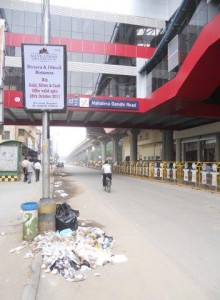
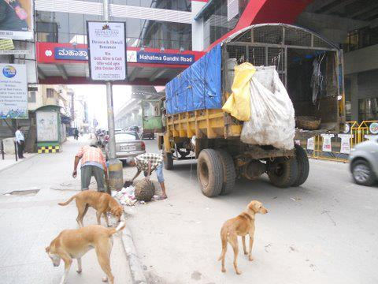
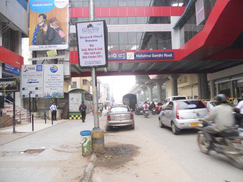
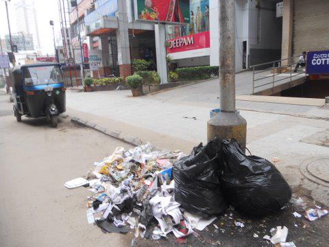
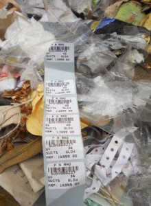
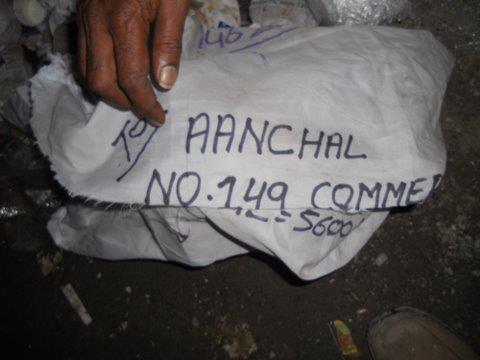
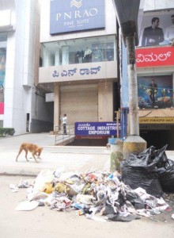
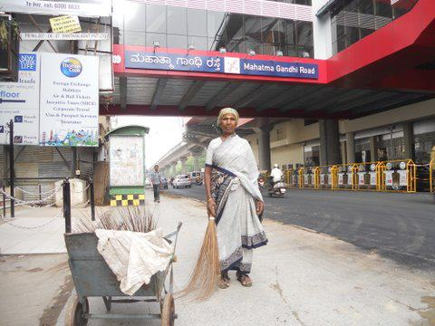

*\[Editor’s Note: The Ugly Indian, an uncategorizable Bangalore-based community organization, has been on my radar for more than a year. They have a fresh approach towards solving the problem of urban cleanliness; an approach that starts with acknowledging that we (“us Indians”) have abysmal standards of public hygiene; an internalization that “WE Ugly Indians are part of the problem and only WE can fix it.” The visuals and captions in their [introduction page](http://theuglyindian.com/intro2.html) captures the prevailing status quo.\]*

The centerpiece of The Ugly Indian intervention is called a ‘SpotFix’ – a sizable section of a busy Bangalore street is transformed via a unique engagement model that includes BBMP garbage staff, nearby shopkeepers, private housekeepers, and even the general public. Here, in 28 pictures, some 4000+ words, and a 3-part series, is the story of the M.G.Road Metro Station Spotfix on the eve of the Namma Metro launch. The narrative is straight from The Ugly Indian’s Facebook page in *their own words* – it reads like a detective story!

<figure aria-describedby="caption-attachment-397" class="wp-caption alignleft" id="attachment_397" style="width: 220px">

<figcaption class="wp-caption-text" id="caption-attachment-397">Act 1, Scene 1</figcaption></figure>

**Act 1 Scene 1: MG Road Metro Station, 8:30am**

1\. This Spot is opp the new MG Road Metro Station, due to open next week.  
2\. This photo was taken at 830am (near Plaza/PN Rao)  
This is what The Ugly Indian sees in the picture:  
a. The footpath and street has been swept (as it is every morning – by the lady BBMP sweeper)  
b. The tereBin has been cleared at 8am (it is cleared at 8am and 3pm everyday), and was full of cups, banana skins, gutka packets and related ‘small’ litter thrown by conscientious citizens.  
c. The tereBin is deliberately sized to allow only pedestrians to use it – shopkeepers are not allowed to use it. If the bin is any larger, dogs would get in, and footpath space is at a huge premium  
d. The shops closed at 10pm the previous night, and have left their garbage on the street for the 9am BBMP lorry pickup. That is the pile of garbage you see – it is NOT meant for the tereBin.  
This is NORMAL. The system is working. Everyone is doing what they are supposed to do. This is the 2-hr window every morning, where garbage is piled up at specific points to await the BBMP pickup lorry.

<figure aria-describedby="caption-attachment-398" class="wp-caption alignleft" id="attachment_398" style="width: 300px">

<figcaption class="wp-caption-text" id="caption-attachment-398">Act 1, Scene 2</figcaption></figure>

**Act 1 Scene 2: MG Road Metro Station, 9am**

1\. The BBMP Lorry arrives on schedule. They work 7 days a week and are incredibly regular.  
2\. The garbage is cleared in 5 minutes.  
3\. All this happens BEFORE MG Road opens for business.  
4\. The shops that open at 10am have no idea what happens to their garbage after they leave it outside their shop at 10pm the previous night.

<figure aria-describedby="caption-attachment-399" class="wp-caption alignleft" id="attachment_399" style="width: 300px">

<figcaption class="wp-caption-text" id="caption-attachment-399">Act 1, Scene 3</figcaption></figure>

**Act 1 Scene 3: MG Road Metro Station, 9:15 am**

1\. The Lorry leaves.  
2\. The place looks clean (that ‘wetness’ will dry up soon!)  
3\. MG Road opens at 10am and the place looks clean.  
So, what’s the problem?  
Well, cleanliness is a matter of perception.  
Take a photo before 9am, and you will find several such ‘pickup spots’.  
Bangalore has a No-Bin Policy – which means a large community bin or Dumpster is not allowed. Door-to-door pickup is the model – citizens are expected to give their garbage directly to the BBMP Lorry. This works in residential areas, where people are at home at 830-9am. But its different in a commercial area.

The problem is one of timing – in commercial areas, garbage is generated at 11pm when shops/pubs close, and they open only at 11am. BBMP can start work only at 7am, and has to clear streets by 9am. That explains the ‘temporary dump’ at 830am. It is a predictable daily occurrence that is cleared up no later than 9am (sometimes earlier).

<figure aria-describedby="caption-attachment-400" class="wp-caption alignleft" id="attachment_400" style="width: 220px">

<figcaption class="wp-caption-text" id="caption-attachment-400">Act 1, Scene 4</figcaption></figure>

**Act 1 Scene 4: A call to action**

So do you want this Fixed?  
1\. The Metro opens next week. There will be activity here from 7am onwards. This ‘dump’ cannot be allowed to exist.  
2\. The Ugly Indian has a simple rule – if you want to change something that is working fine for everyone else, you’ve got to do it yourself. Without moralising or pointing fingers. Kaam Chalu Mooh Bandh.  
3\. We want to eliminate this dump. We have already eliminated over 20 similar ‘pickup-points’ in CBD – this is one of the last survivors.  
4\. Would you like to be part of the process? Over FB?  
Say YES if want to go through the nitty-gritty of a ‘Garbage Dump Elimination’ SpotFix!  
5\. Tomorrow we go to Fix this. Watch this space for updates!

<figure aria-describedby="caption-attachment-401" class="wp-caption alignleft" id="attachment_401" style="width: 300px">

<figcaption class="wp-caption-text" id="caption-attachment-401">Act 2, Scene 1</figcaption></figure>

<figure aria-describedby="caption-attachment-402" class="wp-caption alignright" id="attachment_402" style="width: 300px">

<figcaption class="wp-caption-text" id="caption-attachment-402">Act 2, Scene 2</figcaption></figure>

**Act 2 Scenes 1-3: Suspects List!**

So, whose garbage could this be?  
Can you help us make a list of ‘suspects’ from this picture?  
Look at both pictures.

<figure aria-describedby="caption-attachment-403" class="wp-caption alignleft" id="attachment_403" style="width: 300px">

<figcaption class="wp-caption-text" id="caption-attachment-403">Act 2, Scene 3: First list of suspects</figcaption></figure>

Here’s the first list of suspects – all clearly visible in the shop name-boards in the picture.  
1\. PN Rao  
2\. Raymond  
3\. Cottage Industries Emporium  
4\. Max New York Life.  
5\. Thomas Cook  
6\. Vimal  
7\. Favourite Shop  
8\. The DOGS!  
and there are 3 more establishments to the left of the picture angle  
9\. Deepam Silks, 10. Komfort Inn, 11. Aanchal Silks

So, we have 11 potential suspects. Let’s go into the dump and look for Fingerprints! The beauty of garbage is that it reveals a lot of clues about its source.

<figure aria-describedby="caption-attachment-404" class="wp-caption alignleft" id="attachment_404" style="width: 220px">

<figcaption class="wp-caption-text" id="caption-attachment-404">Act 2, Scene 3: PN Rao?</figcaption></figure>

<figure aria-describedby="caption-attachment-405" class="wp-caption alignright" id="attachment_405" style="width: 300px">

<figcaption class="wp-caption-text" id="caption-attachment-405">Act 2, Scene 4: Vimal?</figcaption></figure>

**Act 2 Scenes 3 &amp; 4**

PN Rao! – there are lots of bills and similar documents. Clearly, all of PN Rao’s daily litter is here (about 30% of the pile). But…they are a highly respected premium suit-maker that has been around since the 1920s, and it seems unlikely they would do something like this. Hmm…

A Reliance Offer! This has to be the Vimal store! So we now have 2 confirmed sources.

<figure aria-describedby="caption-attachment-406" class="wp-caption alignleft" id="attachment_406" style="width: 300px">

<figcaption class="wp-caption-text" id="caption-attachment-406">Act 2, Scene 5: Aanchal Silks</figcaption></figure>

<figure aria-describedby="caption-attachment-407" class="wp-caption alignright" id="attachment_407" style="width: 300px">

<figcaption class="wp-caption-text" id="caption-attachment-407">Act 2, Scene 6: Max New York Life</figcaption></figure>

**Act 2 Scenes 5 &amp; 6**

Aanchal Silks!

Max New York Life! Suspect #4  
Loads of insurance appl. forms.  
Two black garbage bags full of forms and paper.

<figure aria-describedby="caption-attachment-408" class="wp-caption alignleft" id="attachment_408" style="width: 220px">

<figcaption class="wp-caption-text" id="caption-attachment-408">Act 2, Scene 7: More evidence</figcaption></figure>

**Act 2 Scene 7: More evidence**

We also find documents for Thomas Cook, Raymond, Favourite Shop.  
The presence of dogs indicates food, so Komfort Inn must be a suspect.

The only suspects for whom we do not find evidence are Deepam Silks and Cottage Industries Emporium.

So, we have conclusive evidence for 7 suspects, suspected evidence for 2, and No evidence for 2.

What should we do now? In 15 minutes we have moved from general suspicion to incontrovertible evidence.

What would you do? Now that you have the information? How would you approach the suspects? This is the most crucial part of the SpotFix and calls for a lot of tact.

<figure aria-describedby="caption-attachment-409" class="wp-caption alignleft" id="attachment_409" style="width: 300px">

<figcaption class="wp-caption-text" id="caption-attachment-409">Act 3, Scene 1</figcaption></figure>

**Act 3 Scene 1: The Ugly Indian philosophy**

Thanks for your all your suggestions so far!  
The Ugly Indian has a simple motto.  
No lectures, no activism, no moralising, no self-righteous anger.  
No confrontation, no debates, no arguments, no pamphlets, no advocacy.

Try to solve what you see as a problem without stepping on anyone’s toes, or taking sides in an ideological debate.  
Recognise that others may not see it as a problem at all, and may see you as the problem person who is interfering in their lives.  
Read this page from our website: [http://www.theuglyindian.com/about\_us.html](http://www.theuglyindian.com/about_us.html)

With this philosophy, let’s go ahead and begin SpotFixing!

<figure aria-describedby="caption-attachment-410" class="wp-caption alignleft" id="attachment_410" style="width: 300px">

<figcaption class="wp-caption-text" id="caption-attachment-410">Act 3, Scene 2: Conversation with Kondamma (BBMP employee)</figcaption></figure>

**Act 3 Scene 2: Conversation with Kondamma (BBMP employee)**

It’s 9am. We started our SpotFix at 8am by one person simply coming there, and trying to figure out what was going on.  
In 1 hour, we have been able to piece together a part of the story. All we did was  
a) look around and create a list of suspects  
b) look in the garbage for evidence

Let’s speak to some people BEFORE we approach the store owners.

Meet Kondamma. She is the BBMP employee who sweeps MG Road every morning. She has been on this beat for 6 years now, and in this area for 15 years. Her job is to sweep the street and footpath (from 730-930am). She has 4 grown sons (all married) and is approaching retirement. Her equipment is a small wheelbarrow and a broom. The city of Bangalore depends on this one lady to keep its marquee road clean. Here is the conversation we had with her.

TUI: Namaskaara! Have you ever seen this spot clean at 8am?  
Kondamma: Never in the past 15 years. I hate this spot. If my inspector sees garbage here, he will mark me ‘absent’ for the day, and I will lose my salary for the day.  
TUI: So who dumps garbage here?  
Kondamma: All these shops. Please tell them not to. Ask them to give it directly to the lorry. My job is to sweep the street, not handle shop garbage.

So that’s the crux. It finally boils down to taking it out on the lowest-rung employee – who doesn’t have a voice. And as long as nobody else knows this is happening, life goes on. This is very typical, so TUI is not surprised at all.

This story continues in [Part 2](http://www.techsangam.com/2011/10/20/the-ugly-indians-gift-to-bangalore-on-the-occasion-of-namma-metro-launch-part2/) of this series…