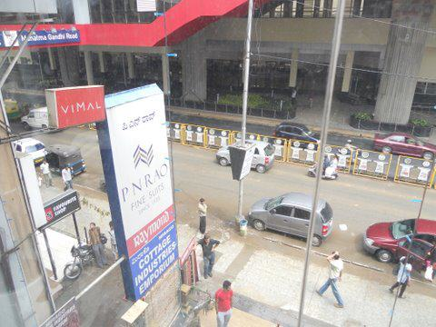
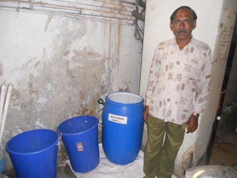
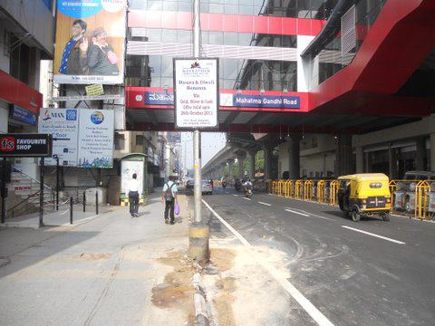
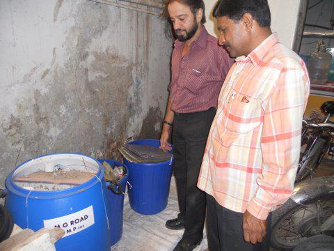
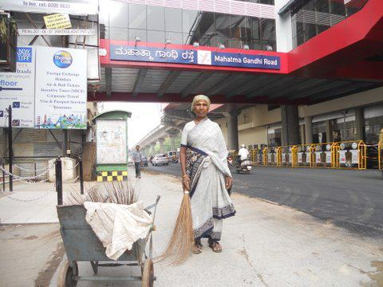
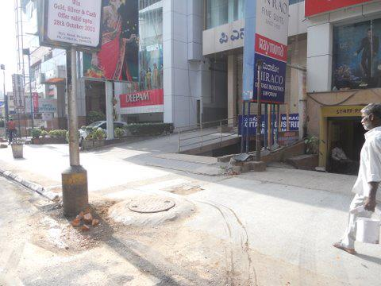
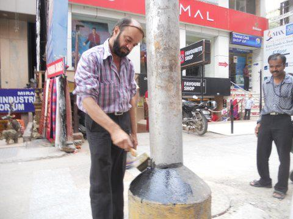
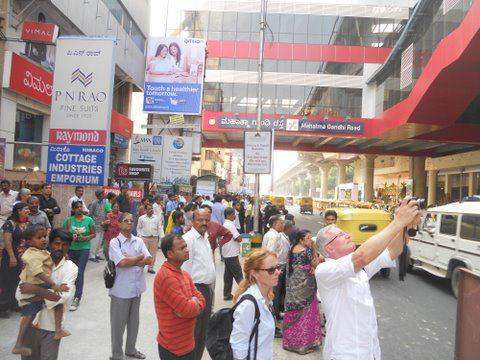

*\[Editor’s Note: If you’ve stumbled onto this post without viewing [Part 1](http://www.techsangam.com/2011/10/19/the-ugly-indians-gift-to-bangalore-on-the-occasion-of-namma-metro-launch/) and [Part 2](http://www.techsangam.com/2011/10/20/the-ugly-indians-gift-to-bangalore-on-the-occasion-of-namma-metro-launch-part2/), we strongly encourage you to view this 3-part series in sequence to fully appreciate the pictorial narrative which reads like a detective story.\]*

<figure aria-describedby="caption-attachment-421" class="wp-caption alignleft" id="attachment_421" style="width: 300px">

<figcaption class="wp-caption-text" id="caption-attachment-421">Act 3 Scene 7: Chat with 4 store managers</figcaption></figure>

**Act 3 Scene 7: Chat with 4 store managers**  
Here is our conversation with Imtiaz, Store Manager at PN Rao.

TUI: We are a group of citizens trying to keep MG Road clean. We took this picture this morning, and want to help you solve this problem.

Imtiaz: (visibly taken aback at the photos) – But how can this happen? Our garbage is kept at the side of our building. Are you sure it’s ours and not anyone else’s?

We show him the evidence.
 He then thinks a bit, and says “maybe its the lady who comes to take away recyclables from our garbage.”

Perfect! He’s got it!

TUI: That’s what we feel too.

Imtiaz: I will make sure she stops doing this from tomorrow – she can take what she wants but she will NOT put it on the footpath. I will give instructions to our admin staff to tell her.

TUI: Great, and we will tell the BBMP Lorry people to come to the side of your shop and take your bag.

It’s a deal. We shake hands and leave.

The whole interaction takes 5 minutes.

 This is a great start!

We then go to Max New York Life.
Same response. Within 5 minutes, we are assured that their garbage will be placed in bins in the basement. But could we ask BBMP to collect it from there? We say we will make that happen.

Two down – and it’s still 1020am. 

We go to Favourite Shop. The proprietor Harish has just come in to work. By now we are confident and just show him the pictures. He is extremely happy that we have come, and says he really wants to solve this and doesn’t know how. We tell him that we will provide the building a bin to keep in their basement, if he can assure us that all garbage will be kept there. He is so warm and helpful that we cannot leave without a chai.

It’s 1045am, and we have actually got assurances from 4 of the ‘suspects’. We quickly meet with Deepam and Cottage Industries who assure us that their garbage goes straight to the Lorry (we believe them because we know), and by 11am we are done with our morning’s work.

It’s been 3 very productive hours. And we have made 7-8 new friends, who commit to support us in making this work.

<figure aria-describedby="caption-attachment-422" class="wp-caption alignleft" id="attachment_422" style="width: 300px">

<figcaption class="wp-caption-text" id="caption-attachment-422">Act 3 Scene 8: Venkatesh, the night shift security guard</figcaption></figure>

**Act 3 Scene 8: Venkatesh, the night shift security guard**

Harish from Favourite Shop has asked us to return at 9pm with our bin. He wants us to meet Venkatesh, the night shift security guard, who is around when all the action happens in the morning.

When we present Venkatesh our bin (the circular blue one in the picture), we are pleasantly surprised that Max New York Life has already placed 2 empty bins at the same place in the basement. So now there are 3 bins awaiting the building’s garbage at 5:30am the next morning. This is the bulk of the problem, and if this happens, then nothing should hit the footpath.

Or, to put it differently, if we find anything on the footpath the next day, we can be sure it is not from these 4 shops.

As it is 915pm, we go and meet the proprietor at Aanchal Silks and the security guard at Komfort Inn – and tell them that we are coming for an ‘inspection’ at 8am the next morning and we want to see their garbage on their own premises. We can now talk confidently as ‘we’ have installed a system at their neighbour’s – so we now have some moral authority to ask them to do what we say. So we are all set for next morning.

We plan to come at 7am to see what has happened. We are in for a BIG surprise!  
Can you guess what happens the next morning? 🙂

<figure aria-describedby="caption-attachment-423" class="wp-caption alignleft" id="attachment_423" style="width: 220px">

<figcaption class="wp-caption-text" id="caption-attachment-423">Act 3 Quick Recap</figcaption></figure>

**Quick Recap of the Day (Act 3 – Scenes 1 through 8)!**  
8am: This photo taken  
8 – 9:30 am: Collect evidence/meet BBMP staff  
9:30 – 11 am: Meet 5 suspects  
9 – 10pm: Install bin/meet night security

We have spent 4 hours of our time, and made 8 friends.  
Will all this work?

Let’s see what happened the next morning!

<figure aria-describedby="caption-attachment-424" class="wp-caption alignleft" id="attachment_424" style="width: 300px">

<figcaption class="wp-caption-text" id="caption-attachment-424">Act 4 Scene 1: SUCCESS</figcaption></figure>

**Act 4 Scene 1: SUCCESS**

This photo was taken at 7am the next morning!

There is no garbage at all – not a single speck.

But wait – there is something else that surprises us.

The whole road has been freshly tarred! As the Metro opens on Thursday, the BBMP has worked overnight and tarred the entire stretch of MG Road! We are told they worked between 11pm-3am and finished the job.  
(It is clear that is the govt wants to do something, they can actually do it overnight)

That’s why we see a little bit of a mud around our lamp-post.

This is mind-blowing – not only is there no garbage, this stretch may actually begin to look nice once the roadworks are done.

Let’s go into the basement of Favorite Shop and see if the bins have been used!

<figure aria-describedby="caption-attachment-425" class="wp-caption alignleft" id="attachment_425" style="width: 300px">

<figcaption class="wp-caption-text" id="caption-attachment-425">Act 4 Scene 2: Basement of Favourite Shop</figcaption></figure>

**Act 4 Scene 2: Basement of Favorite Shop**

The bins are full!

Harish (with beard) from Favourite Shop, along with the Building’s admin supervisor, have got far more involved than we would have expected. Normally proprietors and bosses do not come down to basements and garbage dumps – when they do, we know they are serious.

The Max New York Life paper garbage is in the 2 small blue bins, and all the other garbage is in our Big bin. Shortly, the BBMP staff arrives and transfer this garbage directly to their Lorry. We go with them to all 4 ‘new’ pickup points and incredibly, everyone has kept their garbage inside their premises, and it all works rather smoothly.

<figure aria-describedby="caption-attachment-426" class="wp-caption alignleft" id="attachment_426" style="width: 300px">

<figcaption class="wp-caption-text" id="caption-attachment-426">Act 4 Scene 3: Kondamma has reasons to be happy</figcaption></figure>

**Act 4 Scene 3: In which Kondamma is ecstatic**

Kondamma is ecstatic ! She tells us that she is seeing this lamp-post clean (on her arrival to sweep) for the first time in 15 years! We have a very touching video interview with her, which we will publish shortly. Interestingly, there are only 2 dogs here this morning (normally there are 5). They look hungry. We suspect they will shift base soon – if this sustains.

But this is just Day 1. This is no guarantee of success – it is just a good sign. If this is too much trouble for even one person in the chain, it will lapse back to the old ways. So we leave at 9am, after the BBMP lorry leaves. Our approach is to not visit again for 24 hours and see if it sustains on its own steam.

We send brief thank you sms’es to those who participated.  
And we plan to come the next morning at 7am (unannounced).

<figure aria-describedby="caption-attachment-427" class="wp-caption alignleft" id="attachment_427" style="width: 300px">

<figcaption class="wp-caption-text" id="caption-attachment-427">Act 5 Scene 1: Next morning 7am</figcaption></figure>

**Act 5 Scene 1: Next morning 7am**  
No garbage, no dogs.  
It seems to be working.

Later in the day, we meet with everyone concerned, and they all express happiness with the way it’s turned out.

We think this will sustain. But we will keep watch. And the moment there is a lapse, we will intervene again.

Please use the Metro once it launches on Thursday. When you alight on MG Road, please look at this lamp-post opposite Favourite Shop/PN Rao. If you have followed this story, hopefully you have a reason to smile.

*Those who haven’t followed this story will notice nothing special, and will probably have lots to say about the poor quality footpath, the ugly manhole etc. etc. etc. and that there is no hope for this city.*

Ignore them – there will always be skeptics.  
Solving intractable civic problems needs a lot of commonsense and attitude.

This entire SpotFix was done by one person who devoted 4 hours of time over 2 days. That’s it.

The only expense was Rs 300 for a bin. The Favourite Shop proprietor offered to pay the rs 300 – we declined and said it is our little contribution. We asked them to invest in this system and make it work – for ‘the greater good’ of the street. And the city.

**Moral of the story**

Just because a ‘problem’ hasn’t been solved for 15 years, doesn’t mean it cannot be solved.

It needs one person with the right attitude who is determined to see it through till the end. Sometimes it happens in one day, sometimes longer. But no force on earth can stop one person – who is willing to make the solution his/her problem. And approaches it with commonsense.

All other stakeholders rally around such a person.  
Everyone is waiting for someone else to step forward and take charge of common problems.

The only rules are:  
1\. Do not step on anyone’s toes.  
2\. Be sincere and genuine.  
3\. Make problem-solving the focus – not any ideology.  
4\. Kaam Chalu Mooh Bandh

A video on this Spotfix will soon be released.

Hope you enjoyed the story.

If you feel you can do the same with a spot near your home/office, hope you get some pointers here.

<figure aria-describedby="caption-attachment-428" class="wp-caption alignleft" id="attachment_428" style="width: 300px">

<figcaption class="wp-caption-text" id="caption-attachment-428">Act 5 Scene 2: Spotfix bonus segment</figcaption></figure>

**Act 5 Scene 2: Spotfix bonus segment**

The govt, in their wisdom, has tarred a 100 metre stretch of MG Road under the Metro station. But the footpath is still a mess, and none of the street-lights are painted. It’s a real shame – if the footpath on MG Road has not been fixed for the Metro, it probably never will.

So we decide to do our little bit.

The Spot has not seen garbage for 3 days now. The system is working well, we are told. It is already looking and feeling cleaner. Harish Lalwani, from Favourite Shop, comes out to give us a hand as we paint the street-light. For the record, this is the most beautiful street-light on MG Road on the day the Metro opened! Please go and take a look at it!

Maybe the ministers arriving tomorrow for the inauguration will notice? 🙂

We will post an update tomorrow!

Note: Our ulterior motive, of course, is to make shopkeepers take ‘ownership’ of the footpath in front of their shops. It is not their responsibility (it is the government’s), but we feel good when some people (like Harish) step forward on their own and support what TUI does.

<figure aria-describedby="caption-attachment-429" class="wp-caption alignleft" id="attachment_429" style="width: 300px">

<figcaption class="wp-caption-text" id="caption-attachment-429">Postlude: the Metro launches!</figcaption></figure>

**Postlude**

The Metro is launched at 4pm today!  
This picture is worth a thousand words.  
It aptly captures The Ugly Indian’s role – anonymous, in the background, and playing a small, but important role, in the daily lives of those who walk on MG Road and Bangalore CBD.