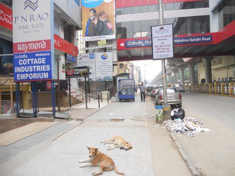
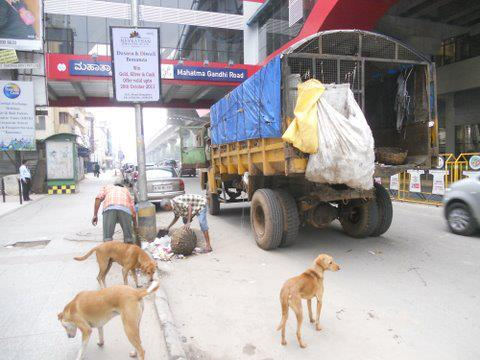

*\[Editor’s Note: If you’ve stumbled onto this post without viewing [Part 1](../2011/10/19/the-ugly-indians-gift-to-bangalore-on-the-occasion-of-namma-metro-launch/), we strongly encourage you to follow the 3-part series in sequence to fully appreciate the pictorial narrative which reads like a detective story.\]*

<figure aria-describedby="caption-attachment-413" class="wp-caption alignleft" id="attachment_413" style="width: 225px">

<figcaption class="wp-caption-text" id="caption-attachment-413">Act 3 Scene3: Ragpicker lady who arrives at 6am</figcaption></figure>

**Act 3 Scene 3: The security guards speak**

We then talk to all the Security Guards. All the guards are either from Assam or Orissa who work the night shift to send money home. They are excellent sources of info. They see everything and know everything – a faceless constant on our streets. They tell us the ‘real story’. Of course, it takes some cajoling and letting them know this will not affect their job. But they see us photographing the garbage and are curious about why we are doing this.

The real story emerges. PN Rao &amp; 2 other shops keep their garbage ‘in their premises’ at night. They are being responsible and doing as they have been instructed by the BBMP. A ‘ragpicker lady’ comes there around 6am, rummages around for garbage useful to her (anything that has resale value), retains the black bag for her ‘find’, and dumps the rest on the street. She does that with the garbage of 3 establishments.

A-ha – so we have a new culprit. That nobody has ever met. She comes in at 6am, or earlier. She does this because she is in competition with other ‘ragpicker ladies’, it is first-come-first-served and this garbage is their livelihood. We know many such ladies. Typically they are widows (and grandmothers), and earn about Rs 100-150/day from resale of recyclable items they ‘find’ in your garbage. They aren’t as lucky as Kondamma to have a job as a sweeper. They are also part of the large faceless ‘invisible’ people who inhabit our cities who live off our waste. As far as she is concerned, she is not doing anything wrong. When shops throw out garbage, she has every right to recycle whatever is valuable, and keep the rest on the street where the BBMP lorry picks it up at 9am. So now we have 2 new bits of information about PN Rao – let’s meet him and see what he knows about what happens to his garbage.

We plan to meet PN Rao at 10am once they open. It has been 2 hours since this SpotFix began, and we are slowly beginning to piece the story together. Hopefully our meeting with PN Rao and others will remove all unknowns.

<figure aria-describedby="caption-attachment-414" class="wp-caption alignleft" id="attachment_414" style="width: 300px">

<figcaption class="wp-caption-text" id="caption-attachment-414">Act 3 Scene 4</figcaption></figure>

**Act 3 Scene 4: Hello…what about the dogs?**

Wait! We seem to have missed the most important suspect of all – the Dogs!

These dogs are very resourceful. They are able to smell a small piece of food in a huge plastic garbage bag, carry the bag out of its place, rip open the bag and get their food. Their ‘skill’ has to be seen to be believed. So, we learn that the ‘canteen garbage’ (ie coffee cups, biscuits etc) of one of the offices is mixed with their ‘paper garbage’ – and the dogs wait here everyday for that particular bag. And then they rip it apart.

Most of us love dogs, and the garbage workers do so too. These dogs follow the lorry, and the garbage workers bring them waste food to feed, when they arrive. Most hotels throw out perfectly edible food (as far as dogs are concerned) – so, for the garbage workers it makes eminent sense to feed leftover bones and food waste to these friendly companions of theirs. After all, the dogs are the only creatures who seem to respect the garbage workers, and wait for them everyday.

So, again, this is all part of the daily cycle. The dogs get their food, the garbage workers do what they think is right with wasted food, and life goes on. Only a few of us (we repeat, only a few) care about the fact thet street looks a mess for that 2-hour window. If we ‘solve’ this open garbage problem, the dogs will not get their daily meal – and that is something we need to worry about, as it will upset the rhythm of what has been happening for years now. And someone will get upset and put a spoke in our plans.

We cannot over-emphasise how important this is – try to achieve what YOU want with minimal/no change in other people’s lives. You have to accept that others directly involved might not think like you or have the same priorities. Most are living on the edge, fight for daily survival, and are totally invisible and faceless to those who read posts like this!

<figure aria-describedby="caption-attachment-415" class="wp-caption alignleft" id="attachment_415" style="width: 300px">

<figcaption class="wp-caption-text" id="caption-attachment-415">Act 3 Scene 4: Where is Babu Jr?</figcaption></figure>

**Act 3 Scene 4: Where is Babu Jr?**

Wait! There is one more thing we observed when the BBMP Lorry came. Satya and Babu Sr get down to clear the garbage. Babu Jr is missing! Where could he be?

We soon find that he has gone into Deepam Silks and soon emerges with Deepam’s garbage bin. He does the same with 5 other shops. He dumps their garbage directly into the Lorry, and then he goes back and returns the bin to their basements. So, that is why we did not find Deepam’s garbage on the street – they have a ‘direct pickup’ system with BBMP.

Hmm…so there is a system at work here for 6 shops, and somehow these other 5 shops in our suspect list are not part of it.  
Or maybe Babu Jr and co take pity on the ragpicker ladies, and ‘allow’ them to earn their daily income, on the condition that they keep the rest of the garbage near the lamppost.

Who knows? There are all kinds of dynamics between people ‘who live on the edge’ – and TUI is honest enough to admit that we don’t know, and will never know, the full story.

<figure aria-describedby="caption-attachment-416" class="wp-caption alignleft" id="attachment_416" style="width: 300px">

<figcaption class="wp-caption-text" id="caption-attachment-416">Act 3 Scene 5</figcaption></figure>

**Act 3 Scene 5: PN Rao show time!**

PN Rao opens at 10am.

We walk in, armed with all this information about their garbage, and the photos. So whom should we meet in the store? The store manager? The salesman? The cashier? The security guard? The cleaner?

How do we introduce ourselves? What should we say to them? Please post your suggestions. You now know more about the situation than PN Rao’s staff themselves – as they come in to work only at 10am everyday.

What we care about is that the garbage of these 5 shops is hitting the lamp-post, and we want that to change. That’s it. We don’t want to interfere in the daily lives of all these people, we don’t want to affect their livelihood, we don’t want to lecture anyone about recycling. We want to achieve our single-minded aim (that the garbage should go directly to the lorry and never reach the footpath) with minimum change in daily behaviour of everyone else concerned.

This is a crucial point – missed by many.

NEVER impose your views or aesthetic ideals. Kaam Chalu Mooh bandh. Achieve what you want by making it easy for everyone else in the chain.

<figure aria-describedby="caption-attachment-417" class="wp-caption alignleft" id="attachment_417" style="width: 300px">

<figcaption class="wp-caption-text" id="caption-attachment-417">Act 3 Scene 6: Scoop from security guard</figcaption></figure>

**Act 3 Scene 6: Scoop from security guard**

We ask for the Store manager at PN Rao and are directed to Mr Imtiaz. As the store is just opening for business, he politely asks us to wait for 5 mins while he starts the day. We have politely asked for 5 minutes of his time – nothing more. We don’t say what we have come to talk about, but we clarify that we haven’t come to get a suit stitched! We are well-dressed and could well be a PN Rao customer, so we get access and audience.

While we wait, we chat with the Security guard of the next building who has seen us photographing. That building has 3 shops – Favourite Shop (another Bangalore veteran), Thomas Cook and Max New York Life. He tells us something very interesting. Apparently, the garbage of the entire building is managed by a single person. These companies keep the garbage ‘inside’ the building at a private dump in the basement. This guy (let’s call him Mr X), has to report to work elsewhere at 630am. So he comes every morning at 530am, dumps all this garbage on the footpath and leaves. So, Mr X is the cause of 3 shops’ garbage hitting the footpath. All this happens before sunrise and nobody knows.

So, we are now down to 2 Culprits – the ragpicker lady who ‘handles’ PN Rao’s garbage and Mr X who handles that of 3 other shops. It is entirely possible that none of the staff of these shops is even aware of what goes on between 10pm and 10am with their garbage.

We ALWAYS give shopkeepers the benefit of doubt before approaching them with evidence. We ALWAYS tell them that ‘we know you face this problem of dumping in front of your store. We can help you find a way to solve it.

One more TUI mantra:  
When you approach a shopkeeper with evidence, always have a ‘solution’ in hand too. One that is easy to implement, and that YOU can help in installing. Never approach a shopkeeper with a complaint. Or with a threat.

So, can you help us with the right approach to PN Rao, Favourite Shop, Thomas Cook and Max New York Life? Beyond showing them the picture of the garbage, what practical solution can we offer them?

This story continues and concludes in [Part 3](http://www.techsangam.com/2011/10/20/the-ugly-indians-gift-to-bangalore-on-the-occasion-of-namma-metro-launch-part-3/) of this series.