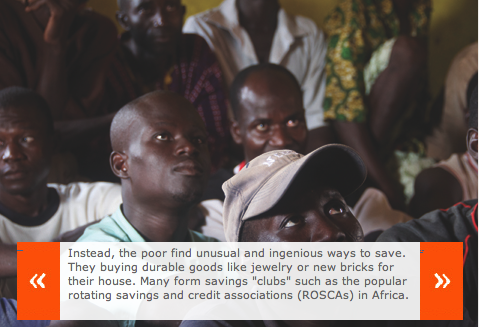
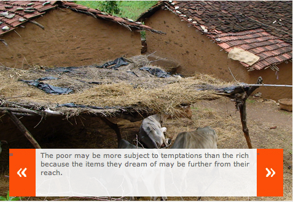
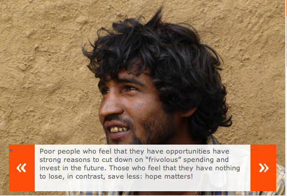

In chapter 8 (Saving Brick by Brick) of [Poor Economics](http://pooreconomics.com/), Banerjee and Duflo delve into the subject of savings – the psychology behind why a majority of the poor find it incredibly hard to save and how they are caught in a catch-22 situation.

*Savings is less attractive for the poor, because for them the goal tends to be very far away, and they know that there will be lots of temptations along the way. But of course, if they do not save they remain poor.*

> Andrei Shleifer, probably the best exponent of the theory that many people sometimes do silly things, shared with us something that he had noticed in Kenya: a huge difference between the farms run by a group of nuns, which were lush and vibrant, and those run by their neighbors, which were much less impressive. The nuns were using fertilizer and hybrid seeds. Why, he asked us, were the farmers not able to do what the nuns were doing? Could it be a sign that they were much more impatient (the nuns’ profession presumably inclines them to patience because the rewards are mainly in the afterlife)?

Another possibility of course is that the nuns, through whatever church they were affiliated with, had access to some extra capital that their neighbors didn’t. Let’s park that possibility for now because the hypothesis that Banerjee and Duflo are exploring turns out to be fairly credible.

> He (Shleifer) had hit on something that had long been a puzzle for us. In surveys conducted over several years, Michael Kremer, Jonathan Robinson, and Esther found that only about 40 percent of the farmers in the Busia region in western Kenya had ever used fertilizer, and just 25 percent used fertilizer in any given year. Conservative estimates, based on offering a random group of farmers free fertilizer to use on a small part of their fields and then comparing the harvest on that plot to that on a similar plot of land belonging to the same farmer, suggest that the average annual return to using fertilizer exceeds 70 percent: For $1 paid in fertilizer, the average farmer would get $1.70 worth of extra maize. Why were they not doing it more? It may be that farmers do not know exactly how to use fertilizer. Or they could underestimate the returns. But if that were true, then at least the farmers who got the offer of free fertilizer (and a demonstration of how best to use it) and earned the high returns should be hugely enthusiastic about using it subsequent seasons. In fact, Esther, Kremer, and Robinson found that the farmers who were given free fertilizer one season were 10 percentage points more likely on average to use fertilizer in the very next season after the study, but that still meant that a majority had gone back to not using fertilizer. It was not that they were unimpressed with what they saw: The vast majority claimed to be convinced and initially said they would surely use fertilizer.
> 
> When we asked some farmers why they did not end up using fertilizer, most replied that they did not have enough money on hand to buy fertilizer when it was time to plant and use it. What is surprising is that fertilizer can be purchased (and used) in small quantities, so this is an investment opportunity that seems easily accessible to farmers with even a small amount of savings. It suggests that the issue, once again, is that farmers find it difficult to hold on to even very small sums of money for the period from harvest to planting As Michael and Anna Modimba, a couple who farm maize near Budalengi in western Kenya, explained, saving is hard. On their farm, they had used fertilizer in the last growing season, but not the one before, because they had had no money left to buy it then. Saving at home is difficult, they explained, because there is always something that comes up that requires money (someone is sick, someone needs clothes, a guest has to be fed), and it is hard to say no.
> 
> Another farmer we met the same day, Wycliffe Otieno, had found a way to solve this problem. He always made the decision about whether or not to buy fertilizer just after the harvest. If the harvest was sufficient to pay for school fees and provide food for the family, he immediately sold the rest of his crop and used the money to purchase hybrid seeds, and if he had any leftover money, fertilizer. He stored the seeds and the fertilizer until the next planting season. He explained to us that he always bought the fertilizer in advance, because, like the Modimbas, he knew that money kept in the house would not be saved: When there is money in the house, things always happen, he said, and the money disappears.
> 
> We asked him what he did when he had already purchased fertilizer (but not yet used it) and someone got sick. Wasn’t he tempted to resell it at a loss? His answer was that he never found the need to resell the fertilizer. Instead, he tended to reevaluate the true urgency of any need when there was no money lying around. And if something really needed to be paid for, he would kill a chicken or work a bit harder as a bicycle taxi driver (a job he did on the side when he was not too busy with farming). Although they had never purchased fertilizer in advance, the Modimbas had the same view. If a problem came up but they had no money (say, because they had purchased fertilizer), they would figure something out – perhaps borrow from friends or, as they put it, ‘suspend the issue’; but they would not resell the fertilizer. It was their opinion that it would be a good thing for them to be forced to find an alternative solution, instead of using the cash at home.